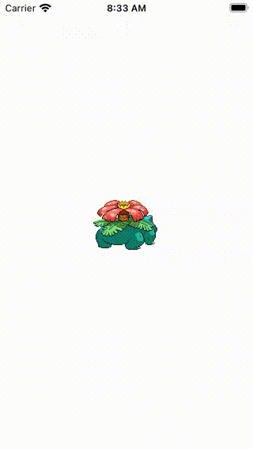

# Create an Image Carousel Using Swift
## Place Images Nicely


Difficulty: Beginner | Easy | **Normal** | Challenging<br/>
This article has been developed using Xcode 12.4, and Swift 5.3.2

This is supported by the YouTube video @[https://youtu.be/tMNyU3y4U-Y](https://youtu.be/tMNyU3y4U-Y)

# Prerequisites:
* You will be expected to be aware how to make a [Single View Application](https://medium.com/swlh/your-first-ios-application-using-xcode-9983cf6efb71)
* You will need to use [Swift Package Manager](https://stevenpcurtis.medium.com/use-swift-package-manager-to-add-dependencies-b605f91a4990) to add dependencies
* Some knowledge of [AutoLayout](https://betterprogramming.pub/demystifying-the-view-drawing-cycle-fb1f7ac519f1) would be useful

# Terminology
Carousel: A set of rotating images
SDWebImage: A framework to help download and display images
UIView: An object that manages the content for a rectangular area on the screen
UIViewController: A view controller is an intermediary between the views it manages and the data of your app

# A What With The What Now?
You might want to display a selection of images that sleekly scroll by in front of the user's eyes, without their interaction? Something like:

<br>

Which is using the [Pokémon API](https://pokeapi.co) to retrieve the images in the carousel implemented above. This did necessitate use of an image downloading or caching mechanism, and in this case [SDWebImage](https://github.com/SDWebImage/SDWebImage) has been used (and installed using [Swift Package Manager](https://stevenpcurtis.medium.com/use-swift-package-manager-to-add-dependencies-b605f91a4990)).

# The Theory
This implementation is going to [subclass a UIView](https://stevenpcurtis.medium.com/subclassing-uiview-in-swift-d372c67b7f3) which means that the Carousel can be reused in multiple `UIViewController` instances.

This reuse of a `UIView` subclass means that we are exploiting the reusability of those views while composing screens for applications.

# Setting up the Reusable UIView
The idea here is create the carousel, and include three URLS for images from a Web API. Here I implement the Carousel using AutoLayout to ensure that the images (in this instance) stay in the middle of the scren as they animate. I did get the images from [the Pokemon API](https://github.com/stevencurtis/Pokemon), but most of the code below should be self-explanatory.

```swift
class ViewController: UIViewController {
    let urls: [URL] = [
        URL(string: "https://raw.githubusercontent.com/PokeAPI/sprites/master/sprites/pokemon/back/1.png")!,
        URL(string: "https://raw.githubusercontent.com/PokeAPI/sprites/master/sprites/pokemon/back/2.png")!,
        URL(string: "https://raw.githubusercontent.com/PokeAPI/sprites/master/sprites/pokemon/back/3.png")!
    ]

    lazy var carousel = Carousel(frame: .zero, urls: urls)

    override func viewDidLoad() {
        super.viewDidLoad()
        setupHierarchy()
        setupComponents()
        setupConstraints()
    }

    override func loadView() {
        let view = UIView()
        view.backgroundColor = .systemBackground
        self.view = view
    }

    func setupHierarchy() {
        self.view.addSubview(carousel)
    }

    func setupComponents() {
        carousel.translatesAutoresizingMaskIntoConstraints = false
    }

    func setupConstraints() {
        NSLayoutConstraint.activate([
            carousel.topAnchor.constraint(equalTo: view.topAnchor),
            carousel.bottomAnchor.constraint(equalTo: view.bottomAnchor),
            carousel.leadingAnchor.constraint(equalTo: view.leadingAnchor),
            carousel.trailingAnchor.constraint(equalTo: view.trailingAnchor)
        ])
    }
}
```

# The Carousel
The Carousel uses a subclassed `UICollectionViewFlowLayout`:
## UICollectionViewFlowLayout

```swift
final class CarouselLayout: UICollectionViewFlowLayout {
    // perform the setup for the layout
    override init() {
        super.init()
        self.minimumInteritemSpacing = 0
        self.minimumLineSpacing = 0
        self.scrollDirection = .horizontal
        self.sectionInset = .zero
    }

    @available(*, unavailable)
    required init?(coder: NSCoder) {
        fatalError("init(coder:) has not been implemented")
    }

    // Tells the layout object to update the current layout.
    override func prepare() {
        super.prepare()
        if let collectionView = collectionView {
            itemSize = collectionView.frame.size
        }
    }

    // Asks the layout object if the new bounds require a layout update.
    override func shouldInvalidateLayout(forBoundsChange newBounds: CGRect) -> Bool {
        guard itemSize != newBounds.size else { return false }
        itemSize = newBounds.size
        return true
    }
}
```

## Carousel

The carousel itself is a subclass of `UIView`, and requires initialization

```swift
class Carousel: UIView {
    public init(frame: CGRect, urls: [URL]) {
        self.urls = urls
        super.init(frame: frame)
        setupView()
    }

    // init from code
    override init(frame: CGRect) {
        super.init(frame: frame)
        setupView()
    }

    // init from xib or storyboard
    required init?(coder aDecoder: NSCoder) {
        super.init(coder: aDecoder)
        setupView()
    }
...
```

There is then the `UICollectionView` that is created using a [lazy var](https://stevenpcurtis.medium.com/the-lazy-variables-what-and-why-in-swift-619cb951ee0f), and sets up the layout. We also have a number of properties:

```swift
var urls: [URL] = []
var selectedIndex: Int = 0
private var timer: Timer?
```

The shared `setupView` sets up the `UICollectionView`

```swift
private func setupView() {
    collectionView.backgroundColor = .clear
    collectionView.delegate = self
    collectionView.dataSource = self
    collectionView.isUserInteractionEnabled = false
    collectionView.isPagingEnabled = true

    collectionView.translatesAutoresizingMaskIntoConstraints = false
    addSubview(collectionView)

    collectionView.register(UICollectionViewCell.self, forCellWithReuseIdentifier: "cell")

    NSLayoutConstraint.activate([
        collectionView.topAnchor.constraint(equalTo: topAnchor),
        collectionView.bottomAnchor.constraint(equalTo: bottomAnchor),
        collectionView.trailingAnchor.constraint(equalTo: trailingAnchor),
        collectionView.leadingAnchor.constraint(equalTo: leadingAnchor)
    ])

    scheduleTimerIfNeeded()
}
```

The last part of this calls the function `scheduleTimerIfNeeded` which will cancel any existing timer, and create a timer with a delay of three seconds (that is, it is called every three seconds). This only functions if we do have some URLs to display!

```swift
private func scheduleTimerIfNeeded() {
    guard urls.count > 1 else { return }
    timer?.invalidate()
    timer = Timer.scheduledTimer(
        withTimeInterval: 3.0,
        repeats: true,
        block: { [weak self] _ in
            self?.selectNext()
        }
    )
}
```

`selectNext` takes our current `selectedIndex` and increments it, and calls a function which scrolls the `UICollectionView` to the appropriate item.

```swift
private func selectItem(at index: Int) {
    let index = urls.count > index ? index : 0
    guard selectedIndex != index else { return }
    selectedIndex = index
    collectionView.scrollToItem(at: IndexPath(item: selectedIndex, section: 0), at: .centeredHorizontally, animated: true)
}
```

The `UICollectionView` must use a `UICollectionViewDataSource` and `UICollectionViewDelegate`, which setup the cells:

```swift
extension Carousel: UICollectionViewDataSource {
    func collectionView(_ collectionView: UICollectionView, numberOfItemsInSection section: Int) -> Int {
        return urls.count
    }

    func collectionView(_ collectionView: UICollectionView, cellForItemAt indexPath: IndexPath) -> UICollectionViewCell {
        let cell = collectionView.dequeueReusableCell(withReuseIdentifier: "cell", for: indexPath)
        let imageView: UIImageView = UIImageView(frame: .zero )
        imageView.translatesAutoresizingMaskIntoConstraints = false
        imageView.contentMode = .center
        imageView.sd_setImage(with: urls[indexPath.row], placeholderImage: UIImage(named: "placeholder"))
        cell.contentView.addSubview(imageView)
        NSLayoutConstraint.activate([
            imageView.topAnchor.constraint(equalTo: cell.topAnchor),
            imageView.bottomAnchor.constraint(equalTo: cell.bottomAnchor),
            imageView.trailingAnchor.constraint(equalTo: cell.trailingAnchor),
            imageView.leadingAnchor.constraint(equalTo: cell.leadingAnchor)
        ])
        return cell
    }
}

extension Carousel: UICollectionViewDelegate {}
```

We can see the complete `Carousel.swift` file:

```swift
class Carousel: UIView {
    private lazy var collectionView = UICollectionView(
        frame: .zero,
        collectionViewLayout: CarouselLayout()
    )

    var urls: [URL] = []
    var selectedIndex: Int = 0
    private var timer: Timer?

    public init(frame: CGRect, urls: [URL]) {
        self.urls = urls
        super.init(frame: frame)
        setupView()
    }

    // init from code
    override init(frame: CGRect) {
        super.init(frame: frame)
        setupView()
    }

    // init from xib or storyboard
    required init?(coder aDecoder: NSCoder) {
        super.init(coder: aDecoder)
        setupView()
    }

    private func setupView() {
        collectionView.backgroundColor = .clear
        collectionView.delegate = self
        collectionView.dataSource = self
        collectionView.isUserInteractionEnabled = false
        collectionView.isPagingEnabled = true

        collectionView.translatesAutoresizingMaskIntoConstraints = false
        addSubview(collectionView)

        collectionView.register(UICollectionViewCell.self, forCellWithReuseIdentifier: "cell")

        NSLayoutConstraint.activate([
            collectionView.topAnchor.constraint(equalTo: topAnchor),
            collectionView.bottomAnchor.constraint(equalTo: bottomAnchor),
            collectionView.trailingAnchor.constraint(equalTo: trailingAnchor),
            collectionView.leadingAnchor.constraint(equalTo: leadingAnchor)
        ])

        scheduleTimerIfNeeded()
    }

    deinit {
        timer?.invalidate()
    }

    private func scheduleTimerIfNeeded() {
        guard urls.count > 1 else { return }
        timer?.invalidate()
        timer = Timer.scheduledTimer(
            withTimeInterval: 3.0,
            repeats: true,
            block: { [weak self] _ in
                self?.selectNext()
            }
        )
    }

    private func selectNext() {
        selectItem(at: selectedIndex + 1)
    }

    private func selectItem(at index: Int) {
        let index = urls.count > index ? index : 0
        guard selectedIndex != index else { return }
        selectedIndex = index
        collectionView.scrollToItem(at: IndexPath(item: selectedIndex, section: 0), at: .centeredHorizontally, animated: true)
    }
}

extension Carousel: UICollectionViewDataSource {
    func collectionView(_ collectionView: UICollectionView, numberOfItemsInSection section: Int) -> Int {
        return urls.count
    }

    func collectionView(_ collectionView: UICollectionView, cellForItemAt indexPath: IndexPath) -> UICollectionViewCell {
        let cell = collectionView.dequeueReusableCell(withReuseIdentifier: "cell", for: indexPath)
        let imageView: UIImageView = UIImageView(frame: .zero )
        imageView.translatesAutoresizingMaskIntoConstraints = false
        imageView.contentMode = .center
        imageView.sd_setImage(with: urls[indexPath.row], placeholderImage: UIImage(named: "placeholder"))
        cell.contentView.addSubview(imageView)
        NSLayoutConstraint.activate([
            imageView.topAnchor.constraint(equalTo: cell.topAnchor),
            imageView.bottomAnchor.constraint(equalTo: cell.bottomAnchor),
            imageView.trailingAnchor.constraint(equalTo: cell.trailingAnchor),
            imageView.leadingAnchor.constraint(equalTo: cell.leadingAnchor)
        ])
        return cell
    }
}

extension Carousel: UICollectionViewDelegate {}
```

# The Repo
Sometimes it is easier to see all of the code in situ, and the repo provides exactly that. The link? Go on then.[https://github.com/stevencurtis/SwiftCoding/tree/master/ImagesCarousel](https://github.com/stevencurtis/SwiftCoding/tree/master/ImagesCarousel)


# Conclusion
I've actually used this implementation in an implementation that [displays images from the Pokemon API](https://github.com/stevencurtis/Pokemon), which is an interesting API that you can use for your own project.

This particular project allows you to use a carousel within your projects, and I hope that it is useful for you in your programming journey.

If you've any questions, comments or suggestions please hit me up on [Twitter](https://twitter.com/stevenpcurtis)
