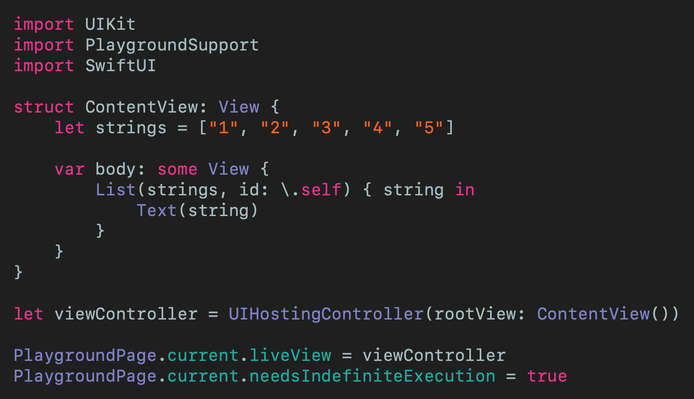

# Imperative vs. Declarative Swift Programming
## Let the worlds collide!

 
Photo by Joshua Rawson-Harris on Unsplash

Redux is a state management system. Intrigued? Read on

Difficulty: Beginner | Easy | **Normal** | Challenging

This article has been developed using Xcode 11.4.1, and Swift 5.2.2

## Prerequisites:
* Coding in Swift Playgrounds (guide [HERE](https://medium.com/@stevenpcurtis.sc/coding-in-swift-playgrounds-1a5563efa089))
* Using SwiftUI in Playgrounds (guide [HERE](https://medium.com/@stevenpcurtis.sc/using-swiftui-in-a-playground-4f8a74181593))
* [Map](https://medium.com/better-programming/mapping-in-swift-a6d6132a38af) is used, as are [Arrays](https://medium.com/swlh/the-array-in-swift-d3e0fb04a0dd) and [for loops](https://medium.com/swlh/for-loops-in-swift-628a6a2b2ea7)

## Terminology
Declarative programming: a programming paradigm that uses statements that change a program's state
Imperative programming: a programming paradigm that expresses the logic of a computation without describing the program flow

## The Swift example
In Swift you can generalize (American spelling, sorry mum) that you can code in an `Imperative` or a `Declarative` style.

Let us see a rather simplistic example, in the abstract then using a concrete example, and then in rather more concrete code.

So `Imperative` can be thought of as telling the machine how to do something step-by-step, and revealing the result. In contrast, a `Declarative` style opens the door to using a declarative abstraction to produce a result.

So let us move to an example. You wish to take an `Array` `Arr` of `Integers`, and multiply each element by two.

So our Swift declaration of `Arr` should be familiar to you (or you can study Swift's [`Array`](https://medium.com/swlh/the-array-in-swift-d3e0fb04a0dd)) like so:

`let arr = [1, 2, 3, 4, 5]`

To perform the doubling we will explicity iterate over the length of the array, doubling each element in turn. These doubled elements are added to a new array at each step.

`var output: [Int] = []
for i in 0..<arr.count {
    output.append(arr[i] * 2)
}`

An alternative to this can be using Swift's higher-order functions, in particular [map](https://medium.com/better-programming/mapping-in-swift-a6d6132a38af) for this:

`let output = arr.map{ $0 * 2 }`

Here the `map` function creates a new array, where each element in the new array is created by passing each element in turn into the function passed to map (i.e. `$0 * 2`).

So the `map` function can be through of how the computation should perform, and the `map` function itself deals with the iteration and state management - we specify *what* we are looking for by providing the `map` function with a function to run (if that makes any sense, which it almost certainly doesn't).

Want the code?

If you're downloading the repo `ImperitiveDeclarative.playground` has you covered here.

# The UIKit vs. SwiftUI
Each of these examples has their own playground - I hope this is a little useful for you in running these examples on your own machine.

Each of these display a particular `Array` of `Strings` ("1", "2", "3", "4" and "5") and displays them in a table.

The two versions are displayed here for use in `Playgrounds`
## The UIKit version

 
[Click for Gist](https://gist.github.com/stevencurtis/40ee232ebd848831980e05abbfe81b96)

## The SwiftUI version
 
[Click for Gist](https://gist.github.com/stevencurtis/40ee232ebd848831980e05abbfe81b96)

For those downloading from the repo, `SwiftUIList.playground` is the one that you would want!

# Conclusion
What this comparison does is gives you some examples of the difference between `imperative` and `declarative` programming paradigms. 

You might well need to think of your context before committing to a certain programming style - business logic is frequently written in an `imperative` style since there frequently isn't a generic abstraction for the custom code that needs to be written for your shopping cart (or other business logic task). 

With all this said, don't let inexperience with `declarative` language features hold you back, particularly when [SwiftUI](https://medium.com/@stevenpcurtis.sc/hello-world-swiftui-92bcf48a62d3) leverages these abstractions to display UI on your device. 

Neat!

If you've any questions, comments or suggestions please hit me up on [Twitter](https://twitter.com/stevenpcurtis)

Feel free to sign up to my [newsletter](https://slidetosubscribe.com/embed/swiftcoding/)
