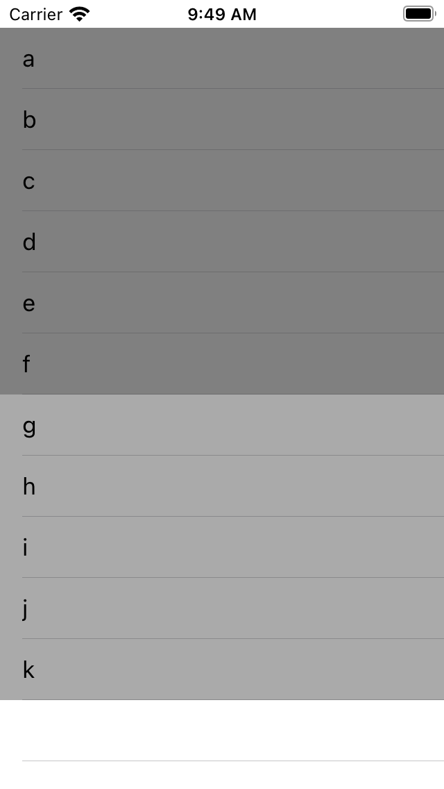
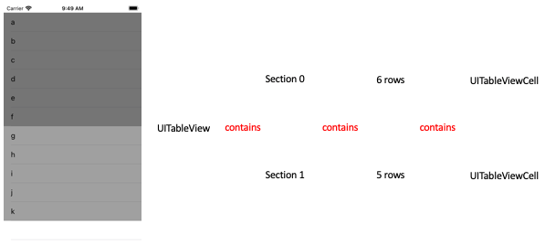

# Understanding Swift's IndexPath
## That is, so it works


<sub>Image by NordWood Themes @nordwood</sub>

# Before we start
Difficulty: **Beginner** | Easy | Normal | Challenging<br>
This article has been developed using Xcode 12.2, and Swift 5.3

## Prerequisites
* You will be expected to be aware how to either make a [Single View Application in Swift](https://medium.com/swlh/your-first-ios-application-using-xcode-9983cf6efb71) or use a [Playground]
* You can follow along with this article, but it would be useful to have some knowledge of the [UITableView](https://medium.com/@stevenpcurtis.sc/the-hidden-workings-of-uitableview-73feb60a13c3)

## Keywords and Terminology
IndexPath: The path to a specific node in a tree of nested array collections
Row: The content in a UITableview is ordered into rows
Section: A grouping of rows in a UITableView
UICollectionView: An object that manages an ordered collection of data items and presents them using customizable layouts
UITableView: A view that presents data using rows arranged in a single column

# This project
## Warning!
Please not that this isn't a production-ready implementation of a `UITableView`; the architecture is all over the place meaning I've just whacked some `String` instances into a table. My favourite (current) architecture is [MVVMC](https://medium.com/@stevenpcurtis.sc/mvvm-c-architecture-with-dependency-injection-testing-3b7197eb2e4d) and I'd usually create the `UITableView` [programatically myself](https://medium.com/@stevenpcurtis.sc/write-clean-code-by-overriding-loadview-ac4f172163d0), but as a simple example to describe the `IndexPath` I stand by my decisions here, but don't take it all too seriously (It isn't intended to be used in production).

## The project
Two sections of data are going to be displayed on the `UITableView`, the first array containing six `String` instances: "a", "b", "c", "d", "e", "f" and the second containing five instance: "g", "h", "i", "j", "k". The background for the first is `.gray` and the second is `.lightGray`



The full details of the project can be downloaded from the [Repo](https://github.com/stevencurtis/SwiftCoding/tree/master/IndexPath).

# What is an Index Path?
An IndexPath is, according to Apple "A list of indexes that together represent the path to a specific location in a tree of nested arrays." which is unnecessarily complicated for the concept at hand here.

Let us take a step back into the structure of a `UITableView`.

Any `UITableView` instance is made up of sections and rows, as described in the following diagram:



Each row needs to have a unique reference, that is which cell (the section and row).

I can give you the code for my entire `UITableViewDelegate`

```swift
extension ViewController : UITableViewDelegate {
    func tableView(_ tableView: UITableView, didSelectRowAt indexPath: IndexPath) {
        print ("The indexPath is: \(indexPath), the row is: \(indexPath.row) and section is: \(indexPath.section)")
    }
}
```

so if we click on the topmost row in the `UITableView` (that contains "a") writes the following to the console:

```swift
The indexPath is: [0, 0], the row is: 0 and section is: 0
```

since the first element is part of the first section (0 because that is [zero indexed](https://medium.com/swlh/zero-indexed-arrays-f752a47abf65), and is the first element (0).

whereas pressing the last item (that contains "k") 

```swift
The indexPath is: [1, 4], the row is: 4 and section is: 
```

since the last element is part of the second section (1), and is the fifth element (4).

# UITableView and UICollectionView
There is no real difference between `UITableView` and `UICollectionView` for the purposes of using IndexPath in order to identify a particular cell - but row would not make any sense in that context. As a result the two properties are section and item for `UICollectionView`.

# Conclusion
IndexPaths are used everywhere when we are using `UIKit` in our project, and knowing what 
The [Repo](https://github.com/stevencurtis/SwiftCoding/tree/master/IndexPath) has the code ready to go!

If you've any questions, comments or suggestions please hit me up on [Twitter](https://twitter.com/stevenpcurtis) 
