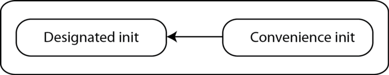
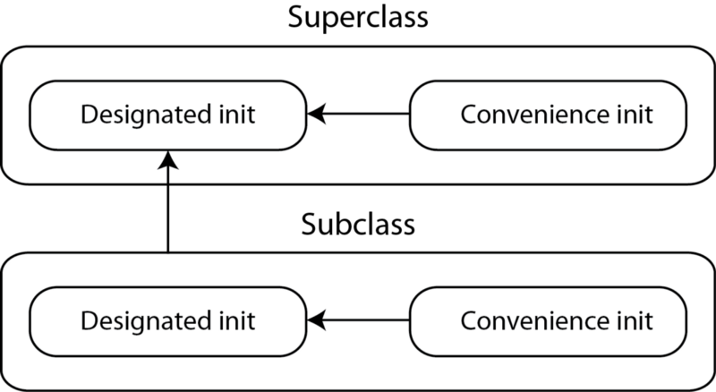

# Swift Initialization
## A Simple(ish) guide

Initialization is hugely important in any modern language. This is not a full guide (Apple have provided a long guide, which is referenced below) but rather a shorter example-laden walk through initialization for Swift.

# Before we start

Difficulty: **Beginner** | Easy | Normal | Challenging
This article has been developed using Xcode 12.2, and Swift 5.3

## Prerequisites:
Some understanding of OO concepts
Some idea of Structs and Classes in Swift

## Terminology
Initializers: Called to create a new instance of a type, be it a struct, enum or a class.
Initializer delegation: Where an initializer calls other initializers to perform part of an instances initialization.

#Initializers
## Initializers for structs - the default initializer
An initializer can easily be created within a struct (note that the internal and external names are usually the same in an initializer)

```swift
struct Address {
    var firstLine : String
    var secondLine : String
    init(firstLine: String, secondLine: String) {
        self.firstLine = firstLine
        self.secondLine = secondLine
    }
}

var testAddress = Address(firstLine: "FL", secondLine: "SL")
```

However, Swift has a memberwize initializer (so long as you do not provide a single initializer).

```swift

struct AddressDefault {
    var firstLine : String
    var secondLine : String
}

var testDefaultAddress = AddressDefault(firstLine: "FL", secondLine: "SL")
```

We can also call another initializer to perform the initialization (or part of it). This is called initializer delegation.

```swift
struct Bill {
    var amount : Float
    var billedTo : String
    init(amount: Float, billedTo: String){
        self.amount = amount
        self.billedTo = billedTo
    }
    
    init(amount: Double, billedTo: String) {
        self.init(amount: Float(amount), billedTo: billedTo)
    }
}
```

**Designated initializers for a simple class**

These are the main initializers used for a class, and they are required to have at least one. This generic example applies to any concrete class type.

```swift

class SimpleClass {
    var simplePropertyString: String
    init(simplePropertyString: String) {
        self.simplePropertyString = simplePropertyString
    }
}

var simpleClass = SimpleClass(simplePropertyString: "Test Property")
```

**Convenience initializers for a simple class**
Here the convenience init does not demand that we pass an ID value, and instead declares an id number (ignore the ridiculous logic in this example).  

```swift
class User {
    var name: String
    var id: Int
    
    init(name: String, id: Int) {
        self.name = name
        self.id = id
    }
    
    convenience init(name: String) {
        let number = Int.random(in: 0 ..< 10)
        self.init(name: name, id: number)
    }
}
```


A convenience initializer must call a designated initializer

**Convenience and Designated initializers for subclasses**

This example ignores the complexity of Apple's documentation where multiple designated initializers are possible (which of course they are). The rule is simply: a designated init must call the designated init from the immediate superclass. However, the example of a registeredUser and User below the reasons behind this become clear. A registered user needs to have the variable previousVisits initialized before using the initializer in the superclass. Take a look below:

```swift

class User {
    var name: String
    var id: Int
    
    init(name: String, id: Int) {
        self.name = name
        self.id = id
    }
    
    convenience init(name: String) {
        let number = Int.random(in: 0 ..< 10)
        self.init(name: name, id: number)
    }
}

class registeredUser: User {
    var previousVisits: Int
    init(name: String, id: Int, previousVisits: Int) {
        self.previousVisits = previousVisits
        super.init(name: name, id: id)
    }
    
    convenience override init(name: String, id: Int) {
        self.init(name: name, id: id, previousVisits: 0)
    }
    
}
```
A designated init must call the designated init from the immediate superclass



**Failable Initializers**
This can apply to a class, a struct or an emum. 
Here the example shows that you only have 5 days in a working week (and names them).

```swift

enum WeekDay: String {
    case monday, tuesday, wednesday, thursday, friday
    init?(index: Int){
        switch index {
        case 0 : self = .monday
        case 1 : self = .tuesday
        case 2 : self = .wednesday
        case 3 : self = .thursday
        case 4 : self = .friday
        default : return nil
        }
    }
}

let mDay = WeekDay.init(index: 0)
print (mDay) // Initialization.WeekDay.monday

let noDay = WeekDay.init(index: 9)
print (noDay) // nil
```

These initializers can fail. However the Swift book says:
"You can override a failable initializer with a nonfailable initializer but not the other way round"
So you can define a subclass for which initialization cannot fail, even though initialization of the superclass is allowed to fail.

```swift

class Policeman {
    var name: String
    var gunLicence = String()
    // initialize with no licence
    init (name: String) {
        self.name = name
    }
    init?(name: String, licence: String)
    {
        if licence.isEmpty {return nil}
        self.name = name
    }
}

class ArmedPolice: Policeman {
    override init(name: String) {
        super.init(name: name)
        self.gunLicence = "Arms"
    }
    override init(name: String, licence: String) {
        // cannot override the failable init in policeman
        super.init(name: name)
        if licence.isEmpty {
            self.gunLicence = "Arms"
        } else {
            self.gunLicence = licence
        }
    }
}
```

**Required Initializers**
A required initializer means that every subclass of the class must implement that initializer. 
Of course dogs are wild, apart from when they aren't.

```swift

class Dog {
    var wild: Bool = true
    var legs = 4
    required init(wild: Bool) {
        self.wild = wild
    }
    
    init() {
    }
}

class Yorkie: Dog {
    required init(wild: Bool) {
        super.init(wild: wild)
    }
}

var dogInstance = Dog()
var alsatian = Dog(wild: true)
var tommo = Yorkie(wild: false)
```

**References**

For a full in-depth guide, there is no better place to go than Apple's docs, which is linked to below:

https://docs.swift.org/swift-book/LanguageGuide/Initialization.html#//apple_ref/doc/uid/TP40014097-CH18-XID_295

# Conclusion
I hope this little guide has been of help to you!

Subscribing to Medium using this link shares some revenue with me. Or click the rather large banner below! Any revenue encourages me to create more articles. I know I have a large amount of articles, but some of these earn less than $1 dollar and without some support I find it difficult to justify time away from my family to create these tutorials (so any help is much appreciated).
Join Medium with my referral link - Steven Curtis
Read every story from Steven Curtis (and thousands of other writers on Medium). Your membership fee directly supports…stevenpcurtis.medium.com
You might alternatively like to give me a hand by buying me a coffee https://www.buymeacoffee.com/stevenpcuri.
If you've any questions, comments or suggestions please hit me up on Twitter
