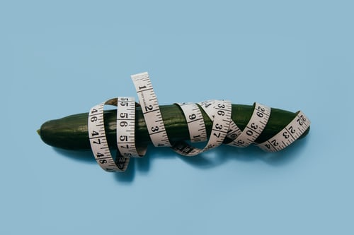

# Intrinsic Content Size
## What is it?

<br/>
<sub>Photo by Charles Deluvio<sub>

You may have come across intrinsicContentSize, perhaps through work with `UICollectionView` or similar. 

But what is it, and what can you do to improve you understanding of this for your journey in Swift?

# Terminology
frame: A rectangle which describes a view's location and size in it's superview's coordinate system
intrinsicContentSize: The natural size for the receiving view, considering only properties of the view itself

# The Basics
I've already created a [tips article](https://stevenpcurtis.medium.com/what-is-intrinsiccontentsize-anyway-swift-content-tips-672086cf770f) on intrinsic content size which covers something about `intrinsicContentSize`. I've never been happy with that article as it's just too abstract.

I just want to see what `intrinsicContentSize` and frame mean for views in `UIKit`. This is that article.

# The Example
In the attached [repo](https://github.com/stevencurtis/SwiftCoding/tree/master/IntrinsicContentSizeExample) is a simple view controller (placed in a `UINavigationController`) that gives us the opportunity to compare content sizes.

The setup on `viewDidLoad()` is really simple for the standard view controller that I've created:

```swift
super.viewDidLoad()
self.navigationController?.title = "Test"
self.sampleLabel.text = "Test"
```

I've placed some print statements for logging into the View Controller:

```swift
print(self.view.intrinsicContentSize)
print(self.view.frame)
print(self.navigationController!.navigationBar.intrinsicContentSize)
print(self.navigationController!.navigationBar.frame)
```

Which produces the following output to the console:

```swift
view intrinsicContentSize (-1.0, -1.0)
view frame (0.0, 0.0, 320.0, 568.0)
navigation bar intrinsicContentSize (-1.0, 44.0)
navigation bar frame (0.0, 20.0, 320.0, 44.0)
sampleLabel intrinsicContentSize (32.5, 20.5)
sampleLabel frame (144.0, 306.0, 32.5, 20.5)
```

If we change the `sampleLabel.text` to `"This is long text"` (`self.sampleLabel.text = "This is long text"`) we get the following output:

```swift
view intrinsicContentSize (-1.0, -1.0)
view frame (0.0, 0.0, 320.0, 568.0)
navigation bar intrinsicContentSize (-1.0, 44.0)
navigation bar frame (0.0, 20.0, 320.0, 44.0)
sampleLabel intrinsicContentSize (119.5, 20.5)
sampleLabel frame (100.5, 306.0, 119.5, 20.5)
```

As you can see the `sampleLabel` frame and `intrinsicContentSize` have changed, but there are some surprises here.

# Wait, what -1.0??
The first thing, first.
-1 means that [noIntrinsicMetric](https://developer.apple.com/documentation/uikit/uiview/1622486-nointrinsicmetric) is set.

This means that essentially there is no [intrinsic content size](https://developer.apple.com/documentation/uikit/uiview/1622600-intrinsiccontentsize) set - and interestingly that is always true for the view - in the [AutoLayout Guide](https://developer.apple.com/library/archive/documentation/UserExperience/Conceptual/AutolayoutPG/ViewswithIntrinsicContentSize.html) tells us that intrinsic content size simplifies layout, and conceptually [intrinsic content size](https://developer.apple.com/library/archive/documentation/UserExperience/Conceptual/AutolayoutPG/AnatomyofaConstraint.html#//apple_ref/doc/uid/TP40010853-CH9-SW21) doesn't make sense for `UIView`.

So intrinsic content size is based on the content you place in a view, and AutoLayout will automagically adapt to the content and how it changes - meaning that you need to use less constraints which has to be a good thing. 

# So a UIView doesn't have an intrinsic content size
Let us take a look at this by adding a `UIView` subclass.

```swift
@IBDesignable
class BlueView: UIView {
    override init(frame: CGRect) {
        super.init(frame: frame)
        setUpView()
    }
    
    required init?(coder: NSCoder) {
        super.init(coder: coder)
        setUpView()
    }
    
    func setUpView() {
        self.backgroundColor = .blue
    }
    
    override var intrinsicContentSize: CGSize {
        return CGSize(width: 50, height: 50)
    }
    
    override func prepareForInterfaceBuilder() {
        super.prepareForInterfaceBuilder()
        self.backgroundColor = .blue
    }
}
```

This means (drum-roll) that you don't need to define the width and height in the `Storyboard` - it is taken from the `intrinsicContentSize` which we've set as 50 * 50.

In this case 

You know...just like a `UILabel` - you don't usually need to set the width or the height, so we are just replicating this type of functionality.

Now of course when we log the `intrinsicContentSize` of the view we can see that (50.0, 50.0) will be printed.

If a view does not have an `intrinsicContentSize`, (like the plain `UIView` is also missing as in this example) `UIKit` won't be able to base the size of the shape on it's `intrinsicContentSize` (kind of a circular argument).

If there is an `intrinsicContentSize`, like in the case of a `UILabel` we can tryst `UIKit` to base the size of the element on `intrinsicContentSize` if no other constraints are provided.

# Conclusion
I hope this relatively deep-dive into `intrinsicContentSize` helps you out, and gives you an idea of how this can be helpfully used within your Apps!

Have a great morning/afternoon/evening/weekend!

If you've any questions, comments or suggestions please hit me up on [Twitter](https://twitter.com/stevenpcurtis) 
