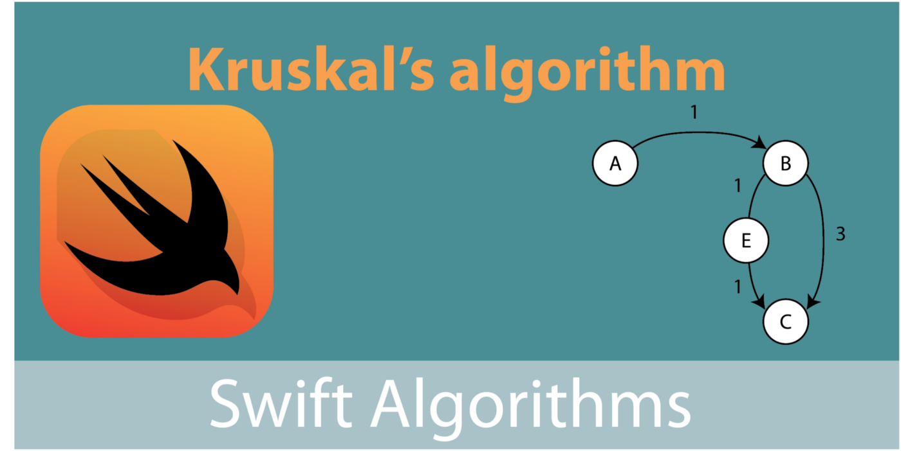
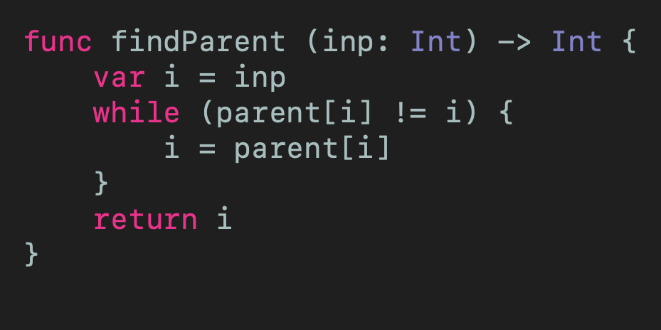

# Kruskal’s Algorithm in Swift
## Get the smallest edge!

 
Swift Coding Header

Kruskal’s is a minimum spanning tree algorithm. The approach is to pick the smallest edge repeatedly so long as there is not a cycle with the spanning tree created so far.

Let us see this in detail through an example, before giving that all-important Swift code (see the Gist towards the bottom of this article).

# Prerequisites

* Some experience of trees and graphs (a sprinkle of graph theory helps!)
* [Closures](https://medium.com/swift-coding/swift-closures-c14cb7aa2170) (one is used to define the minimum edge in the code below)

# Terminology
**Vertex**: A point where edges intersect or branch (also known as a node, plural vertices)
**Edges**: The connections between vertices, containing a weight
**Path**: A collection of edges and nodes between vertices
**Graph**: A collection of nodes and edges
**Spanning tree**: A spanning tree is a subset of a Graph, which has all the vertices covered with minimum possible number of edges

# Motivation
*Kruskal’s algorithm* is a greedy approach for finding a minimum spanning tree. This lends it to sorting, and it is certainly something the budding Computer Science student should know something about.

# Spanning tree
A spanning tree is a subset of the graph in question, that has all the vertices connected with a minimum number of edges

 
The original graph is on the left, with three spanning trees on the right

By definition spanning trees cannot have cycles.
A complete undirected graph can have maximum **n^n-2** number of spanning trees, where n is the number of nodes.

## Algorithm
1. Create a set of all the edges in the minimum spanning tree
While the set is not empty, and the spanning tree is not complete
1. Draw the edge of least weight, removing it from the set
2. Keep adding minimum weight edges as long as they don’t form a cycle (closed path)

## Implementation notes for using a matrix
We can count the number of edges, and since there will always be **n — 1** edges on a spanning tree we know to take that number of edges in total.
A crucial part of this is the function to make sure that the smallest candidate edge is not only not the smallest edge, but the two nodes that would be involved are not both already in the same set.
For example (in the diagram below) after the first two edges (**0-1** and **0-2**) have been chosen, the next smallest edge is **1–2**.

 
An example of Kruskal's algorithm

However, if this was chosen we would have a cycle.
To know this programatically, we set up a parent array.
Initially no node has a parent, so effectively points to itself:
`parent = [0,1,2,3,4]`

**Edge 1:**
**0 -> 2** with cost **1**
`parent = [2,1,2,3,4]`

i.e. **0** now has **2** as a parent (so the first element in the parent array is now **2**, showing that element **0** now has **2** as a parent)

**Edge 2:**
If we tried to pick the same edge as before (**0 -> 2**), the parent of both nodes would be the same node(**2**), which would indicate a cycle by definition.
So we pick the lowest edge without the same parent
**0 -> 1** with cost **2**
`parent = [2,1,1,3,4]`

**Edge 3:**
If we wanted to pick edge **1 -> 2** the parents of both of these nodes is the same! As before, picking that edge would create a cycle.
As a result we pick the next smallest edge, that from **3 -> 4** with cost **5**.
`parent = [2,4,1,4,4]`

**The find parent code:**
Because of the way creating a shared parent works, we will always eventually find a node that is its own ultimate parent. If not we would have a cycle in the graph, which is the situation we are trying to prevent.

 
[Click for Gist](https://gist.github.com/stevencurtis/3417158c0cdc5671810f6888f71f8198)

**Creating a shared parent**
With two nodes, we make the ultimate parent for the first node the second node. This gives us the following situation:

 
[Click for Gist](https://gist.github.com/stevencurtis/413f841d3e38d7f3d46131bed0c781ea)

**The code**

 
[Click for Gist](https://gist.github.com/stevencurtis/479f34b3a89b94f43c2abea844d6dbf4)

This code may be made much faster by using an adjacency matrix implementation of the graph, but that will be down to the developer to pick the best way for their particular use.

If you've any questions, comments or suggestions please hit me up on [Twitter](https://twitter.com/stevenpcurtis) 

Why not sign up to my [newsletter](https://subscribe.to/swiftcodingblog/)
