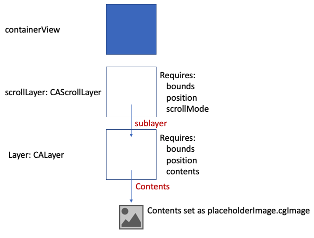

# CALayers: A guide
## Layer it on one another

# Before we start
This is an easy guide, intended to go into detail about CALayers and even something about the performance of the same.

Oh, you might also be interested in this [article](https://stevenpcurtis.medium.com/the-only-cagradientlayer-guide-you-will-ever-need-ab882e36b754)

Difficulty: Beginner | **Easy** | Normal | Challenging<br>
This article has been developed using Xcode 12.2, and Swift 5.3

## Keywords and Terminology
CALayer: A layer manages images and allows you to perform animations on those images
CAShapeLayer: A layer that draws a cubic Bezier spline in its coordinate space
CATextLayer: A layer that provides simple text layout and rendering of plain or attributed strings
UIView: An object that manages the content for a rectangular area on the screen

## The Repo
I've prepared a [Repo](https://github.com/stevencurtis/SwiftCoding/tree/master/LayersPerformance) which should help you follow along with this article!  

## The Theory
Within a view, a backing layer is used to process bitmap information about those views. Therefore `UIView` instances have a root `CALayer`, and a programmer can add further layers to a particular `UIView` instance and these are actually sublayers of the root `CALayer`.

**The initial performance benefit**
Since a layer is less heavyweight than a `UIView` instance they can help lead the way to better performance than instantiating a large `UIView` class.

Not only that but `CALayer` instances are part of the Core Animation library which is closer to the graphics hardware than much of `UIKit`, and can communicate with `OpenGL` APIs without using that (sometimes tricky) API, which is nice (although we do of course lose some of the `OpenGL` functionality while using a higher-level API). 

**But why?**
`CALayer` is there so bitmaps can be easily generated, processed by Core Graphics and `OpenGL` ultimately to be rendered by the GPU of the device. Many developers go some time without using `CALayer`, but there are some reasons that using `CALayer` is a fantastic way to improve your App.

**Animations**
Among the properties of `CALayer` you can animate `UIView` instances. Who doesn't want their app to look just a little better?

**CALayer subclasses**
`CALayer` has a number of subclasses provided to us from Core animation, and these are powerful in themselves. Here is a list of them:
* CAShapeLayer
* CAScrollLayer
* CATextLayer
* CATiledLayer
* CAReplicatorLayer
* CAGradientLayer

# The Project
This is a rather simple project with some code snippets that can help see how `CALayer` might work.

## Accessing a CALayer
Layers exist to do all sorts of great things. In order to manipulate this layer, I've added some `UIView` instances in the storyboard and connected up their outlets (this is all available in the  [Repo](https://github.com/stevencurtis/SwiftCoding/tree/master/LayersPerformance)).

The first `UIView` instance is called `firstView`. This can be accessed through the layer property on the `UIView`.

```swift
let layer: CALayer = firstView.layer
```

we then have access to a number of properties - one of the first that developers tend to use is the cornerRadius property.

therefore we can use the layer defined above, or  access the layer property directly on the `UIView`

```swift
firstView.layer.cornerRadius = 20
```

## Common CALayer Properties
**cornerRadius**
The cornerRadius property of a CALayer object is used to round the corners of a layer. This property specifies the radius of the rounded corners, and setting it to a value greater than zero will result in the layer having rounded corners.

```swift
box.layer.cornerRadius = 10.0
```

**shadow**
The shadow property of a CALayer object is used to add a shadow to the layer. This property specifies the appearance of the shadow, including its colour, size, and blur radius.

The example below sets a black shadow, and it will be offset to 2 points vertically below the layer. The `shadowRadius` means the shadow will be blurred with a radius of 4 points.

```swift
box.layer.shadowColor = UIColor.black.cgColor
box.layer.shadowOffset = CGSize(width: 0, height: 2)
box.layer.shadowRadius = 4.0
```
**borderColor & borderWidth**
The `borderColor` and `borderWidth` properties of a `CALayer` object are used to add a border around the layer. The `borderColor` property specifies the color of the border, while the `borderWidth` property specifies the width of the border.

```swift
box.layer.borderColor = UIColor.red.cgColor
box.layer.borderWidth = 2.0
```
**backgroundColor & opacity**
The `backgroundColor` and opacity properties of a `CALayer` object are used to set the background color and opacity of the layer, respectively.

```swift
box.layer.backgroundColor = UIColor.blue.cgColor
box.layer.opacity = 0.5
```

**Images**
The `CALayer` of a `UIView` instance can hold images using the contents property (in fact, other types of content such as text of a custom drawing can also be held)

```swift
box.layer.contents = UIImage(named: "tree.jpg")?.CGImage
box.layer.contentsGravity = kCAGravityResize
box.layer.masksToBounds = true 
layer.magnificationFilter - controls the behaviour of the enlarged image
```

**Properties to Improve performance**
`drawsAsynchronously`
False by default. Improves performance when a layer is repeatedly redrawn, which depending on your use can make a large difference to your user.
`shouldRasterize`
False by default. When set to true, only render the contents of the `CALayer` instance once in order to improve performance.
`rasterizationScale`
This is the scale at which the device will rasterize content. When `shouldRasterize` is set to True, the larger value of `rasterizationScale` will magnify the content and smaller values will reduce it.

**But…**
However, as ever with optimization strategies it is important to use them only when necessary as they can increase memory usage and/or degrade image quality and may not improve performance in all cases.

## CAShapeLayer
I've previously written about creating a [circular profile image](https://medium.com/swlh/create-a-circular-profile-image-swift-uikit-19ae4eaa8bb1).

Effectively a `UIBezierPath` can be drawn (which itself is a vector-based path that can be used to create vector shaped), itself path of `UIKit` rather than Core Graphics.

Which resulted in me writing the following function:
```swift
internal func drawRingFittingInsideSquareView() {
    let midPoint: CGFloat = bounds.size.width/2
    let lineWidth: CGFloat = 2
    let circlePath = UIBezierPath(
        arcCenter: CGPoint(x: midPoint, y: midPoint),
        radius: CGFloat(midPoint - (lineWidth/2)),
        startAngle: CGFloat(0),
        endAngle: CGFloat(Double.pi * 2),
        clockwise: true)
    if let sl = shapeLayer {
        sl.path = circlePath.cgPath
        sl.fillColor = UIColor.clear.cgColor
        sl.strokeColor = UIColor.lightGray.cgColor
        sl.lineWidth = lineWidth
        layer.addSublayer(sl)
    }
}
```

This particular example is not in the attached  [Repo](https://github.com/stevencurtis/SwiftCoding/tree/master/LayersPerformance), but does exist in the [circular profile image tutorial](https://medium.com/swlh/create-a-circular-profile-image-swift-uikit-19ae4eaa8bb1).

## CAScrollLayer
A traditional `UIScrollView` actually doesn't use a `CAScrollLayer`, and works by changing the `CALayer`'s bounds directly. 

If `UIScrollView` doesn't use `CAScrollLayer`, you may well ask what the point is in ever using one. A `CAScrollLayer` adjusts the bounds' origin to a value you specify rather than the bounds at all, it doesn't adjust the bounds at all because there isn't any need (contents can overflow the bounds).

The `scrollPoint` and `scrollRectToVisible` are implemented in a `CAScrollLayer` rather than a `UIScrollView`, and their implementation saves you from needing to code these yourself to implement layer scrolling. In effect, if you wish a user to interact with the content you should use a `UIScrollView`, but if you wish to create an animation (for example 3D animation) `CAScrollLayer` is a better choice and can be used in combination with other layer types.

We can note that the following two points are true:
- Set the scrolling mode to horizontal or vertical
- Scroll to a specific point

In the case of the implementation [in the Repo](https://github.com/stevencurtis/SwiftCoding/tree/master/LayersPerformance) there is a `containerView`



This translates into the following that I've put into `viewDidAppear`:

```swift
// access the layer
let layer: CALayer = containerView.layer
// set properties on the layer
layer.cornerRadius = 20
// more commonly used like this
containerView.layer.cornerRadius = 20
// set the image with the PlasholderImage from the asset catalog
if let placeholderImage = UIImage(named: "PlaceholderImage") {
    // set the image size
    let imageSize = placeholderImage.size
    // a new CALayer
    let layer: CALayer = CALayer()
    // set the layer bounds
    layer.bounds = CGRect(x: 0.0, y: 0.0, width: imageSize.width, height: imageSize.height)
    // set the layer position
    layer.position = CGPoint(x: imageSize.width/2, y: imageSize.height/2)
    // layer contents is set to be the cgImage of the placeholder Image
    layer.contents = placeholderImage.cgImage
    // the bounds of the scrollLayer
    scrollLayer.bounds = CGRect(x: 0.0, y: 0.0, width: 50.0, height: 50.0)
    // the initial position of the scrollLayer
    scrollLayer.position = CGPoint(x: self.view.bounds.size.width/2, y: self.view.bounds.size.height/2)
    // the scrollLayer can scroll horizontally
    scrollLayer.scrollMode = CAScrollLayerScrollMode.horizontally
    // add the layer to the scrollLayer
    scrollLayer.addSublayer(layer)
    // add the scroll Layer to the view
    view.layer.addSublayer(scrollLayer)
}

// instantiate with the target and selector
displayLink = CADisplayLink(target: self, selector: #selector(updateCADisplayLink))
// this is 15 frames per second
displayLink?.preferredFramesPerSecond = 15

// register the displayLink with a runLoop. Common is the mode to use for timers
displayLink?.add(to: .current, forMode: .common)
```

which requires the following property and function in order to function

```swift
// the view that will contain the CAScrollLayer
@IBOutlet weak var containerView: UIView!

// The CAScrollLayer
let scrollLayer: CAScrollLayer = CAScrollLayer()

// The CADisplayLink
var displayLink: CADisplayLink? = nil

// a property to store the trams;
var xTranslation: CGFloat = 0.0

// update at 15 fps
@objc func updateCADisplayLink() {
    // the new point to scroll to
    let newPoint = CGPoint(x: xTranslation, y: 0.0)
    scrollLayer.scroll(newPoint)
    xTranslation += 10.0
    // stop scrolling at the edge of the image
    // we can see that with the chosen placeholder image
    if xTranslation > 100.0 {
        // stor the CADisplayLink
        displayLink?.invalidate()
    }
}
```

## CATextLayer
A fast way of rendering text or attributed Strings. You may well wish to use `CATextLayer` for the speed of doing so.

As an example I whacked the following into `viewDidAppear`:

```swift
let myTextLayer = CATextLayer()
myTextLayer.string = "HI!"
myTextLayer.backgroundColor = UIColor.blue.cgColor
myTextLayer.foregroundColor = UIColor.cyan.cgColor
myTextLayer.frame = textContainerView.bounds
textContainerView.layer.addSublayer(myTextLayer)
```
  
 Since `CATextLayer` disables antialiasing which can alter the blurriness of the resultant text.
 
## AVPlayerLayer
 Holds an AVPlayer to play media files of type `AVPlayerItem`. That is, `AVPlayerLayer` is a layer used for playing videos. It is an underlying implementation used by high-level APIs which provides lower-level control over the display of the video.
 
 This involves the use of the following class:
     
 ```swift
final class PlayerView: UIView {
    override static var layerClass: AnyClass {
        return AVPlayerLayer.self
    }

    var playerLayer: AVPlayerLayer {
        return layer as! AVPlayerLayer
    }

    var player: AVPlayer? {
        get {
            return playerLayer.player
        }
    
        set {
            playerLayer.player = newValue
        }
    }
}
 ```
 
 In the main `UIViewController` class the `PlayerView` is initialized, and we will also require an AVPlayer. Note that at the top of the `UIViewController` we will need to import AVFoundation `import AVFoundation`.
 
 ```swift
 @IBOutlet weak var playerView: PlayerView!
var videoPlayer: AVPlayer? = nil
 ```
 Now unfortunately the video I've included has me speaking on it, but don't let that put you off if you decide to watch this from the repo. The following `playVideo` function is the one that does the work here and plays the video from the file in the App.
 
 ```swift
 func playVideo() {
    // path of the video in the bundle
    guard let path = Bundle.main.path(forResource: "AppInventorL1Setupemulator", ofType:"mp4") else {
        debugPrint("video.m4v not found")
        return
    }
    // set the video player with the path
    videoPlayer = AVPlayer(url: URL(fileURLWithPath: path))
    // play the video now!
    videoPlayer?.playImmediately(atRate: 1)
    // setup the AVPlayer as the player
    playerView.player = videoPlayer
}
 ```
 
## CAGradientLayer
 Used in my stateful button, and this is essentially another layer that can be added to any particular `UIView` subclass.
 
 The property can be something like `private let gradientViewLayer = CAGradientLayer()`
 
 and then added as a sublayer in the relevant view:
 	
```swift
// set the frame of the gradient view
gradientViewLayer.frame = self.bounds
// set the gradientViewLayer colours
gradientViewLayer.colors = [firstGradientColor, secondGradientColor]
// set the corner radius
gradientViewLayer.cornerRadius = self.cornerRadius
// the start point of the gradient
gradientViewLayer.startPoint = CGPoint(x: 0.0, y: 0.5)
// the end point of the gradient
gradientViewLayer.endPoint = CGPoint(x: 1.0, y: 0.5)
// insert the gradientViewLayer as a sublayer
self.layer.insertSublayer(gradientViewLayer, at: 0)
```

This particular example is not in the attached  [Repo](https://github.com/stevencurtis/SwiftCoding/tree/master/LayersPerformance) but does exist in the [circular profile image tutorial](https://medium.com/swlh/create-a-circular-profile-image-swift-uikit-19ae4eaa8bb1).

CAGradientLayer lets you draw any color to any color gradients, any direction you'd like, different kinds of gradients, different stops of gradients like multiple positions, and so forth, transparency, and similar.

## CAReplicatorLayer
 A stamp that can repeat sublayers with various transformations
 ```swift
 // The replicator layer
let replicatorLayer = CAReplicatorLayer()
// each square here is a CALayer
let redSquare = CALayer()
// set the background colour of the square
redSquare.backgroundColor = UIColor.red.cgColor
// each red square will be made up of thie CGRect
redSquare.frame = CGRect(x: 20, y: 20, width: 50, height: 50)
// there will be two red squares
replicatorLayer.instanceCount = 2
// the transform applied to the previous image, tx here is 110
replicatorLayer.instanceTransform = CATransform3DMakeTranslation(110, 0, 0)
// add the red square instances to the replicatorLayer
replicatorLayer.addSublayer(redSquare)
// add the replicatorLayer to the replicatorView
replicatorView.layer.addSublayer(replicatorLayer)
 ```
 
## CATransformLayer
`CALayer` does not manage the depth of a 3D hierarchy, so, therefore, does not flatten its sublayers. 

```swift
if let placeholderImage = UIImage(named: "PlaceholderImage") {
    let imageSize = placeholderImage.size
    // a new CALayer
    let layer: CALayer = CALayer()
    // set the layer bounds
    layer.bounds = CGRect(x: 0.0, y: 0.0, width: imageSize.width / 2, height: imageSize.height / 2)
    // set the layer position
    layer.position = CGPoint(x: imageSize.width/2, y: imageSize.height/2)
    // layer contents is set to be the cgImage of the placeholder Image
    layer.contents = placeholderImage.cgImage

    // create the transform layer
    let transformLayer = CATransformLayer()
    // set up a CATransform3DIdentity
    var perspective = CATransform3DIdentity
    // m34 = 1/z distance to projection plane (the 1/ez term)
    // http://en.wikipedia.org/wiki/3D_projection#Perspective_projection
    perspective.m34 = -1 / 500
    // transform to the perspective
    transformLayer.transform = perspective
    // set the position of the transform layer
    transformLayer.position = CGPoint(x: transformContainerView.bounds.midX, y: transformContainerView.bounds.midY)
    // add the layer
    transformLayer.addSublayer(layer)
    // add the transform layer as a subview
    transformContainerView.layer.addSublayer(transformLayer)
    // transform the layer
    layer.transform = CATransform3DMakeRotation(-0.5, 1, 0, 0)
}
```
 
## CAEmitterLayer
 This is the particle system that works in UIKit Apps, `CAEmitterLayer` which is a layer that emits, animates, and renders a particle system. It uses `CAEmitterCell` to define the particles, and `CAEmitterCell` (or cells) that can be assigned to the emitter layer.
 
 I wanted a load of black items to float up from the bottom of the screen. Granted, I didn't have to add a `emitterContainerView` to do so, but consistency is usually worth something.
 
 The following is added into `viewDidAppear`
 
 ```swift
 let confettiViewEmitterLayer = CAEmitterLayer()
// set the size of the emitter (where the particles originate)
confettiViewEmitterLayer.emitterSize = CGSize(width: emitterContainerView.frame.width, height: 2)
// set the shape to be a line, as opposed to be a rectange etc.
confettiViewEmitterLayer.emitterShape = CAEmitterLayerEmitterShape.line
// set the position of the emitter
confettiViewEmitterLayer.emitterPosition = CGPoint(x: emitterContainerView.frame.width / 2, y: emitterContainerView.frame.height / 2)
// set the cells that emit. In this case, a single cell
confettiViewEmitterLayer.emitterCells = [generateConfettiEmitterCell()]
// add the emitter layer as a subview
emitterContainerView.layer.addSublayer(confettiViewEmitterLayer)
 ```
 
 which does of course call the following function
 
 ```swift
 // this is a function that creates the CAEmitterCell
private func generateConfettiEmitterCell() -> CAEmitterCell {
    let cell = CAEmitterCell()
    // set the colour to be black
    cell.color = UIColor.black.cgColor
    // set the contents to be the placeholder image
    cell.contents = UIImage(named: "PlaceholderImage")?.cgImage
    // number of items created per second
    cell.birthRate = 4.0
    // the lifetime of a cell in seconds
    cell.lifetime = 14.0
    // how much the lifetime of a cell can vary
    cell.lifetimeRange = 0
    // the scale factor applied to the call
    cell.scale = 0.1
    // the range in which the scale factor can vary
    cell.scaleRange = 0.25
    // the intial velocity of the cell
    cell.velocity = -CGFloat(100)
    // the amount by which the velocity can vary
    cell.velocityRange = 0
    // emission angle
    cell.emissionLongitude = CGFloat.pi
    // the cone around which emissions can occur
    cell.emissionRange = 0.5
    // the rotational velocity applied to the cell
    cell.spin = 3.5
    // the variance of spin over a cell's lifetime
    cell.spinRange = 1
    return cell
}
 ```

# Conclusion

The [Repo](https://github.com/stevencurtis/SwiftCoding/tree/master/LayersPerformance) makes things rather easier to

But please do remember that this all doesn't work with `UIView's` animation framework since we are working at a lower level than that.

If you've any questions, comments, or suggestions please hit me up on [Twitter](https://twitter.com/stevenpcurtis) 
