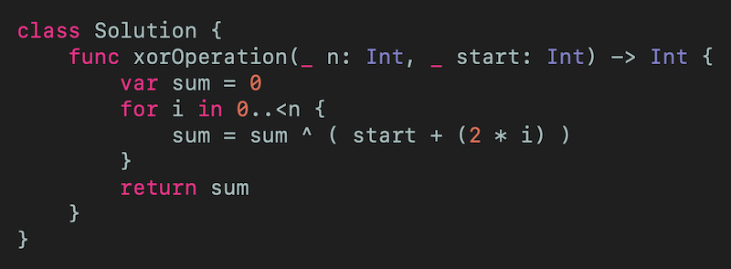
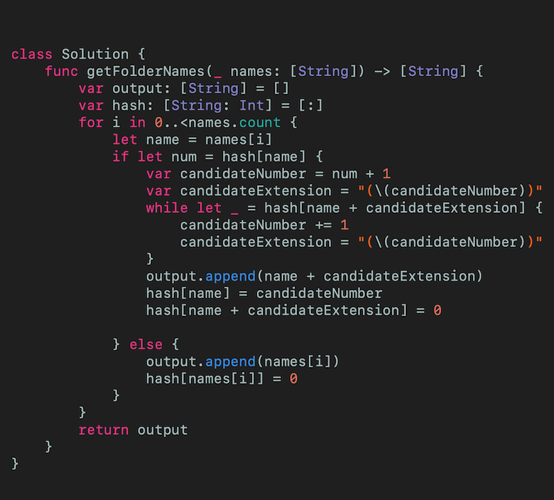
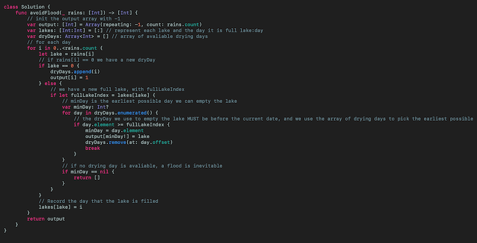
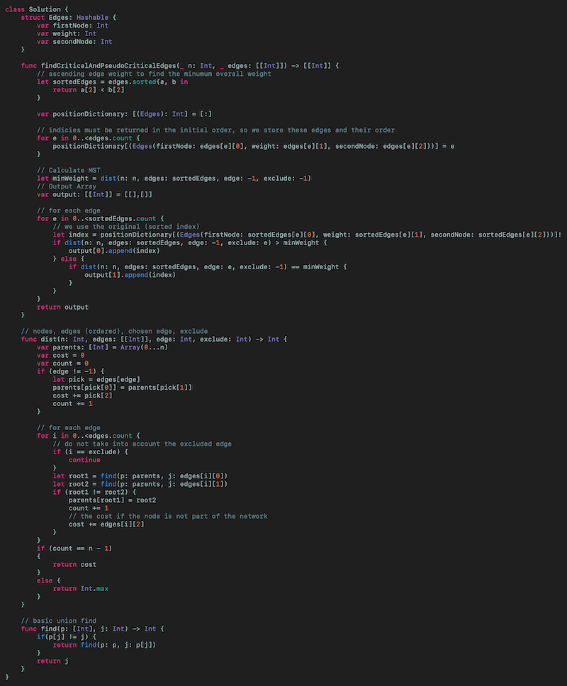

# LeetCode Weekly Contest 194 Swift solutions
## Serial

 
Photo by Abigail Miller on Unsplash

This article is about the 4 challenges in the LeetCode Weekly Contest 194. That is
* 1486 XOR Operation in an Array
* 1487 Making File Names Unique
* 1488 Avoid Flood in The City
* 1489 Find Critical and Pseudo-Critical Edges in Minimum Spanning Tree

The solutions assume some knowledge of [Big O notation](https://medium.com/@stevenpcurtis.sc/beginners-big-o-for-swift-developers-c1ca94f2520)

# The Problems
Each problem will be approached in turn, with a solution and also with articles explaining the tools, techniques and theory that will help you solve these problems yourself.

Let us get started!

## 1486. XOR Operation in an Array
This is a task around [logical operators](https://medium.com/@stevenpcurtis.sc/logical-operators-in-swift-b20a1e9b53af).

You are asked to return the bitwise `XOR` (which in Swift is ^) of an array where each element is defined by `nums[i] = start + 2 * i` where start is the initial element in the array, and i is the index of the array.

 
[Click for Gist](https://gist.github.com/stevencurtis/7f3e915c2b5b7838df10c4a02d475707)

You could of course rewrite this as a recursive function. 

## 1487. Making File Names Unique
Given an array of strings called `names` possessing size n there will be n unique `names`.

To ensure that each unique name is unique where there is a collision `(k)` is appended to the name of the file, using the smallest possible integer `k` to ensure that the solution is unique. 

The unique names are passed in an array of `Strings`.

To keep the solution fast enough a [dictionary](https://medium.com/@stevenpcurtis.sc/dictionary-in-swift-52b14d6cfa93) is used since the access in a dictionary in Swift is O(n).

We traverse across the input names and see if they are in our dictionary (here called `hash`). This dictionary also stores the previous `k` value that has been stored when constructing the file which is returned in the output `[String]` (that is, array of Strings).

 
[Click for Gist](https://gist.github.com/stevencurtis/485c483d95ea93cd0d6687d90d2261ee)

## 1488. Avoid Flood in The City

This is a medium problem, so we start to get into more tricky problem territory.

There are lakes that can only be filled once. We are given an array of rainy days that will fill the appropriate lake with water (as defined by `rains[i]` for lake `i`). If `rains[i] == 0` one lake (of your choice) can be emptied.
Now the main part of this problem is that a lake can only be filled once (until emptied!) and would be flooded if there is no other option but to fill a lake multiple times (and an empty array `[]` would be returned). 
A valid answer is an array of Integer that for each element i, if `rains[i] > 0` then `ans[i] == -1` and if `rains[i] == 0` then `ans[i]` becomes the Integer representing the lake that you choose to empty.

This problem must be completed quick enough to not get the dreaded "Time Limit Exceeded" error, and to enable this a [dictionary](https://medium.com/@stevenpcurtis.sc/dictionary-in-swift-52b14d6cfa93) is used to store each lake (and the day it is filled).

Now it makes sense  that each lake can only be filled once - if this is not true we return the empty array.

It is tricky because you need to use an array for dryDays rather than a set because the "soonest" available dry day must be picked for any particular lake in order to avoid floods.

 
[Click for Gist](https://gist.github.com/stevencurtis/b3553c4d18982b70a226ce8f3401f5f3)

## 1489. Find Critical and Pseudo-Critical Edges in Minimum Spanning Tree

This last problem is given a weighting of 7 by LeetCode - meaning that it is quite tricky.
The solution requires looking at Kruskal's Algorithm in Swift.
The graph is given to us as a set of Edges (startNode, weight, endNode) representing a weighted undirected connected graph with n verticies.
The basic algorithm is:
* Find the minimum using Kruskal's algorithm (using union-find to detect cycles)
* For each edge, if the the MST excluding this edge result in a higher weight, that edge is a critical edge. If the MST including the edge is the same weight as the minimum, it is added to the pseudo-critical edge list

We must calculate the Minimum Spanning Tree (MST) of this undirected graph (the algorithm here relies on a sorted array of edges), and make sure that the original index is used of the array (even though, as stated, they are sorted).

Calculate the minimum weight, and if edges are larger than this the are critical. Smaller edges are non-critical.

Here is the code:

 
[Click for Gist](https://gist.github.com/stevencurtis/08e744e46407c41b6b1d7fe3a7e18e7a)

If you've any questions, comments or suggestions please hit me up on [Twitter](https://twitter.com/stevenpcurtis) 

Feel free to sign up to my [newsletter](https://slidetosubscribe.com/embed/swiftcoding/)
