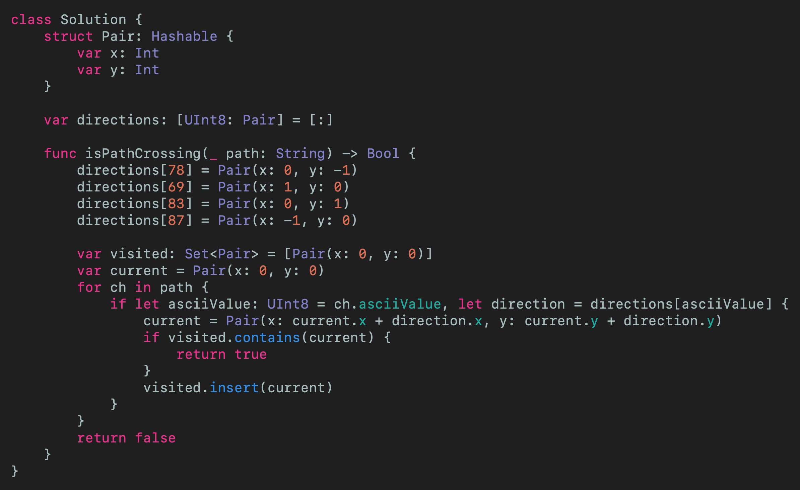
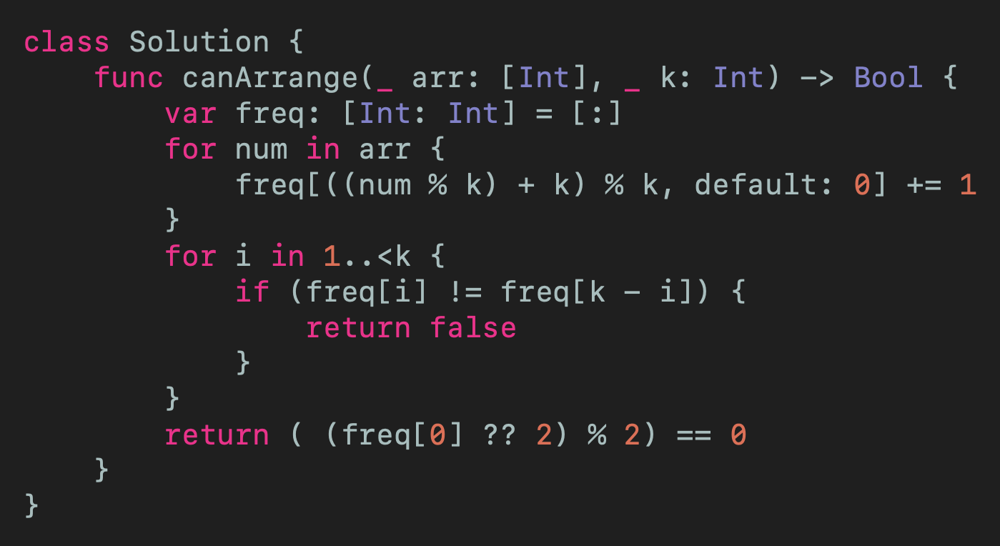
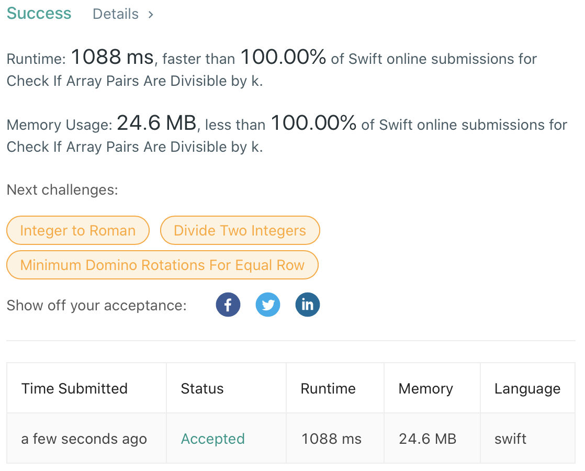
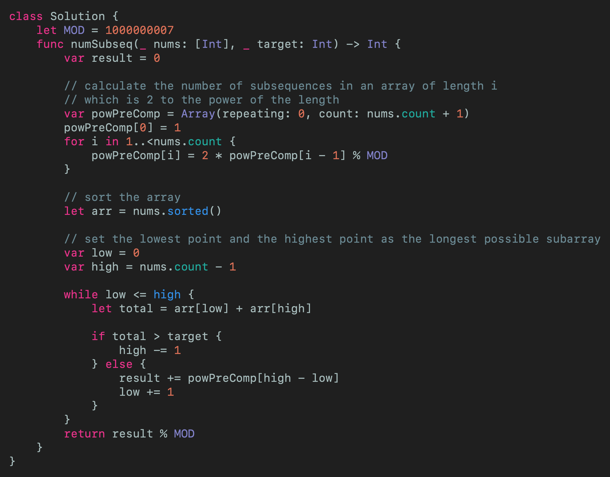
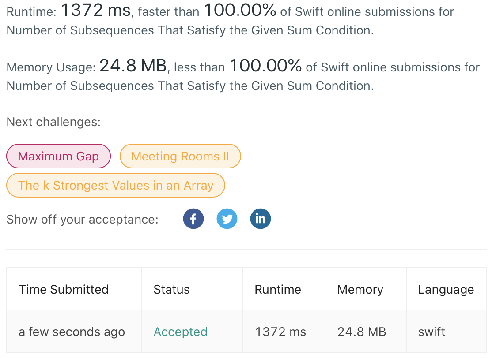
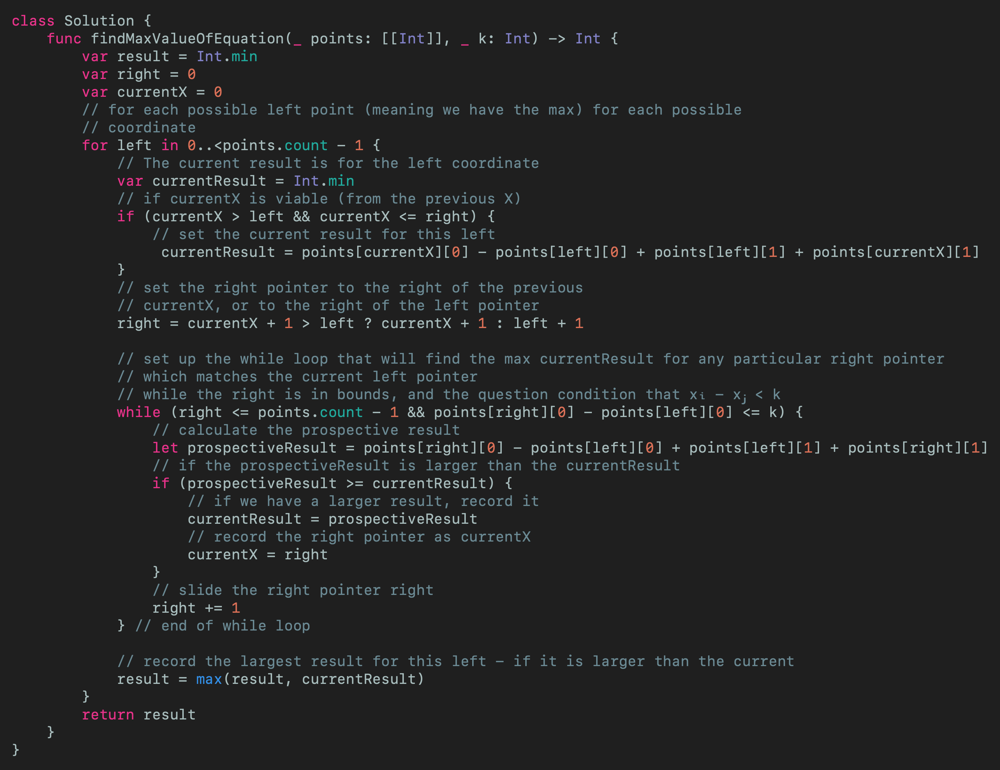
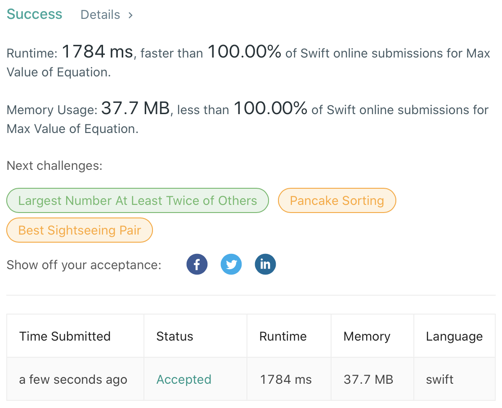

# LeetCode Weekly Contest 195 Swift Solutions
## Array subsequences feature!

 
Photo by Art Lasovsky on Unsplash

This article is about the 4 challenges in the LeetCode Weekly Contest 195. That is
* 1496 Path Crossing
* 1497 Check If Array Pairs Are Divisible by k
* 1498 Number of Subsequences That Satisfy the Given Sum Condition
* 1499 Max Value of Equation

The solutions assume some knowledge of [Big O notation](https://medium.com/@stevenpcurtis.sc/beginners-big-o-for-swift-developers-c1ca94f2520)

# The Problems
Each problem will be approached in turn, with a solution and also with articles explaining the tools, techniques and theory that will help you solve these problems yourself.

Let us get started!

## 1496. Path Crossing
I have used some knowledge of [Strings and Characters](https://medium.com/@stevenpcurtis.sc/strings-and-characters-in-swift-behind-the-scenes-e29bdc4d23a6) in Swift to make this solution a little faster.

Given a `String` of paths represented as the single characters 'N, 'S', 'E' and 'W' a path is formed from the origin (0,0) where 'N, 'S', 'E' and 'W' represent moving up, down, east and west respectively.

I decided to represent each location as a pair (and since there will be comparisons this will need to conform to [Hashable](https://medium.com/@stevenpcurtis.sc/swifts-hashable-fd57e6cd6426)) resulting in 
`struct Pair: Hashable {
    var x: Int
    var y: Int
}`

Now each character is matched to an ASCII number, that is 'N, 'S', 'E' and 'W' relates to 78, 69, 83 and 87 respectively. Therefore using a [Dictionary](https://medium.com/@stevenpcurtis.sc/dictionary-in-swift-52b14d6cfa93) of these pairs (with the ASCII `UInt8` as an equivalent for the character) can be stored using the following definition
`var directions: [UInt8: Pair] = [:]`
populated with
`directions[78] = Pair(x: 0, y: -1)
directions[69] = Pair(x: 1, y: 0)
directions[83] = Pair(x: 0, y: 1)
directions[87] = Pair(x: -1, y: 0)`

The logic of the code then becomes traverse the input `String` (say "NES" Nintendo fans) and check to see if each coordinate has previously been visited coordinate using a [`Set`](https://medium.com/@stevenpcurtis.sc/sets-in-swift-94cea4dd7c9f) 

which gave the result 

## 1497 Check If Array Pairs Are Divisible by k
Split an array of `Integer` `arr` into pairs, such that each pair is divisible by `k`. If the whole array can be split into such pairs, `True` should be returned (if not `False` should be returned).

To solve this in Swift, I've used a [Dictionary](https://medium.com/@stevenpcurtis.sc/dictionary-in-swift-52b14d6cfa93) as lookups are typically performed in O(1). 

So using [%](https://medium.com/@stevenpcurtis.sc/the-swifts-remainder-operator-and-mod-a1cf17836cb7) in Swift we traverse the array storing the frequency of `((num % k) + k) % k` in the dictionary (using Swift's natty default for dictionaries). This looks like;

`freq[((num % k) + k) % k, default: 0] += 1`

With the main part of the equation `((num % k) + k) % k` being so as `num % k` is not sufficient for negative `k`, so we add `k` and `%k` again as in the equation - making this correct for both positive and negative numbers.

Which gives the result

## 1498 Number of Subsequences That Satisfy the Given Sum Condition
Here the given sum condition is that the sum of the minimum and maximum element are less or equal than the `target`.

The question tells us that we should return the result `modulo 10^9 + 7`, which here I've coded as
`let MOD = 1000000007`.

This heart of the can be calculated with the following code snippet that precomputes 2^`n` (which is important as `n` can be large in this question):
`var powPreComp = Array(repeating: 0, count: nums.count + 1)
powPreComp[0] = 1
for i in 1..<nums.count {
    powPreComp[i] = 2 * powPreComp[i - 1] % MOD
}`
which results in the array `powPreComp` containing: `[1, 2, 4, 8, 16, 32, 64, ...]`

We don't care about the order of the elements - only them minimum and maximum within that sub array. Therefore effectively [1 2 3] = [2 3 1] = [ 3 2 1]  = [3 1 2] = [2 1 3].

I've gone for Swift's internal sort here

`let arr = nums.sorted()`

Now we can use a two-pointer solution to find the maxium array length with the answer - and keep moving that left pointer until the pointers cross. The solution is as follows:

Giving the following result:

## 1499 Max Value of Equation
We are given an array of `points` that represent the coordinates of points on a 2D plane (which is sorted on the x value).

The task is to find the maximum value of yi + yj + |xi - xj| where |xi - xj and 1 <= i < j <= points.length|

So given an array of points (x, y) there will be a set of pairs (1 element or more) where the difference between x₁ and x₂ is less than k - but which of these pairs will have the maximum  value yᵢ + yⱼ + |xᵢ - xⱼ|… out of all of the possible values?

Giving the following result:

# Conclusion
If you've any questions, comments or suggestions please hit me up on [Twitter](https://twitter.com/stevenpcurtis) 

Feel free to sign up to my [newsletter](https://slidetosubscribe.com/embed/swiftcoding/)
