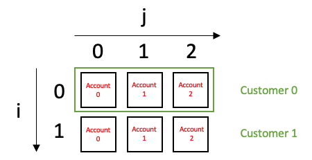
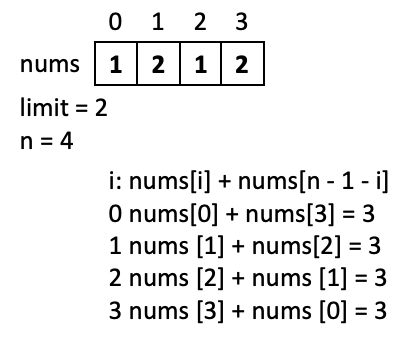

# LeetCode Weekly Contest 217 Swift solutions
## No specialist knowledge required


<sub>Photo by Sean O. @seantookthese</sub>

This article is about the 4 challenges in the LeetCode Weekly Contest 217. That isL

1672 Richest Customer Wealth<br>
1673 Find the Most Competitive Subsequence<br>
1674 Minimum Moves to Mkae Array Complementary<br>
1675 Minimize Deviation in Array<br>

The solutions may assume some knowledge of Big O notation

## The Problems
Each problem will be approached in turn, with a solution and also with articles explaining the tools, techniques and theory that will help you solve these problems yourself.

Let us get started!

## 1672 Richest Customer Wealth<br>
Accounts are given as a two-dimensional grid `accounts[i][j]` where the row represents the customer:


The question asks us to *sum* the accounts for each customer, and return the largest sum of each customer.

For this solution I've closen to use [reduce](https://medium.com/@stevenpcurtis.sc/create-your-own-reduce-function-in-swift-e92b519c9659) to create the sum of a customer's accounts. The solution is given in the following function:

```swift
class Solution {
    func maximumWealth(_ accounts: [[Int]]) -> Int {
    	// store the largest sum
        var largestWealth = 0
        // for each row representing a customer
        for customer in accounts {
        	// the largest sum becomes the largest out of the previus largest sum and the 
        	// sum of the current customer accounts
            largestWealth = max(largestWealth, customer.reduce(0, +))
        }
        // return the largest sum
        return largestWealth
    }
}
```

## 1673 Find the Most Competitive Subsequence<br>
This challenge tasks us with finding the most competitive subsequence in an arrray. We are using an array essentially as a [stack](https://medium.com/@stevenpcurtis.sc/a7defa317cea?source=friends_link&sk=adea0dc58c743b0ae1a1cc0182c100a2), but save space (and time!) since we are going to use this stack as the result array.

We find that the competitive subsequence is the smallest number.

We are given an array, and a length which represents how long the candidate subsequences are. A subsequence is a sequence generated from the array deleting some elements of the array without changing the order of the array.

So how can we find the smallest possible number result?

```swift
class Solution {
    func mostCompetitive(_ nums: [Int], _ k: Int) -> [Int] {
    	// the result is stored as an array of Int
    	// think of this as a Stack as we use this in the solution
        var result : [Int] = []
        // traverse the list, but tell inform us of the index as well as the element of each num
        for num in nums.enumerated() {
        	// if the current num is larger, pop off every element on the stack so long as there is space for the rest of the number in the array
        	// all the existing numbers on the 
            while (!result.isEmpty &&
                    result.last! > num.element &&
                    ((result.count - 1) + nums.count - num.offset) >= k
            ) {
                // Once we found there is a smaller number we can replace the top element stack, we can do a pop operation until we cannot pop, so long as we have space left in the array
                result.removeLast()
            }
            // If we do not have a complete number in the result array
            if result.count < k {
                //   Push the new smaller element into the stack and go on up to k
                result.append(num.element)
            }
        }
        // return the array of Integer
        return result
    }
}
```

## 1674 Minimum Moves to Make an Array Complementary<br>
An array is said to be complementary if for indicies i in an array nums has a `limit` and a length of `n`, then the following has the same result for all i, that is: nums[i] + nums[n - 1 - i].



In order to make the array complementary to a `Target` we can make a moves: 
* Replace an Integer from `nums` with a number from `1` to `limit`

So what is the *minimum* number of those moves that we would need to make a given `nums` array complementary (as defined above).

A complementary array `nums` consists of pairs `A = nums[i], B = nums[n - 1 - i] where A + B = Target`.
There are 5 possible solutions for (A, B) given a `Target`:
 1. `2 <= Target < min(A, B) + 1` both A and B need to be made smaller - so 2 operations are required
 2. `min(A, B) + 1 <= T < A + B` Make the larger of A and B smaller - one operation required
 3. `T = A + B` - No operations are needed
 4. `A + B < T < max(A, B) + limit` - Make the smaller of A and B larger - one operation required
 5. `max(A, B) + limit < T <= 1 * limit` - both A and B need to be larger - so 2 operations are required

we use a memo to store the moves, much in the way that we would for [subarray sum](https://github.com/stevencurtis/SwiftCoding/tree/master/LeetCode/PrefixSum).

```swift
class Solution {
    func minMoves(_ nums: [Int], _ limit: Int) -> Int {
        // a store for the left boundary of the cases for each num in nums, always at least 2 long
        // that is, the delta is the range of possible target values
        var memo: [Int] = Array(repeating: 0, count: 2 * limit + 2)
        // the length of the array
        let n = nums.count
        // for the first half of the array, as the second half is compared with n - 1 - i
        for i in 0..<n / 2 {
            // first element
            let a = nums[i]
            // second element
            let b = nums[n - 1 - i]
            // two moves more is the maxium possible moves here, would only need to perform this
            // for the first half of the array
            memo[2] += 2
            // add or subtract one move according to the 5 rules set out above
            memo[min(a, b) + 1] -= 1
            memo[a + b] -= 1
            memo[a + b + 1] += 1
            memo[max(a, b) + limit + 1] += 1
        }
        // create the result. The maximum would be a move for each number in the array
        // that is, replacing each number with a value from 1..limit for every case in the array
        var res = n
        
        var curr = 0
        // from 2 to 2 * limit, we accumulate the number of moves of all pairs to subtract or add as in prefix sum
        for i in 2...2 * limit {
            curr += memo[i]
            // find the smallest
            res = min(res, curr)
        }
        // return the result
        return res
    }
}
```

## 1675 Minimize Deviation in Array<br>

Given an array `nums` containing `n` positive integers return the minimum difference between all the elements in the array.

To limit the differencce there are two operations that can be performed on the Array:
* Divide an even element by 2
* Multiply an odd element by 2

*Theory*
The largest off factor of all the numbers can be calculated by  traversing the nums array, and this is `maxOdd` factor that we pick operations that will transform the list as close as possible to `maxOdd`. 

```swift
for i in nums {
    var j = i
    while j % 2 == 0 {
        j = Int(floor(Double(j / 2)))
    }
    maxOdd = max(maxOdd, j)
}
```

We then traverse the nums array, and we calculate a list of pairs defined as `var dev: [(Int, Int)] = []`

```swift
var dev: [(Int, Int)] = []
for i in nums {
    // i is odd
    if i % 2 == 1 {
        // if it will put the element and move maxOdd
        if 2 * i > maxOdd {
            // multiply the odd element by 2
            dev.append((2 * i - maxOdd, maxOdd-i))
        } else {
            dev.append((Int.max, maxOdd - 2 * i))
        }
    } else {
        // i is even
        if i < maxOdd {
            dev.append((Int.max, maxOdd - i))
        } else {
            var j = i
            while j % 2 == 0 && j > maxOdd {
                // divide the even element by 2 until it is less than maxOdd
                j = j / 2
            }
            if j < maxOdd {
                // if it is smaller than maxOdd, bring it back up
                dev.append((2 * j - maxOdd, maxOdd - j))
            }
        }
    }
}
```


We then sort the pairs, and work out the minimal sum:

```swift
dev.sort{$0>$1}
if dev.count == 0 {return 0}
var maxDown: [Int] = Array(repeating: 0, count: dev.count)
var cur = 0
for i in 0..<maxDown.count {
    cur = max(cur, dev[i].1)
    maxDown[i] = cur
}
var mn = (min(maxDown.last!, dev[0].0))
for i in 0..<maxDown.count - 1 {
    if dev[i + 1].0 != Int.max {
        mn = min(mn, (maxDown[i] + dev[i + 1].0))
    }
}
return mn
```


Putting it all together:

```swift
class Solution {
    func minimumDeviation(_ nums: [Int]) -> Int {
        var maxOdd = 0
        for i in nums {
            var j = i
            while j % 2 == 0 {
                j = Int(floor(Double(j / 2)))
            }
            maxOdd = max(maxOdd, j)
        }
        var dev: [(Int, Int)] = []
        for i in nums {
            // i is odd
            if i % 2 == 1 {
                // if it will put the element and move maxOdd
                if 2 * i > maxOdd {
                    // multiply the odd element by 2
                    dev.append((2 * i - maxOdd, maxOdd-i))
                } else {
                    dev.append((Int.max, maxOdd - 2 * i))
                }
            } else {
                // i is even
                if i < maxOdd {
                    dev.append((Int.max, maxOdd - i))
                } else {
                    var j = i
                    while j % 2 == 0 && j > maxOdd {
                        // divide the even element by 2 until it is less than maxOdd
                        j = j / 2
                    }
                    if j < maxOdd {
                        // if it is smaller than maxOdd, bring it back up
                        dev.append((2 * j - maxOdd, maxOdd - j))
                    }
                }
            }
        }
        
        // Minimal sum of pairs
        dev.sort{$0>$1}
        if dev.count == 0 {return 0}
        var maxDown: [Int] = Array(repeating: 0, count: dev.count)
        var cur = 0
        for i in 0..<maxDown.count {
            cur = max(cur, dev[i].1)
            maxDown[i] = cur
        }
        var mn = (min(maxDown.last!, dev[0].0))
        for i in 0..<maxDown.count - 1 {
            if dev[i + 1].0 != Int.max {
                mn = min(mn, (maxDown[i] + dev[i + 1].0))
            }
        }
        return mn
    }
}
```

## Conclusion
I hope this article has helped you out!

If you've any questions, comments or suggestions please hit me up on [Twitter](https://twitter.com/stevenpcurtis)
