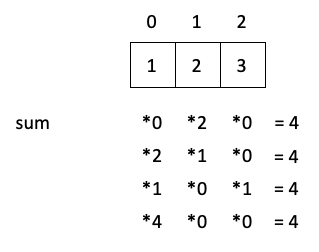
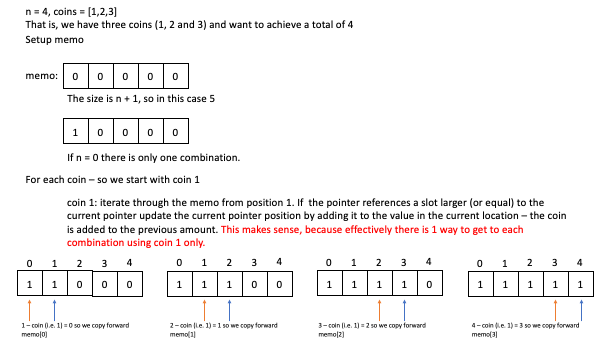
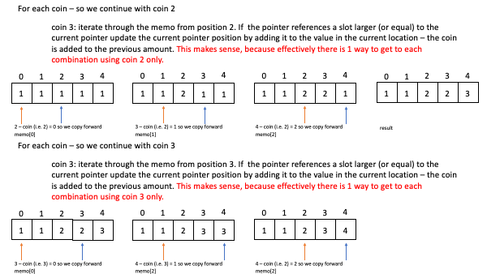

# Use Memorization for LeetCode problems

This is much like the famous coin change problem described in cracking the coding interview.

That challenge has the following problem statement:

```Given an infinite number of quarters(25 cents), dimes(10 cents),
 * nickels(5 cents), and pennies (1 cent), write code to calculate the number of
 * ways of representing n cents
 ```
 with a 
 
n = 4, coins: [1,2,3] ways = 4
n = 12, coins: [1,2,5,10] ways = 15
n = 4, coins: [2,5,3,6] ways = 1
n = 10, coins: [2,5,3,6] ways = 5

We have a solution:

```
func ways(n: Int, coins: [Int]) -> Int {
    var memo: [[Int]] = Array(repeating: Array(repeating: 0, count: coins.count), count: n)
    return coinChange(n, coins, 0, 0, &memo)
}

// cache is a concatenation of amount - index
func coinChange(_ target: Int, _ coins: [Int], _ ptr: Int, _ current : Int, _ memo: inout [[Int]])  -> Int {
    if (current == target) {
        print (memo)
        return 1 }
    if (ptr > coins.count - 1) {return 0}
    if (current > target) {return 0}
    var sum = 0
    if (memo[current][ptr] != 0) {
        return memo[current][ptr]
    }

    // add the current coin and don't move on
    sum += coinChange(target, coins, ptr, current + coins[ptr], &memo )
    // don't take the current coin, and therefore more on
    sum += coinChange(target, coins, ptr + 1, current, &memo)
    memo[current][ptr] = sum

    return sum
}
```
What is happening here (and it can be difficult to visualize, as we can choose infinite coins) is that there are 4 options for if coins 1 - 2 - 3 to equal 4. 

This gives us the following:

<br<

## Alternative momorization
We can, instead of using recursion in the way shown above move on each coin in turn


```swift
func ways(n: Int, coins: [Int]) -> Int {
    var memo: [Int] = Array(repeating: 0, count: n + 1)
    memo[0] = 1
    for coin in coins {
        for i in 1..<memo.count {
            if (i >= coin) {
                memo[i] += memo[i - coin]
            }
        }
    }
    return memo[n]
}
```

<br>
<br>

# Target sum
## The naive solution
This is problem number 494 on LeetCode, and asks us to caculate the number of ways to make a sum of Integers equal to target S. The wrinkle is that we have two symbols: + & - and we have to calculate how many ways there are to acheive the goal.

A naive solution can be represented with the following solution

```
class Solution {
    func findTargetSumWays(_ nums: [Int], _ S: Int) -> Int {
        return find(nums, S, 0, 0)
    }
    func find(_ nums: [Int], _ S: Int, _ currentTotal : Int, _ pointer: Int) -> Int {
        guard pointer < nums.count else { return S == currentTotal ? 1 : 0 }
        
        // either we add, or take away the next element from the list
        var sum = 0
        // add the element
        sum += find(nums, S, currentTotal + nums[pointer], pointer + 1)
        // remove the element
        sum += find(nums, S, currentTotal - nums[pointer], pointer + 1)
        // we can track where we are with a pointer
        // then we also need a sum of the current where we are at
        return sum
    }
}
```

the time complexity of this is O(2^n) and space is O(m) where m is the range of sum

So an example is [1, 1, 1, 1, 1] with a target of 5:
`sol.findTargetSumWays([1, 1, 1, 1, 1], 5)`

## The problem and opportunity
For each of the values in the nums array, we can either add or take away.

This means that we are performing the same calcuation *multiple* times. Let us look at our sample output:

```
-1+1+1+1+1 = 3
+1-1+1+1+1 = 3
+1+1-1+1+1 = 3
+1+1+1-1+1 = 3
+1+1+1+1-1 = 3
```

Taking the first two of these, and the sum we can see something important

[firsttwo](Images/firsttwo.png)

The first two elements are different, but the rolling sum is the same. That means we only need to calculate the rest (and the total) for the rest of the calculation.

In fact, we have repetition for each of the following (pointer, sum) pairs.

4 2
3 1
4 0
2 0
3 -1
4 -2

We can therefore solve this through using memorization.

This memorization needs to store both the pointer and the sum. 

This is tricky in that the sum can actually be negative, so a plain array is not usually suitable. In this we therefore can decide to use a dictionary, with the pointer as the key and sum as the value.


## The memorization
We can improve the implementation this by using memorization. This reduces time complexity to O(n * m) and space complexity to O(n * m) where m is the range of the sum.


```swift
class Solution {
    func findTargetSumWays(_ nums: [Int], _ S: Int) -> Int {
        var memo: [[Int : Int]] = Array(repeating: [Int: Int](), count: nums.count)
        return find(nums, S, 0, 0, memo: &memo)
    }
    func find(_ nums: [Int], _ S: Int, _ currentTotal : Int, _ pointer: Int, memo: inout [[Int : Int]]) -> Int {
        guard pointer < nums.count else { return S == currentTotal ? 1 : 0 }
        
        // either we add, or take away the next element from the list
        var sum = 0
        if memo[pointer][currentTotal] != nil {
            return memo[pointer][currentTotal]!
        }
        
        // add the element
        sum += find(nums, S, currentTotal + nums[pointer], pointer + 1, memo: &memo)
        // remove the element
        sum += find(nums, S, currentTotal - nums[pointer], pointer + 1, memo: &memo)
        // we can track where we are with a pointer
        // then we also need a sum of the current where we are at
        
        memo[pointer][currentTotal] = sum
        return sum
    }
}
```
# Further memorization
## 70 Climbing Stairs
The problem goes something like this:

If you are climbing stairs, it takes `n` steps to reach the top.

For each step, you can either climb 1 or two steps. How many ways can you take to climb to the top (not counting duplicates)?

This is much like the [Fibonnacii series](https://stevenpcurtis.medium.com/fibonacci-series-in-depth-using-swift-4699e940e89f) and there is a dynamic programming solution within that article, which is repeated here:

```swift

var cache : [Int] = [0]

func fib (_ num: Int) -> Int {
    guard num > 1 else { return num }
    if (cache.count > num) {
        return cache[num]
    }
    let fibNum = fibRec(num - 1) + fibRec(num - 2)
    cache.append(fibNum)
    return fibNum
}
```

of course this does not include the *LeetCode* method of wrapping the solution in a `Solution` class. 


# Conclusion


If you've any questions, comments or suggestions please hit me up on [Twitter](https://twitter.com/stevenpcurtis)
