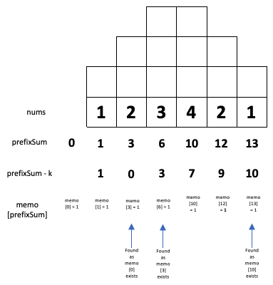

# Understanding Prefix Sum for LeetCode Problems
## This can be hard


# The background
There are number of prefix sum problems on LeetCode, and they tend to either be Medium or Hard problems. Is there a way this can be reasonably explained and coded? Let us have a go!

# The problem
Given aan array of Int `nums`, and an integer `k` calculate the number of continuous subarrays whose sum equals the integer `k`.

Continuous means that there cannot be a gap in the subarray.

# The explanation 
It is possible to create a memo using a [dictionary](https://medium.com/@stevenpcurtis.sc/dictionary-in-swift-52b14d6cfa93) to make our answer as efficient as possible (since a dictionary can be accessed in O(n)).


So the count is incremented if we have visited the prefixSum - 3 (and natually this must have came before the current num we are visiting, in continuous order).

So here is an example where k = 3 and nums is [1,2,3,4,2,1] which gives the result as 3, represented as three blue arrows here



# The solution
Here the dictionary is used to store the memo, as lookup can happen (on average) O(n). 
```swift
class Solution {
    func subarraySum(_ nums: [Int], _ k: Int) -> Int {
        // create a memo, that will store the sum frequences
        var memo : [Int:Int] = [:]
        // this can be the "start" of a contigous array, therefore memo starts as 0
        memo[0] = 1
        var prefixSum: Int = 0
        var count: Int = 0
        // for each Int num in nums
        for num in nums {
            // update the prefixSum - the sum of all elements up tot this point
            prefixSum += num
            // update the count of continuous subarrays
            // if we already
            count += memo[prefixSum - k, default: 0]
            // update the memo
            memo[prefixSum, default: 0] += 1
        }
        return count
    }
}
```
You can download the [repo from](https://github.com/stevencurtis/SwiftCoding/tree/master/LeetCode/PrefixSum)

## Conclusion
This is a really important theoretical tool for your programming toolbox, and is one that is often used for those people who have LeetCode problems to solve.
If you've any questions, comments or suggestions please hit me up on [Twitter](https://twitter.com/stevenpcurtis)