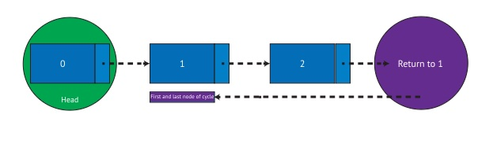
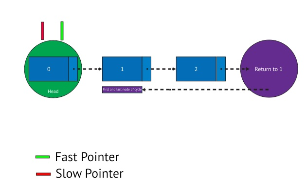
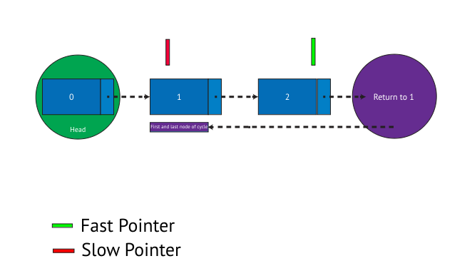
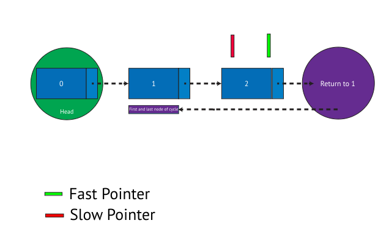

# Floyd’s Cycle Detection Algorithm In Swift
## Or how I forgot === in Swift



I'm not perfect my any means. I've just proven it with my latest attempt at a LeetCode problem.

Given the head of a linked list, determine if the linked list contains a cycle.

If you can see from the (too small, sorry) image above there is a cycle in that linked list

0 →1 →2 →1 →2…ad infinitum

So this challenge is about finding out if there is a cycle in any given linked list.

What could go wrong?

# Clue in the question?
Is this a clickbait subheading? Because the only clue in the question is that you are given a simple implementation of a linked list. That is, indeed, it. Or rather, here it is:

```swift
public class ListNode {
    public var val: Int
    public var next: ListNode?
    public init(_ val: Int) {
        self.val = val
        self.next = nil
    }
}
```

Here the initializer doesn't take in a parameter for the next node, so that property would need to be set directly. Other than that? There isn't too much to see here.

# Simple answers
Probably only simple people give simple answers. Using an array is a simplistic solution.

```swift
func hasCycle(_ head: ListNode?) -> Bool {
    var nodeArray: [ListNode] = []
    var current = head
    while current != nil {
        if nodeArray.contains(current!) {
            return true
        }
        nodeArray.append(current!)
        current = current?.next
    }
    return false
}
```

Unfortunately for LeetCode this is just too slow. Of course, potential commenter, there is also a poor habit of [force-unwrap](https://stevenpcurtis.medium.com/avoiding-force-unwrapping-in-swift-6dae252e970e) but for LeetCode problems I'm focusing on the algorithm here.

So although `append` is an O(1) operation in Swift, `contains` is an O(n) operation.

It just won't get through!

# Simple answers vol II
Let us get rid of that O(n) operation. `contains` for a `Set` has complexity of `O(1)` which is clearly an improvement. 

This is where I'm going to come unstuck!

```swift
class Solution {
    func hasCycle(_ head: ListNode?) -> Bool {
        var nodeSet: Set<ListNode> = []
        var current = head
        while current != nil {
            if nodeSet.contains(current!) {
                return true
            }
            nodeSet.insert(current!)
            current = current?.next
        }
        return false
    }
}
```

If I needed to whiteboard this I might feel a little silly. Because I'd probably write the algorithm and completely forget that to be added to a set your datatype would need to conform to [hashable](https://betterprogramming.pub/swifts-hashable-fd57e6cd6426). Like I said, nobody is perfect.

This conformance can be added to the `ListNode` through an extension

```swift
extension ListNode: Hashable {
    public func hash(into hasher: inout Hasher) {
        hasher.combine(val)
        hasher.combine(next?.val)
    }
}
```

I'm happy that if a `ListNode` has a value and next item it is the *same* item as another `ListNode` with an identical value I'd assume they can be placed at the same index in a hash table. It is clear that for some inputs this would crash (or infinite loop), but if we're coming up with a "simple" solution that doesn't quite work I guess it's OK.

Except even with that rather large caveat, it's still not OK. Since you need to conform to protocol [Equatable](https://betterprogramming.pub/swifts-equatable-and-comparable-protocols-54811114a5cf) for this to work.

```swift
extension ListNode: Equatable {
    public static func == (lhs: ListNode, rhs: ListNode) -> Bool {
        lhs.val == rhs.val && lhs.next?.val == rhs.next?.val
    }
}
```

I'm sure you've seen the problem here. I've taken the same "logic" as my Hashable which is an even worse idea here. One of LeetCode's example inputs is 1->1->1->... which obviously won't help.

If you don't remember how to use [equality](https://stevenpcurtis.medium.com/equality-in-swift-701c779fade4) in your chosen programming language then you'll get these issues.

```swift
extension ListNode: Equatable {
    public static func == (lhs: ListNode, rhs: ListNode) -> Bool {
        return lhs === rhs
    }
}
```

Would be much better.

This is probably why the idea of keeping the nodes in an `Set` is quite an overcomplicated idea for this particular challenge. It also doesn't really make sense when Floyd’s Cycle Detection Algorithm is a thing.

This is why I've put the subheading of I forgot the meaning of `===` in Swift. I genuinely did, and as a result developed code which would not work. 

# Floyd’s Cycle Detection Algorithm
I find most Two Pointer solutions for LeetCode-type problems [fairly prosaic](https://stevenpcurtis.medium.com/leetcode-weekly-contest-195-swift-solutions-242864add325) however since we are dealing with linked lists it really does seem that Floyd's detection algorithm is just a little more tricky to understand than the norm.

Both pointers start at 0 (our linked list is zero-indexed).

```swift
class Solution {
    func hasCycle(_ head: ListNode?) -> Bool {
        guard let head = head else { return false }
        var slow = head
        var fast = head
        while fast.next != nil && fast.next?.next != nil {
            slow = slow.next!
            fast = (fast.next?.next)!
            if slow === fast {
                return true
            }
        }
        return false
    }
}
```
So let us step through this algorithm


The slow pointer moves one space to `ListNode` 1, and the fast pointer moves 2 onto `ListNode` 2.



The slow pointer moves one space to `ListNode` 2, and the fast pointer moves 2 onto `ListNode` 2 (to `ListNode` 1 and then onto `ListNode` 2).



Since the pointers are on the same node we know there is a cycle in the linked list.

We are done there is a cycle!

I guess you'd like the complete code. No problem, here it is:

```swift
public class ListNode {
    public var val: Int
    public var next: ListNode?
    public init(_ val: Int) {
        self.val = val
        self.next = nil
    }
}

extension ListNode: Equatable {
    public static func == (lhs: ListNode, rhs: ListNode) -> Bool {
        return lhs === rhs
    }
}

extension ListNode: CustomStringConvertible {
    public var description: String {
        return self.val.description
    }
}

extension ListNode: Hashable {
    public func hash(into hasher: inout Hasher) {
        hasher.combine(val)
        hasher.combine(next?.description)
    }
}

class Solution {
    func hasCycle(_ head: ListNode?) -> Bool {
        var nodeArray: [ListNode] = []
        var current = head
        while current != nil {
            if nodeArray.contains(current!) {
                return true
            }
            nodeArray.append(current!)
            current = current?.next
        }
        return false
    }
}
```

# Conclusion
If you want to chase down the LeetCode problem that this article is related to, take a look at 141. Linked List Cycle.

Thanks for reading. 

If you've any questions, comments or suggestions please hit me up on [Twitter](https://twitter.com/stevenpcurtis) 
