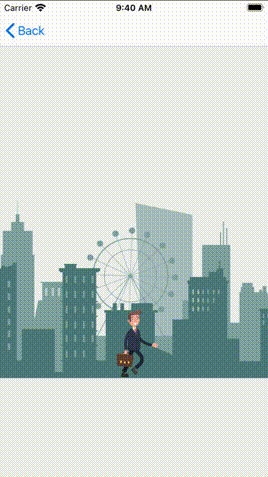
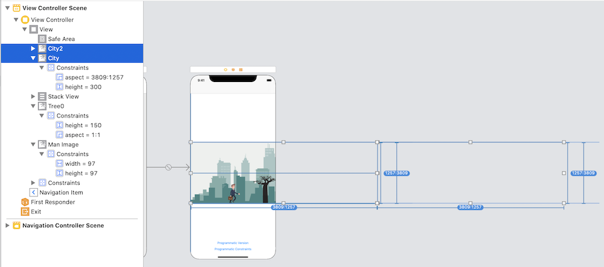

# Create a Loading Animation in Swift
## Walk on, with hope in your heart

<br/>

Difficulty: Beginner | Easy | **Normal** | Challenging<br/>
This article has been developed using Xcode 11.4.1, and Swift 5.2.2

Want to display a loading screen that can appear when you're doing some heavyweight operations? Perhaps you want this with when you are producing your App with a Storyboard, perhaps you want to do this programatically. Either way, this article has you covered.

Oh, and there are versions using `CABasicAnimation` and `UIView.animate` all nestled rather nicely in the attached [Repo](https://github.com/stevencurtis/SwiftCoding/tree/master/LoadingAnimation).


## Prerequisites: 
* You will be expected to be aware how to make a [Single View Application](https://medium.com/swlh/your-first-ios-application-using-xcode-9983cf6efb71) in Swift.
* This article uses [storyboard constraints](https://medium.com/@stevenpcurtis.sc/storyboard-constraints-18bcf6c5b0f9?sk=055faa48b727a50f54619ce7afc9be6f) and [loadview](https://medium.com/@stevenpcurtis.sc/write-clean-code-by-overriding-loadview-ac4f172163d0)

## Terminology:
Storyboard: A visual representation of the User Interface of an Application

# The goal
This article is about producing a rather wonderful loading screen, with an infinitely scrolling background and a tree moving in parallax.

How is it possible to do this, when using the `Storyboard`?

## The Storyboard version
A new `UIViewController` can be created that will have two background images side-by-side.

Now for this to adequately work, the background images must be at least double the width of the devices screen you wish to cover.

The `Storyboard` is created as below with constraints to keep the images horizontally centered in the screen. 

<br/>

The man has a single static image (we will animate walking this in code), as does the tree and both are in static positions on the screen that can be moved later.

**Animating the man**
Within `viewDidLoad()` we can animate the man walking (albeit on the spot), appending images from the asset catalog.

```swift
for i in 0...3 {
    guard let img = UIImage(named: String(i)) else {return}
    manImageList.append(img)
    if i == 3 {
        self.manImage.animationImages = self.manImageList
        self.manImage.animationDuration = 0.50
        self.manImage.startAnimating()
    }
}
```

**Fading in and out nicely**
Within the `Storyboard` I set the man, the tree and the two backgrounds as invisible - the alpha as `0.0` for each of them.

Then before we animate we have the following code, using `.curveEaseOut` to weight the animation towards the beginning of the animation.   

```swift
UIView.animate(withDuration: 0.5, delay: 0, options: [.curveEaseOut], animations: {
    self.tree0.alpha = 1.0
    self.city.alpha = 1.0
    self.city2.alpha = 1.0
    self.manImage.alpha = 1.0
    }, completion: nil)
```

with a similar animation to make them fade out just before the screen disappears. `viewWillDisappear` is called just before the view disappears from the screen, that is when we press one of the buttons to see the other implementation variants of this code!

```swift
override func viewWillDisappear(_ animated: Bool) {
    UIView.animate(withDuration: 0.20, delay: 0, options: [], animations: {
        self.tree0.alpha = 0.0
        self.city2.alpha = 0.0
        self.city.alpha = 0.0
        self.manImage.alpha = 0.0
    }, completion: nil)
}
```

**The animation**

Here I am using `CABasicAnimation` - the tricky part here is to make sure that the first city `city` and the second city `city2` move at the same pace across the screen, here working through the `self.city.frame.size.width`.

```swift
func animate(duration: TimeInterval, delay: TimeInterval) {
    UIView.animate(withDuration: 0.5, delay: 0, options: [.curveEaseOut], animations: {
        self.tree0.alpha = 1.0
        self.city.alpha = 1.0
        self.city2.alpha = 1.0
        self.manImage.alpha = 1.0
        }, completion: nil)
    
    // tree must disappear off the screen, so -50
    let treeAnimation = CABasicAnimation(keyPath: "position.x")
    treeAnimation.duration = duration
    let treeMid: Double = Double(self.city.frame.size.width)
    treeAnimation.fromValue = NSNumber(value: treeMid)
    treeAnimation.toValue = NSNumber(value: -50 )
    treeAnimation.repeatCount = .infinity
    self.tree0.layer.add(treeAnimation, forKey: "basic")
    
    let firstCityAnimation = CABasicAnimation(keyPath: "position.x")
    firstCityAnimation.duration = duration
    firstCityAnimation.fromValue = NSNumber(value: 0.0)
    firstCityAnimation.toValue = NSNumber(value: -1 * Int(self.city.frame.size.width))
    firstCityAnimation.repeatCount = .infinity
    self.city.layer.add(firstCityAnimation, forKey: "basic")

    let secondCityAnimation = CABasicAnimation(keyPath: "position.x")
    secondCityAnimation.duration = duration
    secondCityAnimation.fromValue = NSNumber(value: Int(self.city.frame.size.width) )
    secondCityAnimation.toValue = NSNumber(value: 0 )
    secondCityAnimation.repeatCount = .infinity
    self.city2.layer.add(secondCityAnimation, forKey: "basic")
}
```

This animate function is called from `viewDidAppear`, a good place to start the animation as the constraints are set (everything is in position) and this is called just before the view is visible to the user.

```swift
override func viewDidAppear(_ animated: Bool) {
    super.viewDidAppear(animated)
    animate(duration: 8.0, delay: 0.0)
}
```

## The programmatic version
The `ProgrammaticViewController` displays the items programmatically, but animating the man is done as before!

**Load the view**
Nothing much to see here, but this is much like my guide to programmatically create a view with [loadview](https://medium.com/@stevenpcurtis.sc/write-clean-code-by-overriding-loadview-ac4f172163d0).

``` swift
override func loadView() {
    self.view = UIView()
    self.view.backgroundColor = UIColor(displayP3Red: 238/255, green: 240/255, blue: 238/255, alpha: 1.0)
}
```

**Adding the objects**
I've added the objects in `viewWillAppear` since the frame of the `UIView` is set at this point, but it is before the user will see the screen. 

Here is the code:

```swift
override func viewWillAppear(_ animated: Bool) {
    super.viewWillAppear(animated)
    guard let backgroundImage = UIImage(named:"city") else {return}
    city.image = backgroundImage
    city.clipsToBounds = true
    
    guard let treeImage = UIImage(named: "tree0") else {return}
    tree0.image = treeImage
    tree0.clipsToBounds = true

    let navHeight = self.navigationController?.navigationBar.frame.height

    city.frame = CGRect(
        x: self.view.frame.origin.x,
        y: (self.view.frame.maxY / 2) - 150 + (navHeight ?? 00),
        width: 910,
        height: 300)
    self.view.addSubview(city)

    city2.image = backgroundImage
    city2.frame = CGRect(
        x: city.frame.size.width,
        y: (self.view.frame.maxY / 2) - 150 + (navHeight ?? 00),
        width: 910,
        height: 300)
    self.view.addSubview(city2)
    
    tree0.frame = CGRect(
        x: view.frame.width + 150,
        y: city.frame.maxY - (150),
        width: 150,
        height: 150)
    self.view.addSubview(tree0)
    
    manImage.frame = CGRect(
        x: view.frame.width / 2 - 48,
        y: city.frame.maxY - (97),
        width: 97,
        height: 97)
    self.view.addSubview(manImage)
    
    manImage.alpha = 0.0
    city2.alpha = 0.0
    city.alpha = 0.0
    tree0.alpha = 0.0

    animate()
}
```

**The animation**
Called once again from `viewWillAppear`, however I've put a little delay to make this seem like a nicer transition in my `NavigationBar` implementation here.

Here I'm using `UIView.animate`, and this means the animation is working in just a few lines!

```swift
func animate() {
    UIView.animate(withDuration: 0.5, delay: 0.5, options: [.curveEaseOut], animations: {
        self.tree0.alpha = 1.0
        self.city.alpha = 1.0
        self.city2.alpha = 1.0
        self.manImage.alpha = 1.0
        }, completion: nil)
    
    UIView.animate(withDuration: 8.0, delay: 0.0, options: [.repeat, .curveLinear], animations: {
        self.city.frame = self.city.frame.offsetBy(dx: -1 * self.city.frame.size.width, dy: 0.0)
        self.city2.frame = self.city2.frame.offsetBy(dx: -1 * self.city2.frame.size.width, dy: 0.0)
        self.tree0.frame = self.tree0.frame.offsetBy(dx: -1 * self.city2.frame.size.width * 2, dy: 0.0)
    }, completion: nil)
}
```

**BUT** by not using constraints...what happens when we rotate a device? Bad things happen! Of course I could do some various fixes for this, but why not just use constraints?

## The programmatic version using constraints
Animating the man is done as before, when we choose to load in views it doesn't matter if we have `constraints` or not.

In fact, all the animation is done in much the same way. 


**Load the view**
Now this is where we are creating the subviews in code. The `constraints` here mirror those set up in the `Storyboard` version detailed above. 

*Interesting* parts here might be considered to be `clipsToBounds` which keeps the `UIImage` within the bounds, and of course `translatesAutoresizingMaskIntoConstraints` to let the compiler know that we are taking care of the `constraints` here.

```swift
override func loadView() {
    self.view = UIView()
    self.view.backgroundColor = UIColor(displayP3Red: 238/255, green: 240/255, blue: 238/255, alpha: 1.0)
    
    let navHeight = self.navigationController?.navigationBar.frame.height
    
    guard let backgroundImage = UIImage(named:"city") else {return}
    city.image = backgroundImage
    city.clipsToBounds = true
    self.view.addSubview(city)
    city.translatesAutoresizingMaskIntoConstraints = false
    
    city2.image = backgroundImage
    city2.clipsToBounds = true
    self.view.addSubview(city2)
    city2.translatesAutoresizingMaskIntoConstraints = false
    
    let ratio: CGFloat = 3809 / 1257
    
    guard let treeImage = UIImage(named: "tree0") else {return}
    tree0.image = treeImage
    tree0.clipsToBounds = true
    tree0.translatesAutoresizingMaskIntoConstraints = false
    tree0.contentMode = .scaleAspectFit
    self.view.addSubview(tree0)
    
    manImage.contentMode = .scaleAspectFit
    manImage.translatesAutoresizingMaskIntoConstraints = false
    self.view.addSubview(manImage)
    
    NSLayoutConstraint.activate([
        city.heightAnchor.constraint(equalToConstant: 300),
        city.widthAnchor.constraint(equalTo: city.heightAnchor, multiplier: ratio),
        city.centerYAnchor.constraint(equalTo: self.view.centerYAnchor, constant: (navHeight ?? 0)),
        city.leadingAnchor.constraint(equalTo: self.view.leadingAnchor),
        city2.heightAnchor.constraint(equalToConstant: 300),
        city2.widthAnchor.constraint(equalTo: city2.heightAnchor, multiplier: ratio),
        city2.leadingAnchor.constraint(equalTo: city.trailingAnchor),
        city2.centerYAnchor.constraint(equalTo: self.view.centerYAnchor, constant: (navHeight ?? 0)),
        manImage.widthAnchor.constraint(equalToConstant: 97),
        manImage.heightAnchor.constraint(equalToConstant: 97),
        manImage.centerXAnchor.constraint(equalTo: self.view.centerXAnchor),
        manImage.bottomAnchor.constraint(equalTo: self.city.bottomAnchor),
        tree0.bottomAnchor.constraint(equalTo: self.city.bottomAnchor),
        tree0.heightAnchor.constraint(equalToConstant: 150),
        tree0.widthAnchor.constraint(equalTo: tree0.widthAnchor, multiplier: 1.0)
    ])
}
```

# Conclusion
This article is useful to help you with the difference between `Storyboard` and `constraints`. 

My take on this is that the version using `constraints` programatically is not only easier to write, but easier to maintain and change in the future. If you're not that familiar with walking away from the `storyboard` you might enjoy my [storyboard](https://medium.com/@stevenpcurtis.sc/avoid-storyboards-in-your-apps-8e726df43d2e) technical article.

It is rather complex in the description, but rather easy in the implementation. Take a look at the  attached [Repo](https://github.com/stevencurtis/SwiftCoding/tree/master/LoadingAnimation). It is a rather wonderful thing.

If you've any questions, comments or suggestions please hit me up on [Twitter](https://twitter.com/stevenpcurtis) 


