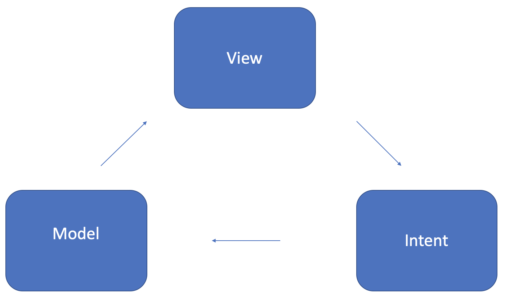
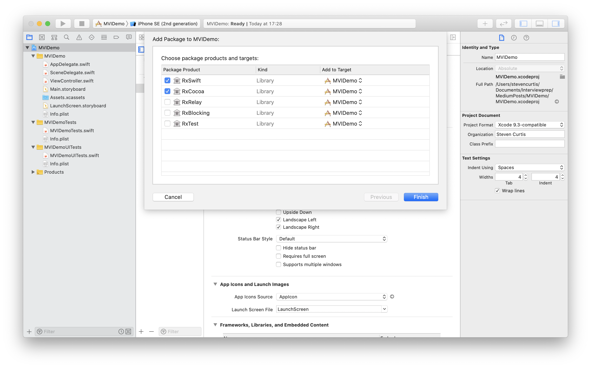
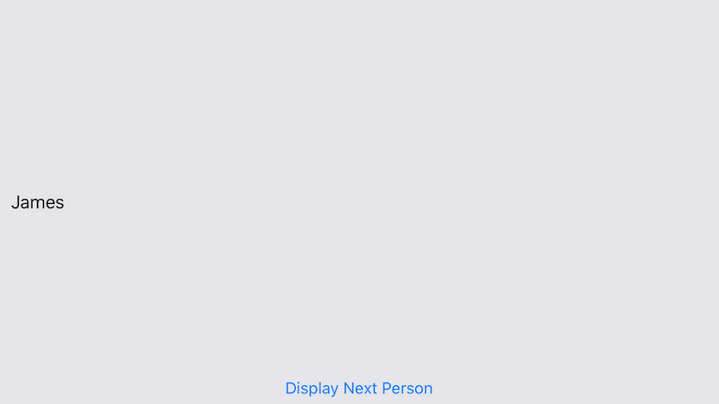
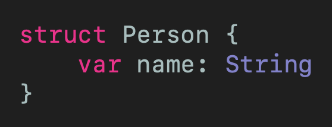
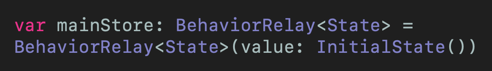
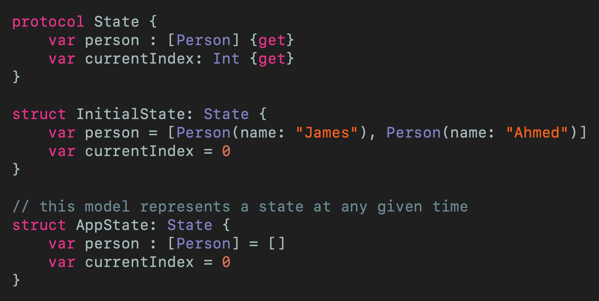
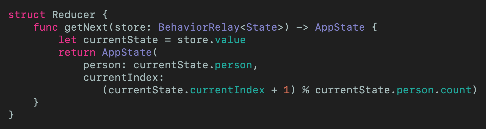
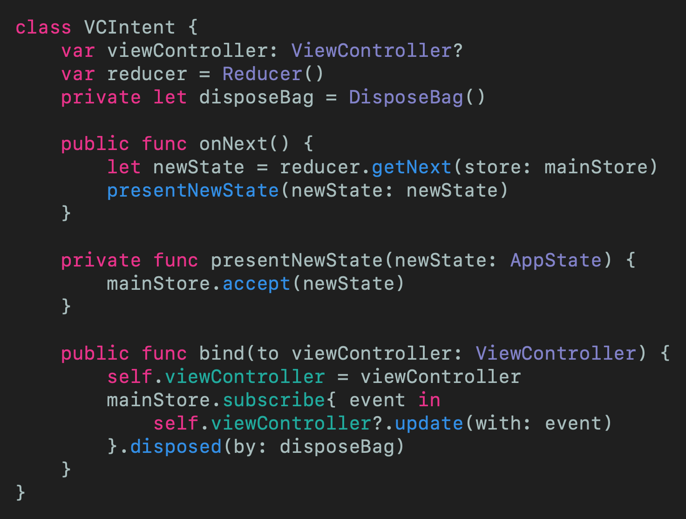
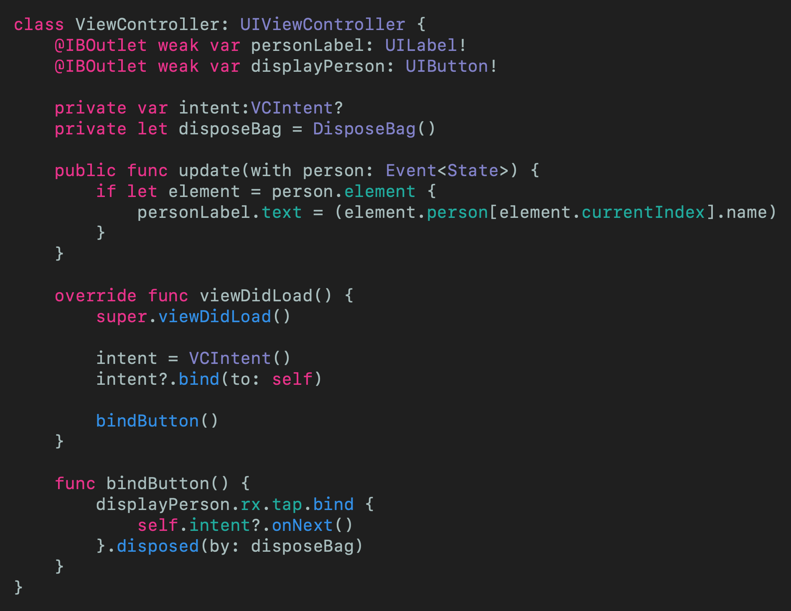

# The MVI Architecture Pattern in Swift
## Architect! With just RxSwift!

 
Photo by KOBU Agency on Unsplash

You might already be familiar with MVVM even MVVM-C and even (jokes) MVC. But MVI? You might have heard of the Flux, Redux and MobX React patterns and you might not be aware that in native development this is actually MVI.

This article explores a sample project that uses **just** RxSwift for implementation. Wow.

Difficulty: Beginner | Easy | **Normal** | Challenging

This article has been developed using Xcode 11.4.1, and Swift 5.2.2

## Prerequisites:
Coding in Swift Playgrounds (guide [HERE](https://medium.com/@stevenpcurtis.sc/coding-in-swift-playgrounds-1a5563efa089))
Some knowledge of RxSwift would be useful (guide [HERE](https://medium.com/swlh/using-mvvm-with-rxswift-baa38325b750))

## Terminology
MVI: Model-View-Intent
Redux: an open-source JavaScript library for managing application state

## The Motivation
MVI is another architecture that looks at improving the separation of concerns when developing Apps. Those traditional patterns, MVC, MVVM and others (VIPER) are traditionally [imperative](https://medium.com/@stevenpcurtis.sc/imperative-vs-declarative-swift-programming-7e3c77309f76). The issue is that reactive programming has become more popular, and there is nothing wrong with using [RxSwift to create the bindings on MVVM](https://medium.com/swlh/using-mvvm-with-rxswift-baa38325b750).

In steps MVI, an architecture that is designed with reactive programming, where the **model** represents the state - the source of truth - of the application. 

The Intent is an interaction that the user triggers and then carries out (often called a presenter, in architectures like MVP - which can be the ViewController in Apple's standard iOS architecture). 
In doing so, it makes code readable and extendable (through adding new states) and easy to debug by featuring a finite number of states.

## The Basics
 

The **View** Observes the user actions and is responsible for visibly representing the model to the user. 
This interaction modifies the **Intent** that manipulates the **Model**.

The more observant of you, will see that this is a cycle. You should also NOT be misled by the **Model**, the model here represents a unique state that represents the source of truth for the App.

### Models
* Models are not mutable
* Each model is a state
* Bugs focus on a particular state
* States can be made persistent

### Some Persistence options
* Realm
* CoreData

## A bit of RxSwift theory (for this project)
Every `Observable` sequence is just a sequence, and it can receive elements asynchronously.

### Subject
A subject maintains a list of observers, that it notifies of changes. This is part of KVO which is an implementation of the [observer pattern](https://medium.com/swift-coding/the-observer-pattern-in-swift-97a0e6fafa58). Each subject can either act as an observable sequence (see below) and can be subscribed to, or act as an observer which means that  new elements can be added onto a subject which will then be emitted to the subject subscribers - or a subject can act *as both*.

### Sequence
In RxSwift, everything is a sequence. This is the idea that everything is a data stream - it can even be referred to as an observable or a sequence (both of which are correct, we are dealing with sequences that are observable. These observable sequences can emit zero or more elements. If an error occurs, the observable sequence can emit an error event

### Control Events
RxSwift makes it easy to detect `UIControlEvents` through use of `rx.bind`. In this article, a `UIButton` called `displayPerson` and we can hook into this control by using `rx.tap`:

`displayPerson.rx.tap.bind {
    print ("tapped")
}.disposed(by: disposeBag)`

### DisposeBag
This ensures that the memory is properly deallocated and the memory correctly released. Disposables that are returned from subscriptions are usually inserted into a `DisposeBag()` that is declared in a view controller with the following property

`var disposeBag = DisposeBag()`

which when (the `DisposeBag()`) is deallocated it's deinit function calls dispose on all of the disposables it contains. Each disposable releases references to any observables that they are observing, which in turn release references to any disposables they are observing until everything is released.

### PublishRelay
This is a relay that (once subscribed to) emits all of the subsequently observed items to the subscriber. This is discrete from **BehavorSubject** that emits the most recently emitted item from the observable.
We can publish the event by using `accept(_ event: Element)` which is then emitted to observers of the observable.

### The project
This project will have a simple button, and then present information as stored in the model on the screen. This will just be a Person with a name - this is a basic project after all!

### Creating the project
We create a Single View Project, and then we need `RxSwift`.

We can use [Swift Package Manager](https://medium.com/@stevenpcurtis.sc/use-swift-package-manager-to-add-dependencies-b605f91a4990?sk=adfd10c7d96557b37ba6ea0443145eb4) for this, [https://github.com/ReactiveX/RxSwift](https://github.com/ReactiveX/RxSwift) Up to next Major.

Now if you are worried about the size of your binary only add RxSwift and RxCocoa - I'm insane so I added the lot (It is a good idea to add tests into your project in any case! However, if you do do this make sure to add RxBlocking and RxTest to your Test target rather than your App target - you have been warned!).

 

# The project step-by-step
## Binding the button
In order to bind a button we need to import `RxSwift` using `import RxSwift` at the top of your `ViewController` class. If you've already put a `UIButton` onto the view in the Storyboard the following code will work a treat (taken from the example `MVIDemo` written below).

## MVIDemo
Included in this repo I've made a nice little demo. I say "nice", but the user interface isn't. What also isn't particularly nice is what the app actually does.

Let me explain.

### The functionality of the App
This particular App will have a an array of people

`let people: [Person] = [Person(name: "James"), Person(name: "Ahmed")]`

and will display the Person's name one at a time starting with the initial person. When the next button is pressed, the next person in the list is displayed.

 

Yes it is ugly. 

Yes it is just a `UILabel` on an view controller with a `UIButton` at the bottom. There's nothing exciting here - this is intended to be an architecture article so please do bear with me.

### The code

Perhaps the *least* interesting part of this code is the person struct. This is going to be the `struct` that represents the person and has a property containing the person's name. Nice (isn't it?). This single struct actually represents the state of our App (as we will see in the next section of this code)

 
[Click for Gist](https://gist.github.com/stevencurtis/fd942a6a52b51a5dba7604a21fb51dfa)

The **store** is declared as a `BehaviourRelay` so can be observed, and is set up with an initial `State` value.

 
[Click for Gist](https://gist.github.com/stevencurtis/6a8a71e52e9ea5110c5a2b3949968885)

The `State` can be referred to as a `model` Being a nice Swift developer, using a
[protocol](https://medium.com/@stevenpcurtis.sc/protocols-in-swift-f46c31283b18) and conforming to that `protocol` for both the `InitialState` and `AppState` is the right things to do in that language.

 
[Click for Gist](https://gist.github.com/stevencurtis/96b2e712bb6528ffbdc7a57ed4add568)

The `reducer` is responsible for returning a new `State` based on the actions that it receives from the `Intent`. For simplicity (as we are not using any external frameworks here) the reducer is represented by a `struct` and the single action we have (that will go to the next name) will call a `func` that moves us to the next element. The **MVI model** (which is the `AppState`!) is immutable - meaning that the `getNext` `func` takes the current `State` from the store and bases a new `AppState` on that - returning a new initialised `State`.

 
[Click for Gist](https://gist.github.com/stevencurtis/68eca7fb387d47c9d5df81e72c318be1)

The **Intent** is also known as *actions*. Here the action is initialited by the user who clicks the button on the view controller. The *intent* then requests a new state from the reducer .

The **intent** is bound to the view controller through the bind function (that updates the view controller when the state is updated), and the main action (so to speak) is through the `onNext()` function.

That `onNext()` function requests the next state from the Reducer, and the logic here for presenting this new state has been separated out to a new function (`presentNewState`) that introduces the `newState` to the `mainStore` - and it is separated because this is a task that would be reused in a larger project.

 
[Click for Gist](https://gist.github.com/stevencurtis/b974961a502b3ec7505839ce38b2232d)

The role of the View Controller is to set up the Intent and bind the button to call the intent. In this implementation the intent is tightly coupled with the router, and there is certainly a call for using [dependency injection](https://medium.com/@stevenpcurtis.sc/learning-dependency-injection-using-swift-c94183742187) but this theoretical small project has been set up with the following:

 
[Click for Gist](https://gist.github.com/stevencurtis/f2fbbd015aa83511499d5bf9fa77d608)

# Conclusion
The MVI architecture is commonly in use in Android development, and is also in use where Redux is used in conjunction with React development.

This is a rather theoretical article that has looked at implementing such an architecture in Swift and iOS. If you are interested in separating the state from the logic of your App you might like to look at [SwiftUI](https://medium.com/@stevenpcurtis.sc/hello-world-swiftui-92bcf48a62d3), and there are of course many other iOS architectures ([MVC](https://medium.com/swift-coding/mvc-in-swift-a9b1121ab6f0) and [MVVM](https://medium.com/@stevenpcurtis.sc/mvvm-in-swift-19ba3f87ed45) are good places to start looking).

I hope you enjoyed reading this article, and it might have helped you in some way.

If you've any questions, comments or suggestions please hit me up on [Twitter](https://medium.com/r/?url=https%3A%2F%2Ftwitter.com%2Fstevenpcurtis)

Feel free to sign up to my [newsletter](https://medium.com/r/?url=https%3A%2F%2Fslidetosubscribe.com%2Fembed%2Fswiftcoding%2F)
