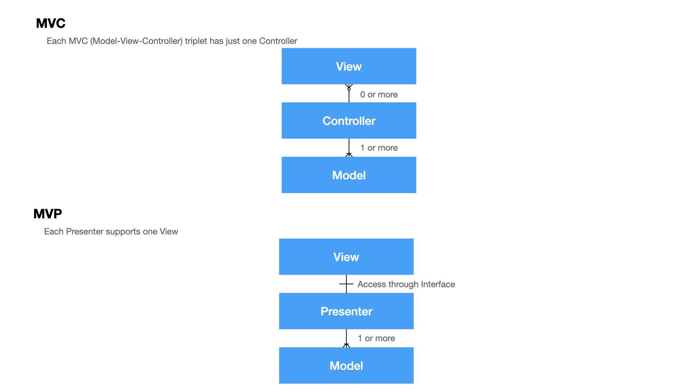

# The MVP Architecture for iOS
## Another avoidance of Massive View Controllers

With an MVP architecture implementation we clearly separate responsibilities in our App (something I've covered in my [SOLID article](https://stevenpcurtis.medium.com/the-solid-principle-applied-to-swift-974e29b94d23)).

Now there are a couple of variations of MVP, [Passive View](http://martinfowler.com/eaaDev/PassiveScreen.html) and [Supervising Controller](https://martinfowler.com/eaaDev/SupervisingPresenter.html), but this is intended to be a minimal viable implementation of this architecture (MV MVP, if you will) so take a look at the following and don't get bogged down in too much detail. 

Difficulty: Beginner | Easy | **Normal** | Challenging<br/>
This article has been developed using Xcode 12.5, and Swift 5.4

# Prerequisites:
* You need to be able to create a new Swift project, and a [Single View Application](https://medium.com/swlh/your-first-ios-application-using-xcode-9983cf6efb71)

# Terminology
MVC: Model, View and Controller
MVP: Model, View and Presenter

# The Difference Between MVC and MVP
## MVP
The role of the controller is replaced with a presenter. 

View is more loosely coupled to the model.
The presenter is responsible for binding the model to the view.
Interaction with the view is through an interface, making it easy to unit test.

The view creates the presenter in this particular implementation.

## MVC
Controllers are based on behaviours which can be shared across views
The view is stateless, and simply renders.

## The diagram
We expect there to be a single view for each presenter. Now of course the View can contain multiple `UIView` classes or similar, but this diagram should make the gist of this rather easier:

<br>

# Constructing the MVP
## View
The View delegates user interaction events to the presenter, and displays data passed by the presenter. By definition, the `UIViewController`, `UIView`, `UITableViewCell` all belong to the View layer.
## Presenter
The Presenter contains the presentation logic to handle user interactions, and tells the View layer what to present. 
**Expectations for iOS development**
We expect there to be one Presenter for each view controller when we use the MVP architecture in iOS development, and  we expect the Presenter to have no connection to the User Interface (so we would expect there to be no to have a `UIKit` dependency (therefore we don't import `UIKit`, and classically only `Foundation` will be imported)).

We nestle the Presenter classes behind a protocol interface. Now this does cause an issue when the action needs to be visible to Objective-C, but this is overcome by making the whole protocol visible to Objective-C by using the `@objc` keyword. This does only need to be done when a button has it's action in the presenter, so there's that.

# The Implementation
Oh, I set up this programatically (that is, not using the storyboard). Hope that gives you some indication of where this code is going...
## Who made who?
The View creates an instance of the Presenter, and passes an instance of itself to the Presenter.

## Creating the TableView
Creating `UITableView` within the MVP architecture means that we should avoid the `UIKit` dependency in the presenter. 
Therefore conformance to `UITableViewDataSource` and `UITableViewDelegate` should be within the View layer (I happen to have put this in the view controller).
This does not, however, preclude putting the data itself within the presenter so the View Controller needs to know about the presenter in order to ask for data.

## Responding to the User
The `UIButton` has an action nestled in the Presenter. The intention here is to make the View layer as plain as possible - if there were any logic to handle the press this would be in the Presenter so the Action has been placed here.

## Navigation
The Presenter is taking care of the navigation here. It certainly shouldn't be the View, since that should be the most basic view possible without unnecessary logic included.

# The Code
## MenuViewController

```swift
class MenuViewController: UIViewController {
    lazy var menuPresenter = MenuPresenter(view: self)
    let tableView = UITableView()
    
    override func loadView() {
        let view = UIView()
        self.view = view
    }
    
    override func viewDidLoad() {
        super.viewDidLoad()
        self.view.backgroundColor = .white
        
        let redView = UIView()
        redView.backgroundColor = .red
        redView.translatesAutoresizingMaskIntoConstraints = false
        self.view.addSubview(redView)
        
        tableView.translatesAutoresizingMaskIntoConstraints = false
        self.view.addSubview(tableView)

        
        let exampleButton = UIButton()
        exampleButton.setTitle("test", for: .normal)
        exampleButton.translatesAutoresizingMaskIntoConstraints = false
        exampleButton.addTarget(menuPresenter, action: #selector(menuPresenter.buttonPressed), for: .touchUpInside)
        self.view.addSubview(exampleButton)
        
        NSLayoutConstraint.activate([
            redView.topAnchor.constraint(equalTo: self.view.safeAreaLayoutGuide.topAnchor),
            redView.leadingAnchor.constraint(equalTo: self.view.leadingAnchor),
            redView.trailingAnchor.constraint(equalTo: self.view.trailingAnchor),
            redView.heightAnchor.constraint(equalToConstant: 50),
            tableView.topAnchor.constraint(equalTo: redView.bottomAnchor),
            tableView.leadingAnchor.constraint(equalTo: self.view.leadingAnchor),
            tableView.trailingAnchor.constraint(equalTo: self.view.trailingAnchor),
            tableView.bottomAnchor.constraint(equalTo: self.view.bottomAnchor),
            exampleButton.centerXAnchor.constraint(equalTo: redView.centerXAnchor),
            exampleButton.centerYAnchor.constraint(equalTo: redView.centerYAnchor),
            exampleButton.heightAnchor.constraint(equalTo: redView.heightAnchor),
            exampleButton.widthAnchor.constraint(equalTo: redView.widthAnchor)
        ])
        tableView.register(UITableViewCell.self, forCellReuseIdentifier: "cell")
        
        tableView.delegate = self
        tableView.dataSource = self
    }
}

extension MenuViewController: UITableViewDelegate {
    func tableView(_ tableView: UITableView, didSelectRowAt indexPath: IndexPath) {
        menuPresenter.showDetail(data: menuPresenter.data[indexPath.row])
        tableView.deselectRow(at: indexPath, animated: true)
    }
}

extension MenuViewController: UITableViewDataSource {
    func tableView(_ tableView: UITableView, numberOfRowsInSection section: Int) -> Int {
        menuPresenter.data.count
    }
    
    func tableView(_ tableView: UITableView, cellForRowAt indexPath: IndexPath) -> UITableViewCell {
        let cell = tableView.dequeueReusableCell(withIdentifier: "cell", for: indexPath)
        cell.textLabel?.text = menuPresenter.data[indexPath.row]
        return cell
    }
}
```

## MenuPresenter and MenuPresenterProtocol
```swift
@objc protocol MenuPresenterProtocol {
    var data: [String] { get }
    func buttonPressed()
    func showDetail(data: String)
}

class MenuPresenter: MenuPresenterProtocol {
    let data = ["a", "b", "c", "d"]
    weak var view: MenuViewController?
    
    @objc func buttonPressed() {
        print("Button Pressed")
    }
    
    init(view: MenuViewController) {
        self.view = view
    }
    
    func showDetail(data: String) {
        view?.navigationController?.pushViewController(DetailViewController(data: data), animated: true)
    }
}
```
# Improvements
We could place the Presenter behind an interface (you know, a protocol) which can enhance testability.

Some tests would really have helped this article, as would an editor.

However, the main thought from this project is having a coordinator would really have helped this project to enforce some level of Separation of concerns.

# Conclusion
This article is meant to give an indication of how to implement the Model-View-Presenter MVP model. This isn't the only possible implementation of that architecture for iOS (of course it isn't), but I hope it gives you an indication about *how* you might implement this architecture in your own project.

Remember: this is just a way of creating a project that avoids the classic "Massive View Controller" problem everyone talks about with MVC - and is by no means the only solution. 

Not the only solution, a minimal example? Yes it is, but I hope it has given you some guidance of how you might progress your own projects in future.

If you've any questions, comments or suggestions please hit me up on [Twitter](https://twitter.com/stevenpcurtis)
