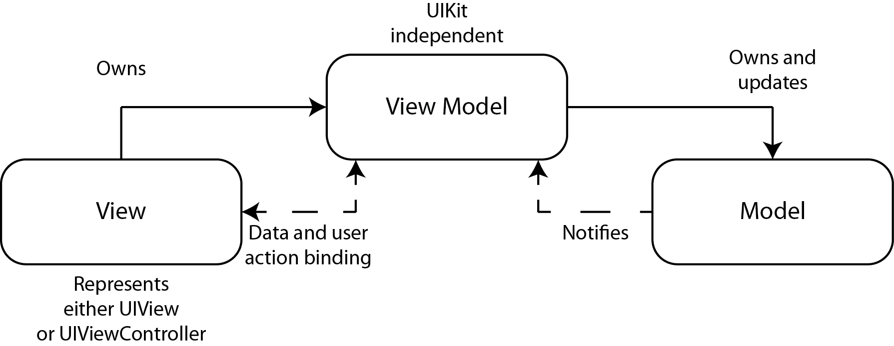

# MVVM Dependency Injection using Storyboards  
## Inject those dependencies!

<br/>
<sub>Photo by 
Nong Vang on Unsplash<sub>

# Terminology:
Dependency Injection: A technique that allows objects to receive other objects on which it depends
MVVM: An architecture pattern consisiting of Model, View and View-Model
Storyboard: A visual representation of the User Interface of an Application

# Useful prerequisites
- [Initializers](https://medium.com/@stevenpcurtis.sc/swift-initializers-fc12908a9106)
- [Segue](https://medium.com/@stevenpcurtis.sc/safe-segues-in-swift-6b38e08bdb9c)

# The example
Sorry, this is awful. I've created two simple screens, neither of which display anything for the user other than a button to go onto the next screen. The first screen makes a network call but prints out the result to the console. 

Simple stuff, right?

# MVVM
I'm going to implement MVVM as follows: <br> 
<br>

this means that we have three seperate sections - the View, View Model and Model.

This means that in this particular case I don't have a model. Why? Because the data I'm pulling in from the network manager will be decoded without a model - not a problem as I'll be showing how the View and ViewModel interact in this example.

## Testing
In order to show how this architecture might be tested, in the test target (so adding a new swift file in your project tests) I've added the following `MockViewModel`:

```swift
import Foundation
@testable import MVVMDI
class MockViewModel: ViewModel {
    var dataRequestClosure: (()->())?
    override func getData() {
        dataRequestClosure!()
    }
}
```

This means that when `getData()` is called in the mock the closure is called, which can be tested for. Excuse the force-unwrapping as this isn't [something that I'd usually do](https://medium.com/@stevenpcurtis.sc/avoiding-force-unwrapping-in-swift-6dae252e970e) but in a test target, well, I do it.

This is then tested with the following tests:

```swift
import XCTest
@testable import MVVMDI
import NetworkLibrary

class MVVMDITests: XCTestCase {
    var networkManager: MockNetworkManager<URLSession>?
    var vm: ViewModel?
    var vc: ViewController?

    override func setUpWithError() throws {
        networkManager = MockNetworkManager<URLSession>(session: URLSession.shared)
        vm = MockViewModel(networkManager: networkManager!)
        vc = ViewController(viewModel: vm!)
    }

    func testRequestData() {
        let expectation = XCTestExpectation(description: #function)
        (vm as! MockViewModel).dataRequestClosure = {
             expectation.fulfill()
        }
        vc!.getData()
        wait(for: [expectation], timeout: 3.0)
    }
}
```

So I'm swapping in the mock ViewModel with it's own injected dependencies (which on another day I might check is being called correctly from the ViewModel etc). The expectation is fulfilled when the `getData()` function is called. Nice! The `MockNetworkManager` is included as part of my package, which works well.

## Network Calls
In order to produce network calls I recommend using my [Network Manager](https://github.com/stevencurtis/networkmanager) which can then be added to a project by clicking on the blue project name and clicking on `Swift Packages` and the plus sign asd highlighted in the image below<br>

<br>

The full guide of how to add a Swift Package is in the [following guide](https://stevenpcurtis.medium.com/use-swift-package-manager-to-add-dependencies-b605f91a4990), but if you can handle it just add the link to the [Network Manager](https://github.com/stevencurtis/networkmanager).

## View Controller
The view controller is instantiated from the Storyboard, which will call the `required init` and create the viewModel:

```swift
required init?(coder: NSCoder) {
    super.init(coder: coder)
    self.viewModel = ViewModel(networkManager: NetworkManager<URLSession>())
}
```

now if we are creating a test instance of the view controller we need another initializer:

```swift
init(viewModel: ViewModel) {
    super.init(nibName: nil, bundle: nil)
    self.viewModel = viewModel
}
```

which in itself does the same, initiating a view controller - however in this instance it is injected (and you can see how that works in the test written above).

This gives us the full `ViewController` class as follows:
```swift
import UIKit
import NetworkLibrary

class ViewController: UIViewController {
    
    var viewModel: ViewModel?
    
    required init?(coder: NSCoder) {
        super.init(coder: coder)
        self.viewModel = ViewModel(networkManager: NetworkManager<URLSession>())
    }
    
    init(viewModel: ViewModel) {
        super.init(nibName: nil, bundle: nil)
        self.viewModel = viewModel
    }

    override func viewDidLoad() {
        super.viewDidLoad()
    }
    
    func getData() {
        viewModel?.getData()
    }
    
    override func viewDidAppear(_ animated: Bool) {
        super.viewDidAppear(animated)
        getData()
    }
}
```

The **ViewModel** on the other hand is also interesting. Here I'm using my [type erased](https://medium.com/@stevenpcurtis.sc/type-erasure-in-swift-8c109cbdd469) network manager which means that I can store my [generic](https://medium.com/better-programming/generics-in-swift-aa111f1c549) network manager as a property in the class. 

Here is how the initializer (and property) looks:

```swift
var network: AnyNetworkManager<URLSession>?

required init<T: NetworkManagerProtocol>(networkManager: T) {
    self.network = AnyNetworkManager(manager: networkManager)
}
```

So the generic network manager is passed through the initializer, and `AnyNetworkManager` works as a type of wrapper (which is that type erasure).

This is then used when `getData()` is called - and then there is a nice little bit of code that prints out the server respose to the console.

Yes - there [is a force-unwrap there](https://medium.com/@stevenpcurtis.sc/avoiding-force-unwrapping-in-swift-6dae252e970e) but I'm not suggesting that you do that in production code, this would usually be an if-let but is here in the demo code in any case.

```swift
import Foundation
import NetworkLibrary
class ViewModel{
    var network: AnyNetworkManager<URLSession>?
    required init<T: NetworkManagerProtocol>(networkManager: T) {
        self.network = AnyNetworkManager(manager: networkManager)
    }
    func getData() {
        let str = URL(string: "https://jsonplaceholder.typicode.com/todos/")!
        network!.fetch(url: str, method: .get, completionBlock: {result in
            switch result {
            case.failure(let error):
                print (error)
            case .success(let data):
                do {
                    let jsonObject = try JSONSerialization.jsonObject(with: data, options: JSONSerialization.ReadingOptions.mutableContainers)
                    if let jsonDict = jsonObject as? NSDictionary {
                        print (jsonDict)
                    }
                    if let jsonArray = jsonObject as? NSArray {
                        print (jsonArray)
                    }
                } catch {
                    // error handling
                }
            }
        })
   }
}
```

## Segue
When you press the button you can segue to a `NextViewController`. To create this view controller and view model the same applies - that is I'm using the same style of initializers as before. 

Want to see the code? Here it is:

```swift
class NextViewController: UIViewController {
    var viewModel: NextViewModel?
    
    required init?(coder: NSCoder) {
        super.init(coder: coder)
        self.viewModel = NextViewModel(networkManager: NetworkManager<URLSession>())
    }
    
    init(viewModel: NextViewModel) {
        super.init(nibName: nil, bundle: nil)
        self.viewModel = viewModel
    }

    override func viewDidLoad() {
        super.viewDidLoad()
        self.view.backgroundColor = .red
    }
}

class NextViewModel{
    var network: AnyNetworkManager<URLSession>?
    
    required init<T: NetworkManagerProtocol>(networkManager: T) {
        self.network = AnyNetworkManager(manager: networkManager)
    }
}
```
Which then allows you to create the same network calls as before

# Conclusion

Want a video? [Why not](https://youtu.be/J3YlwAUboeI)
Want the repo?

 If you've any questions, comments or suggestions please hit me up on [Twitter](https://twitter.com/stevenpcurtis) 