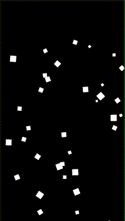
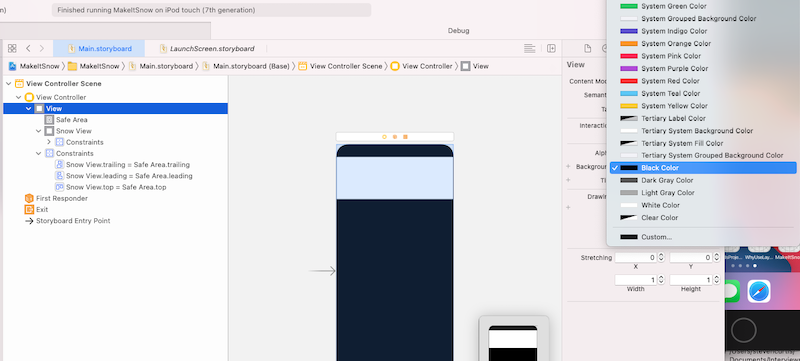

# Make it Snow With a Fun Festive iOS App
## Create it from Scratch, for fun!


This article is going to show you how to make a snowy App using Swift.

It is going to look like the following:



Let us get started!

Oh yes, if you just want to get to the code download from the [Repo](https://github.com/stevencurtis/SwiftCoding/tree/master/MakeItSnow).

#The tutorial
## Open Xcode
Select New>Project...
## Create a new project with the New App template

## Set up the project
Make sure you have the project set up as a Swift Project

## Set up the storyboard
Select `Main.storyboard`, and use the + to find a `UIView`

Drag that `UIView` onto the storyboard, and pin it to the top of the screen using the [techniques described here](https://medium.com/@stevenpcurtis.sc/connect-storyboard-objects-to-code-4105f9b99bba)<br>
Make a height of around 150.<br>
Make the background of the main view back (this is going to be a dark night!), and also make the color of your new `UIView` to be black as well
<br>
Connect the `UIView` by selecting the assistant editor with control-option-commmand-enter and dragging to the code. Call this view `snowView` and connect:

Now you can replace the code in the view controller with the following:
```Swift
import UIKit

class ViewController: UIViewController {

    @IBOutlet weak var snowView: UIView!
    override func viewDidLoad() {
        super.viewDidLoad()
        // Do any additional setup after loading the view.
    }

    override func viewDidAppear(_ animated: Bool) {
        super.viewDidAppear(animated)
        let snowViewEmitterLayer = CAEmitterLayer()
        // set the size of the emitter (where the particles originate)
        snowViewEmitterLayer.emitterSize = CGSize(width: snowView.frame.width, height: 2)
        // set the shape to be a line, as opposed to be a rectange etc.
        snowViewEmitterLayer.emitterShape = CAEmitterLayerEmitterShape.line
        // set the position of the emitter
        snowViewEmitterLayer.emitterPosition = CGPoint(x: snowView.frame.width / 2, y: snowView.frame.height / 2)
        // set the cells that emit. In this case, a single cell
        snowViewEmitterLayer.emitterCells = [generateSnowEmitterCell()]
        // add the emitter layer as a subview
        snowView.layer.addSublayer(snowViewEmitterLayer)
    }


    // this is a function that creates the CAEmitterCell
    private func generateSnowEmitterCell() -> CAEmitterCell {
        let cell = CAEmitterCell()
        // set the colour to be white
        cell.color = UIColor.white.cgColor
        // set the contents to be a white color
        cell.contents = UIColor.white.image(CGSize(width: 55, height: 55)).cgImage
        // number of items created per second
        cell.birthRate = 9.0
        // the lifetime of a cell in seconds
        cell.lifetime = 14.0
        // how much the lifetime of a cell can vary
        cell.lifetimeRange = 0
        // the scale factor applied to the call
        cell.scale = 0.1
        // the range in which the scale factor can vary
        cell.scaleRange = 0.1
        // the intial velocity of the cell
        cell.velocity = CGFloat(100)
        // the amount by which the velocity can vary
        cell.velocityRange = 0
        // emission angle
        cell.emissionLongitude = CGFloat.pi
        // the cone around which emissions can occur
        cell.emissionRange = 0.5
        // the rotational velocity applied to the cell
        cell.spin = 3.5
        // the variance of spin over a cell's lifetime
        cell.spinRange = 1
        return cell
    }

}

// an extension to create a solid image from a color
extension UIColor {
    func image(_ size: CGSize = CGSize(width: 1, height: 1)) -> UIImage {
        return UIGraphicsImageRenderer(size: size).image { rendererContext in
            self.setFill()
            rendererContext.fill(CGRect(origin: .zero, size: size))
        }
    }
}
```

# Conclusion
It is a fun Christmas time for everyone! I hope that you have enjoyed coding this year, and are going to have fun through the New Year and beyond!

I appreciate this was just a little but of fun, but I hope that it has brought some cheer to your year!

If you've any questions, comments or suggestions please hit me up on [Twitter](https://twitter.com/stevenpcurtis)
