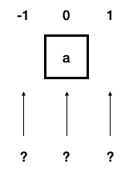

# Safe Swift Arrays
## When you go off the end, be safe

Difficulty: Beginner | **Easy** | Normal | Challenging
This article has been developed using Xcode 11.5, and Swift 5.2.4

## Keywords and Terminology
Array: an ordered series of objects which are the same type

# The problem
It is possible to "run off the end" of an array. This means that that you can get a nasty runtime crash which will throw your user out of the nice iOS App experience that they had. 



There are various solutions to this problem. In this article, I'm going to cover just one: An extension that makes the use of any Array.

# The Solution
By placing the solution in an extension, we can make sure that it is available anywhere in your project. That would be awesome!

We can have it something like the following:
```swift
extension Array {
    subscript(safe index: Index) -> Element? {
        if indices.contains(index) {
            return self[index] as Element
        }
        return nil
    }
}
```

For this example I've used a Playground with Tests [set up using this method](https://medium.com/macoclock/test-driven-development-tdd-in-swift-b903b31598b6) - but if you create a new Playground and copy-paste the code you'll be fine. 

# But that isn't enough
It never is, is it? We should have a test or series of tests that will make sure that our extension works properly. What are those tests? Just look at the code below:

```swift
class MyTests: XCTestCase {
    var array: [String]!
    override func setUp() {
        super.setUp()
        array = ["a"]
    }
    func testLess() {
        XCTAssertEqual(array[safe: -1], "a")
    }
    
    func testFirst() {
        XCTAssertEqual(array[safe: 0], "a")
    }
    
    func testLast() {
        XCTAssertEqual(array[safe: 1], "a")
    }
}

MyTests.defaultTestSuite.run()
```

# Conclusion
It is really important that your code does not crash for your user. Now in order to do so, you might use the code above. 

I hope that helps you, and you can be safe in your arrays. Thank you and goodnight!

If you've any questions, comments or suggestions please hit me up on [Twitter](https://twitter.com/stevenpcurtis) 
