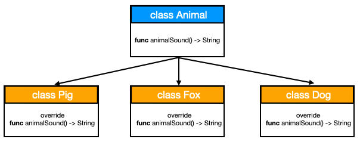

# Method Dispatch in Swift
## Runtime or Compile time?

<br/>
<sub>Photo by Manja Vitolic<sub>

Difficulty: Beginner | Easy | **Normal** | Challenging<br/>
This article has been developed using Xcode 11.5, and Swift 5.2.4

## Prerequisites: 
* You will be expected to be aware how to make a [Single View Application](https://medium.com/swlh/your-first-ios-application-using-xcode-9983cf6efb71) in Swift.
* You should know something about [Protocols](https://medium.com/@stevenpcurtis.sc/protocols-in-swift-f46c31283b18) in Swift
* It would be useful to understand something about [Polymorphism](https://stevenpcurtis.medium.com/polymorphism-in-swift-3b35d354e875) in Swift, since Dispatch is about polymorphic operation calls.

# Terminology:
Compile time: the time in which the programming code is converted to the machine code
Dispatch: The process of selecting which implementation of polymorphic operation to call at runtime
Dynamic Dispatch: A form of polymorphism resolved at run time. Reference types
Method Requirements: Specifc instance and type methods to be implemented by conforming types
Runtime: The period of time where a program is running
Static Dispatch: A form of polymorphism fully resolved at compile time. Applies to Value and reference types

# The Polymorphic example
The following code shows (a rather noddy) use of polymorphism:

```swift
protocol Animal {
    func animalSound() -> String
}

class Mammal: Animal {
    func animalSound() -> String {
        return "Indeterminate grunt"
    }
}

class Pig: Mammal {
    override func animalSound() -> String {
        return "Oink"
    }
}

class Fox: Mammal {}

class Dog: Mammal {
    override func animalSound() -> String {
        return "Woof"
    }
}

let trevor = Dog()
let percy = Pig()
let pepper = Pig()

print (trevor.animalSound()) // Woof
print (percy.animalSound()) // Oink
print (pepper.animalSound()) // Oink

```
which prints the following to the console 

```swift
Woof
Oink
Oink
```



By using inheritance and overriding, we are able to expand the features available from a parent `Animal` class. Each `Animal` is able to express itself with an attractive sound (because we override animalSound). 
This results (in the example) of pigs squealing and dogs barking, which means that all is right with the world!
With that quick review of polymorphism over, let us get to the real stuff!

# Types of Dynamic Dispatch
Dispatch is the process of selecting which implementation of polymorphic operation to call at runtime.
We have two types of dispatch that may be used, Dynamic Dispatch and Message Dispatch. 
Let us take a deeper look into both.

## Static Dispatch
Static Dispatch is supported by both [value and reference types](https://medium.com/swlh/value-and-reference-types-in-swift-3abf240edba). With that said, any value types must be statically dispatched. 

The compiler is able to find the memory address of a function to perform an operation at compile time. This means that optimisations can be made by the compiler to make functions static if applicable in a process called [speculative devirtualization](https://forums.swift.org/t/speculative-devirtualization/12518). 

This is the type of method dispatch used in [protocol extensions](https://medium.com/@stevenpcurtis.sc/protocol-extensions-in-swift-3c8b1127701e)

**Examples**
```swift
struct Customer {
    func lifetimeValue() -> Double { return 0.0 } // static dispatch
}

extension Customer {
    func currentCustomer() -> Bool { return true } // static dispatch
}

// enum is also a value type which does not support inheritance, and therefore is under Static Dispatch
enum Value {
	case one
	case two
}

protocol Animal {
}

class Mammal: Animal {
}

extension Mammal {
	func animalThinks() -> Bool { return true } // static dispatch
}

final class Phone {
	func recCall() -> Bool { } // static dispatch
}
```

Incidentally, any class marked as `final` cannot be subclassed, and in this case will use Static Dispatch and obtain performance benefits from doing so.

# Types of Dispatch
Dispatch is the process of selecting which implementation of polymorphic operation to call at runtime.
Dynamic Dispatch is broken down into Message Dispatch and Witness table dispatch.
Let us take a deeper look into what dynamic dispatch is, and the difference between message dispatch and witness table dispatch.


## Dynamic Dispatch
With Dynamic Dispatch the implementation is chosen at runtime, which adds overhead, but allows [polymorphism](https://stevenpcurtis.medium.com/polymorphism-in-swift-3b35d354e875) to exist in OO languages (of which Swift is one!), by allowing the compiler to be unaware of the implementation of functions to choose until runtime.

Method Requirements are declared in a protocol definition, and this means in our example `protocol` that any conforming `Animal` class need to be able to make a sound using `func animalSound() -> String`.

```swift
protocol Animal {
    func animalSound() -> String
}
```

This means that it is mandatory for all conforming `Animal` objects to make that sound - unless there is a common implementation available in a protocol extension. Protocol extensions can define common implementations for method requirements, as shown by `animalSound` above. Method Requirements use dynamic dispatch (as we will see in an example below)).

There are two types of dynamic dispatch, message dispatch and witness table dispatch.

## Message dispatch
The Cocoa frameworks make good use of message dispatch (Core Data and KVO are users of this technology), as well as enabling `method swizzling` which means that the functionality of a method can be changed at runtime (through modification of the message passing dictionary).

This makes use of the Objective-C runtime, where the `dynamic` keyword is used (in conjunction with `@objc` making methods exposed to the Objective-C runtime.

When the message is dispatched the runtime looks at the class hierarchy to determine the method to invoke using a [series of steps](https://medium.com/@guanshanliu/how-message-passing-works-in-objective-c-9e3d3dd70593). This is slow, but is also cached in an attempt to make this more performant (that is, to make up for the slow performance).

*Examples*
```swift
protocol Animal {
}

class Mammal: Animal {
    @objc dynamic func legs() -> Int { 4 } // message dispatch
} 

extension Mammal {
	@objc func happyPlay() { } // message dispatch
}
```

Since KVO is implemented using swizzling we know that you're in safe hands when using Message dispatch.

** Witness table dispatch **
When we call `func animalSound()` through the base class, it is dynamically dispatched through a function lookup table.

In Swift we call this virtual table a **witness table**. Each concrete class has one witness table that is used to use the correct function using a function pointer. This table is constructed at compile time, and in theory is reasonably fast (as it simply reads and jumps to the location of the function implementation) although not as fast as static dispatch.

Since all object memory is allocated at runtime, these check can only happen at runtime. 

* Examples *

```swift
protocol Animal { 
    func animalSound() -> String
}

class Mammal: Animal {
    func animalSound() -> String {
        return "Indeterminate grunt"
    } // Witness table
}
```

The `Mammal` here uses the Witness table so the compiler knows which animal sound to use when an instance requires it.
This can also apply to inheritance, but of course struct value types cannot support inheritance (they don't have Virtual Tables). They do, however, support Protocol Witness Tables in exactly the same way as classes (and the example above).

# The comparison
Here is a quick list about the relative advantages of each method of dispatch
* Static dispatch - fast execution, and even allows compiler optimisations like inlining
* Dynamic dispatch - flexible, and used for polymorphism. Swift supports table dispatch and message dispatch, although both are sadly less performant than static dispatch

Here is a wonderful table about dispatch types!
[DispatchTable](Images/DispatchTable.png)

# Conclusion
Method dispatch allows us to understand the process by which a program determines the operation that should be executed at a given time - that is, either runtime or compile time. Each of these have advantages and disadvantages, and it is by being aware of these that we can choose how to optimise our code for a great user experience.

After all - it is the user that is most important as we think about creating and delivering software!

Apple have written an article about [increasing performance by reducing dynamic dispatch](https://developer.apple.com/swift/blog/?id=27)

If you've any questions, comments or suggestions please hit me up on [Twitter](https://twitter.com/stevenpcurtis) 
