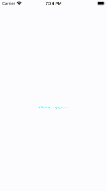
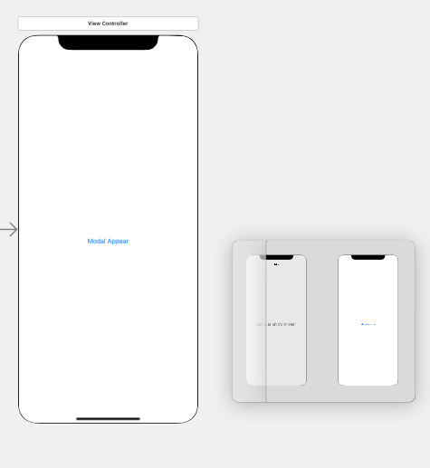

# Wrap a Model View in a UINavigationController
## You can put BarButtonItems on a UINavigationController too!

# Before we start
Difficulty: Beginner | Easy | **Normal** | Challenging<br>
This article has been developed using Xcode 12.5, and Swift 5.4

You know what I've wanted to do for a long time? Make a modally presented `UIViewController` look decent, and have bar button items to make it a little bit easier to use.

Here is a quick tutorial to demonstrate exactly that!



# The Code
There isn't anything special about the storyboard here. I have (rather simply) added a button to a view controller, and hooked up the outlet in code.



The Modal in this case is really simple. I'll just create a programmatic view controller with a red background. Let me also set a creative title, "My Title" to ensure that the right view is being displayed!

https://gist.github.com/stevencurtis/abbb57e60984ccaf5f6e25a71508cf4d

This allows me to take a look at the code in that same `UIViewController`.

Take a look at the code at:
https://gist.github.com/stevencurtis/445498a09e42c1a3ed9f27c76c9547b1

to follow on.

The real work is completed here in the DisplayModal function
https://gist.github.com/stevencurtis/9559b628458bcf9918f1906602c6c8b9

```swift
@IBAction private func DisplayModal(_ sender: UIButton) {
    let viewController = ModalViewController()
    let closeBarButtonItem = UIBarButtonItem(
        title: "Close",
        style: .done,
        target: self,
        action: #selector(self.dismissViewController(animated:)))
    viewController.navigationItem.rightBarButtonItem = closeBarButtonItem

    embeddedNavigationController = UINavigationController(rootViewController: viewController)
    navigationController?.present(embeddedNavigationController!, animated: true)
}
```

Essentially here we have instantiated the `ModalViewController` as declared above. The `UINavigationController` is stored as a variable here and is instantiated as a `UINavigationcontroller` through `embeddedNavigationController = UINavigationController(rootViewController: viewController)`.
We then present the navigation controller with the following: `navigationController?.present(embeddedNavigationController!, animated: true)`

You know what, then it works!

# Conclusion
This was a reasonably short tutorial. I hope it has helped you in some form anyway!

If you've any questions, comments or suggestions please hit me up on [Twitter](https://twitter.com/stevenpcurtis) 

