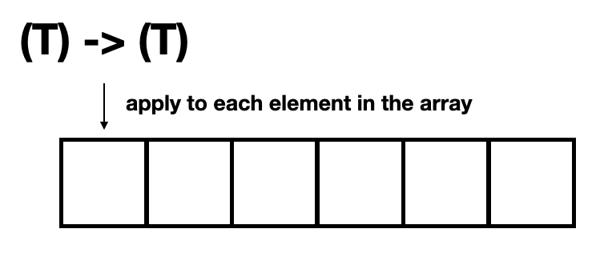
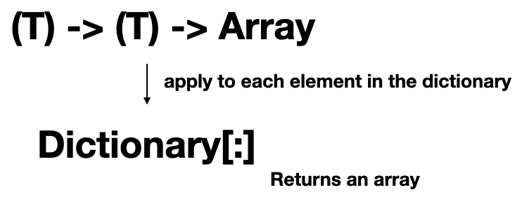
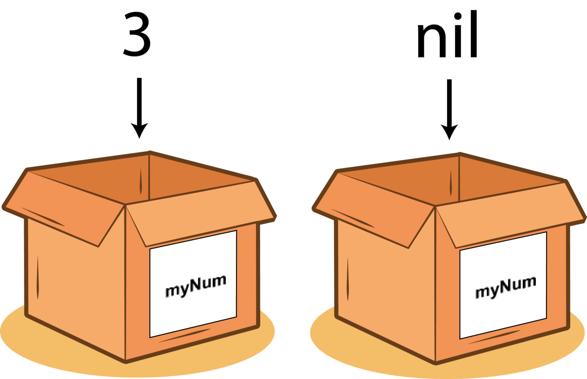
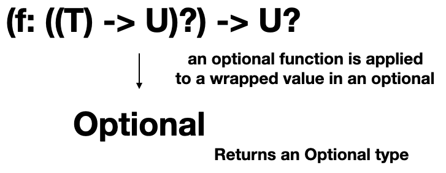

# Monad, Functor and Applicative Swift Functions
## Higher-kinded

I looked at many articles that copy-paste an original Haskell blog post (Simon Peyton Jones not involved, unfortunately) and felt unfulfilled (and requires understanding of [optionals under the hood](https://stevenpcurtis.medium.com/re-implement-optionals-in-swift-41129477934c)) without explaining them. Here is an article that gives a hand with those rather heavy prerequisites!

This gives the advantage of creating complex, composable functional slices of code.

The following explanation moves from the Swift standard library to higher-kinded types.

## Prerequisites
None

## Keywords and Terminology
Applicative: A structure that allows for functional computations to be sequenced, while not allowing results from previous results to be used in the definition of subsequent results
Functor: A design pattern that allows for a generic type to apply a function inside without changing the structure of the generic type
Monads: A type that wraps another type, giving a quality to the underlying type

Higher-Kinded Type: A type that abstracts over a type that, in turn, abstracts over another type

# Functional Programming
For information about functional programming in Swift you can take a look at the following two articles:
https://stevenpcurtis.medium.com/imperative-vs-declarative-swift-programming-7e3c77309f76
https://betterprogramming.pub/mapping-in-swift-a6d6132a38af

## Array and map
For the following examples we are going to double all of the elements in an Array.
**Applying Functions to Arrays**
We can apply a function to each element in an array.

If we were to do this *without* map we would need to iterate over the elements, and add them to a new array. Something like the following will suffice if we are doubling each element of the array:

```swift
let numberArr = [1,2,3,4,5]
var numbers: [Int] = []
for number in numberArr {
    numbers.append(number * 2)
}
```

This code arguably isn't reusable, so isn't that something we can fix?

A transformation is applied to each element in an existing array, the result of which which is appended to a new array. The new array is then returned. 

We could implement **double** function in an extension of `Array`:

```swift
extension Array where Element == Int{
    func double() -> [Element] {
        var array: [Element] = []
        for x in self {
            array.append(x * 2)
        }
        return array
    }
}
```

which is more than a little disappointing. Although it is using a generic [where clause](https://stevenpcurtis.medium.com/extensions-with-generic-where-clauses-in-swift-90c82b7e141f) we are constraining the Array to be of Integer type only. This isn't really reusable.

We can make it functional, and create a map function which would be entirely reusable:

```swift
extension Array {
    func mapped<U>(transform: (U) -> U) -> [U] {
        var array: [U] = []
        for x in self {
            let y = transform(x as! U)
            array.append(y)
        }
        return array
    }
}
```

We no longer have to focus on the iteration when we use this function:

```swift
let numbers = [1,2,3]

print(numbers.mapped{ $0 * 2 })
```

We can think of this like applying a function to every element in the array



**Applying Functions To Arrays Using The Standard Library Map**
Map can be applied to sequence types to create a new sequence with a transformation function applied to each element of the sequence.
Commonly this is used by Swift developers to apply transformation to Arrays.

https://github.com/apple/swift/blob/7123d2614b5f222d03b3762cb110d27a9dd98e24/stdlib/public/core/Sequence.swift

```swift
@inlinable
public func map<T>(
_ transform: (Element) throws -> T
) rethrows -> [T] {
let initialCapacity = underestimatedCount
var result = ContiguousArray<T>()
result.reserveCapacity(initialCapacity)

var iterator = self.makeIterator()

// Add elements up to the initial capacity without checking for regrowth.
for _ in 0..<initialCapacity {
  result.append(try transform(iterator.next()!))
}
// Add remaining elements, if any.
while let element = iterator.next() {
  result.append(try transform(element))
}
return Array(result)
}
```

This means that we can double an array using Swift's Standard Library, called as:

```
print(numbers.map{ $0 * 2 })
```

Which means we are doubling each element in the array, much as before:


**The Issue**
The Standard Library aways returns *Array* instances for map (as well as *filter* and *compactMap*) rather than returning the correct `Sequence` - this becomes apparent when attempting to run a filter on a `Dictionary`.



The reason behind this is that protocol in Swift cannot take generic type parameters, and even if they could we wish to return the `Type` of sequence provided to the function - and there is simply no way of doing that.

The solution is a kind that we can generalize over type constructors. Because Swift don't support that, Swift doesn't actually support `Higher Kinded Types` natively but we can still think about theoretically how this takes place.

# Monad, Functor and Applicative
**Functor**
Categories
- Optional
- Results type
- Futures

The functor itself is a design pattern, and represents a function from values `a` to values `b`; that is `a -> b`..

*A Functor is a mapping between two categories, as specified in category theory (that is the theory which reveals how different kinds of structures relate to each other).*

A contextual value can be thought of as a wrapped value, and a functor as a contextual mapping that is able to be applied to the contextual value. Then it returns the same type that it had been provided with.

** Functor example**
This isn't **just** a map. Let us consider `Optionals` in Swift. Optionals either contain a value or contain `nil`:



which is coded in the standard library as an optional:

```swift
enum Optional<T> {
    case Some(T), Nil
    
    func map<U>(_ f: (T) -> U) -> U? {
        switch self {
        case .Some(let x): return f(x)
        case .Nil: return .none
        }
    }
}
```

here we have `Optional` with a `map` function declared. The `map` function is able to handle `nil`

```
Optional.Some(2).map(plusThree) // 5
Optional.Nil.map(plusThree) // nil
```

The optional is a functor since it maps any type to another type, and any function between two types to another function.

## Monad
A monad is any type that defines `flatMap`. Since the Swift Standard Library defines `flatMap` it is a Monad!

A monad (as distinct from a Applicative Functor) can return another optional.

*The Laws:*
left identity
If we take a value, put it in a default context with return and then feed it to a function by using our function, it’s the same as just taking the value and applying the function to it.

Right identity
If we have a monadic value and we use a function which simply returns, the result is our original monadic value.

Associativity
When we have a chain of monadic function applications, it shouldn’t matter how they’re nested.

## Applicative Functor
A Monad allows Functors to be used in composition. In practice in Swift data types can be mapped over using flatMap. This means we can apply a function that returns a wrapped value, to a wrapped value using flatMap.

Essentially we apply a wrapped function to a wrapped value using apply.



We can add an apply function to optional like:

```swift
extension Optional {
    func apply<U>(f: ((T) -> U)?) -> U? {
        return f.flatMap { self.map($0) }
    }
}
```

If `f` is not nil we call `self.map($0)` where `$0` refers to `f`. On the other hand if our function is nil or the optionals value is nil we return nil.

A functor with a function that takes a value to an instance of a Functor containing that value.
 
Applicative functors allow for functors to be sequenced but do not allow results from prior computations to be used in the definition of subsequent ones (unlike monads).

# Why you might need to know this
In Machine Learning functors are used in layered network protocols, and in Haskell a Functor is a *type class*.

Swift's Optionals are functors and monads, and Swift's `Array` type is also a functor and a monad.

Oh, and `flatMap` is Monadic wheras `compactMap` is not.

# In Practice
An array of optionals can be mapped over with `flatMap`

```swift
let arrayOfOptionals: [String?] = ["three", "four", nil, "five"]
print(arrayOfOptionals.flatMap{ $0 }) // ["three", "four", "five"]
``` 

since an `Array` of any type is both a functor and a monad. Now imagine a world where `Applicative Functor` has been implemented. 

We often need to use guard, often with an optional completion handler.

```swift
func processUrl(
    urlString: String,
    parser: ((NSData?) -> [String: AnyObject])?) -> [String: AnyObject]?
{
    if let url = URL(string: urlString),
       let responseData = NSData(contentsOf: url),
       let parser = parser {
        return parser(responseData)
    } else {
        return nil
    }
}
```

We can see that this is rather messy and annoying in nature, although I am sure that we have all written code much like this.

Imagine having something rather wonderful like the following:

```swift
let parsed = urls.flatMap{ Optional.Some(NSData(contentsOf: $0)).apply(f: parser) }
```

which is so much shorter and, I hope, easier to understand.

Of course to get there we need our optional type and apply:

```swift
enum Optional<T> {
    case Some(T), Nil
    
    func map<U>(_ f: (T) -> U) -> U? {
        switch self {
        case .Some(let x): return f(x)
        case .Nil: return .none
        }
    }
}

extension Optional {
    func apply<U>(f: ((T) -> U)?) -> U? {
        return f.flatMap {
            self.map($0)
        }
    }
}
```

There's a simple example in the repo in a project called `ParserExample`. 

# Conclusion
I hope this article has been of use to you. Happy coding!

If you've any questions, comments or suggestions please hit me up on [Twitter](https://twitter.com/stevenpcurtis)
