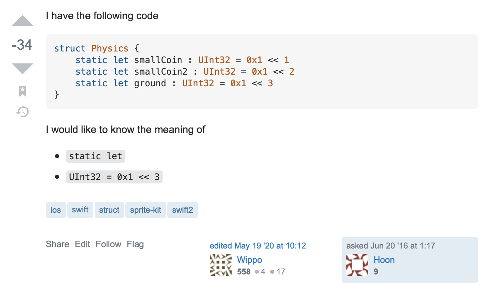
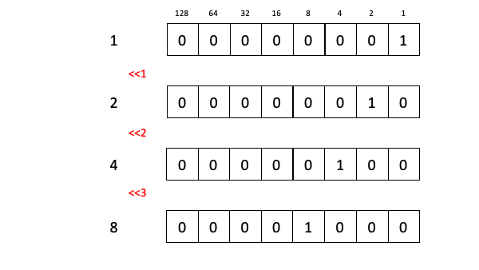

# This is Stack Overflow's Most Downvoted Swift Question
## Fair, or not?

<br/>
<sub>Photo by kaleb tapp on Unsplash<sub>

There is one particular question that caught my eye this week on Stack Overflow. In fact, here it is -



That happens to have a scope of MINUS 34. This makes it the most downvoted question about swift currently on Stack Overflow

Let us explore what happened

# The question
The question has a comment that it represents "standard, well-documented Swift syntax|". This may well be true, however it is worth looking at the question and what is being asked here

```swift
struct Physics {
    static let smallCoin : UInt32 = 0x1 << 1
    static let smallCoin2 : UInt32 = 0x1 << 2
    static let ground : UInt32 = 0x1 << 3
}
```

A `Struct` has been used (which is a value type) and `static` has been used which means that the properties are associated with the type that they are declared on rather than the instance. IN this case there are three properties, all of which are Unsigned Integers representing different values.

It would be useful to create an instance of this `struct` and then read out the properties, which is something that can be done with Swift"

```swift
print (Physics.smallCoin) // 2
print (Physics.smallCoin2) // 4
print (Physics.ground) // 8
```

Therefore we can say that each property is a value that is derived by using a bit shift from [Swift's advanced operators](https://docs.swift.org/swift-book/LanguageGuide/AdvancedOperators.html).

# Knowledge needed in order to answer the question
## Why
It looks like the question might come from a need to have some constants for a physics simulation. The Integer might represent the attraction force (or similar) or a set of items in a world. Which would be nice. 

Which brings us onto the first part of the question:

## Static let
There a a few reasons why you might use `static let` for properties:
* Use static properties for Constants, and similar configuration
* Use static properties for expensive objects, so you only have to create an instance once for the type rather than creating an instance once for the type rather than for each instance
* A [factory](https://stevenpcurtis.medium.com/the-factory-pattern-using-swift-b534ae9f983f) can use static methods to create complex objects

We are going to focus on the first of these.

The question is about a `stuct` and this `struct` could well represent something like Constants. I have this in many of my projects, although I generally use an enum rather than the suggested `struct`, in the following kind of format

```swift
struct Constants {
    static let offset = 10
}

enum {
    static let offset = 10
}
```

for the difference between struct and enum take a look at [this article](https://stevenpcurtis.medium.com/classes-enums-or-structures-how-to-choose-your-swift-type-f33b4b76230e)

which leads us to the question where we have a value for smallCoin, smallCoin2 and ground represented as a `static let` within the `struct`.


## UInt32 = 0x1 << 3
The type given (of my presumption that this is a Constant). The type given here is [UInt32](https://medium.com/@stevenpcurtis.sc/int-uint8-or-uint16-swift-im-confused-bbb19f28e4ad) which means that the value is an unsigned [Integer](https://stevenpcurtis.medium.com/what-is-an-integer-1a26cdd18d68), and then this value is given as `0x1 << 1`, `0x1 << 2` or `0x1 << 3` depending on the property we are referring to. 

To understand this, we need to recognize that `0x1` is [hexadecimal](https://medium.com/@stevenpcurtis.sc/hexadecimal-in-programming-691ffe32f707), and represents the denery value of 1. From there, we are using the [bit shift operator](https://docs.swift.org/swift-book/LanguageGuide/AdvancedOperators.html):



The initial value of 1, bitshift by 1 creates the value 2.
The initial value of 1, bitshift by 2 creates the value 4.
The initial value of 1, bitshift by 3 creates the value 8.

Now why we would need to bitshift a single value like this it is not entirely clear.

# The cost
The person who posed the question, Hoon, has only asked this question and never asked another question, or answered a question themselves. This could mean that the person no longer codes in Swift, or perhaps does not code at all anymore. 

The question of fairness could be limited here because the thing is the *human* cost of the downvotes and the feeling that such a negative score can give a person. It really isn't great.

# Conclusion
Stack Overflow can be a difficult place to ask questions, and it can be tricky to think of all the ways that you need to behave in order to get a pressing question asked.

If you've any questions, comments or suggestions please hit me up on [Twitter](https://twitter.com/stevenpcurtis)
