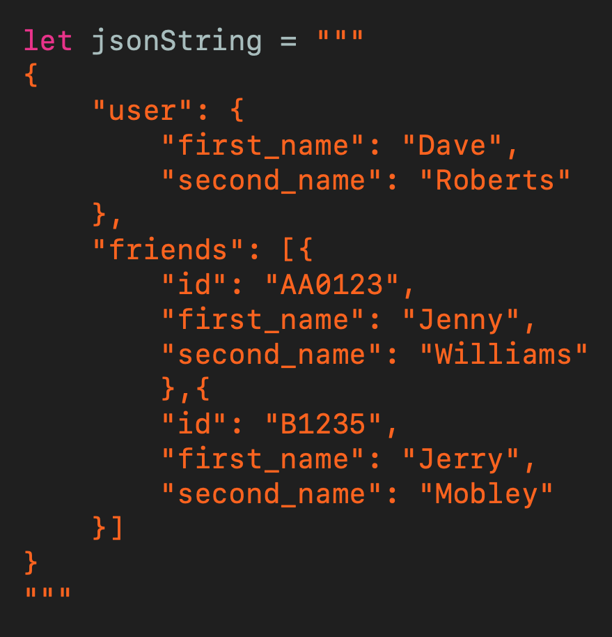
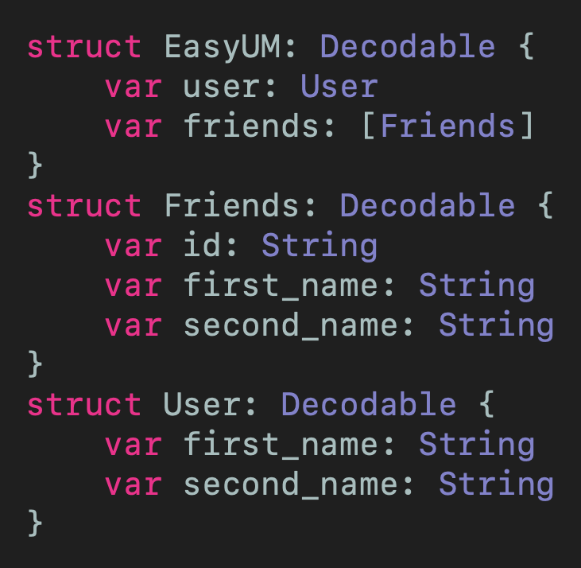
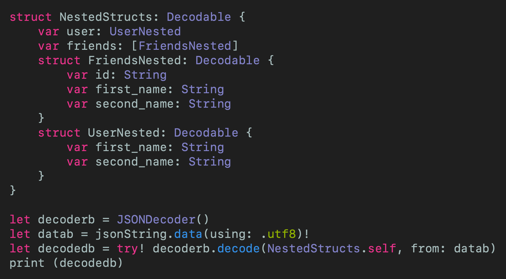
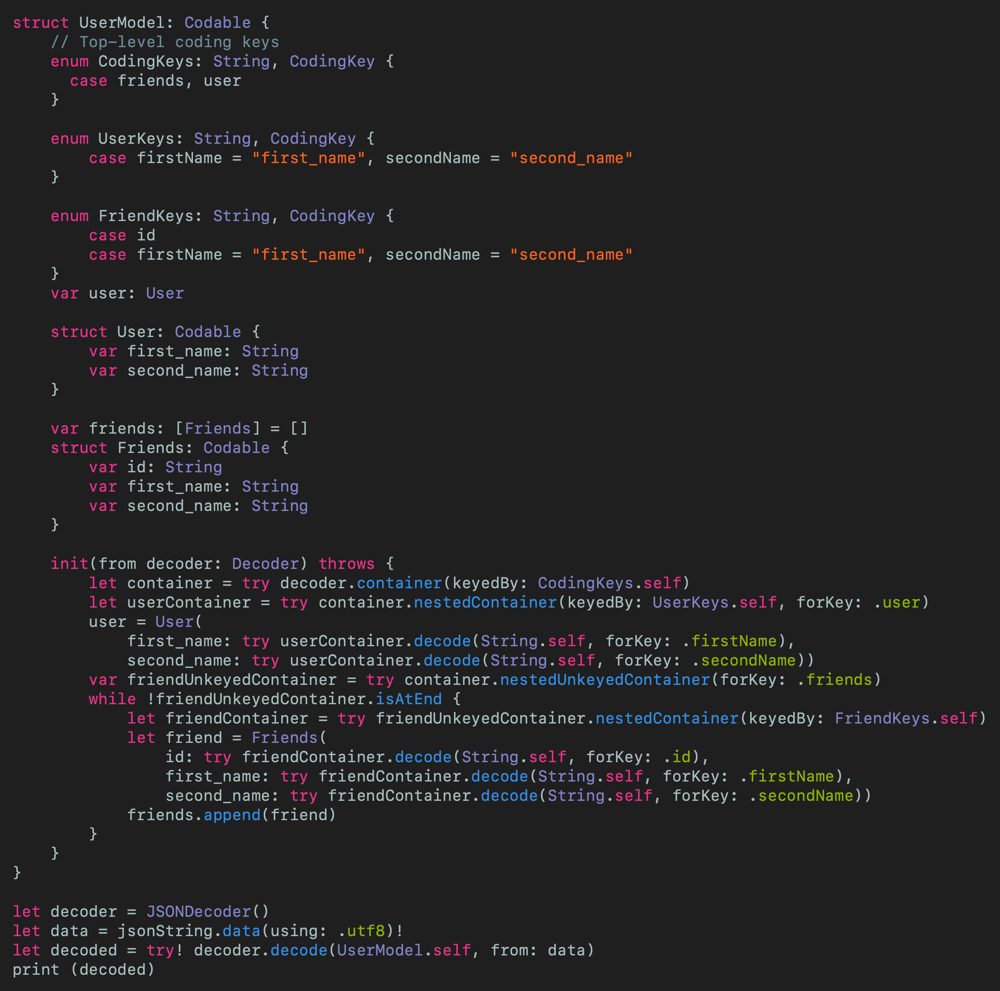

# Decode JSON like a PRO
## Deal if your JSON contains an array

 
Photo by Elizeu Dias on Unsplash

Difficulty: Beginner | Easy | **Normal** | Challenging 
This article has been developed using Xcode 11.5, and Swift 5.2.4

## Prerequisites: 
* You will be expected to be aware how to make a [Single View Application](https://medium.com/swlh/your-first-ios-application-using-xcode-9983cf6efb71) in Swift.
* This article is a continuation of an  [existing article about codable with nested JSON](https://medium.com/@stevenpcurtis.sc/using-codable-with-nested-json-you-can-2d5a891d40c3)

## Terminology:
JSON: JavaScript Object Notation, a lightweight format for storing and transporting data

# Decoding JSON
Decoding JSON is good, right?
I remember creating [an article about Using Codable with Nested JSON](https://medium.com/swlh/your-first-ios-application-using-xcode-9983cf6efb71) and we can easily [test JSON decoding](https://medium.com/@stevenpcurtis.sc/decode-json-with-swift-test-e2d26dfafd6d) yet it is missing a vital part of deciding **JSON** - one that is very likely to come up in your daily life as a developer (really).

JSON arrays are common in JSON strings from any given API endpoints.

Now this particular article will talk about decoding JSON with nested arrays, and will not venture into testing since that would be a re-tread of [this article](https://medium.com/@stevenpcurtis.sc/decode-json-with-swift-test-e2d26dfafd6d)]

# An example situation
Imagine (if you've a reasonable imagination that is, but don't get too excited) that you've logged into an API. Since the App in question is something like a social network, you are returned your user's first name, second name and some information about their friends on the network.

Naturally you'd need to put this into a model that you call from your ViewModels (you're using [MVVM](https://medium.com/@stevenpcurtis.sc/mvvm-in-swift-19ba3f87ed45), right?) - but it's an *array* of friends. So you don't know how many friends you have in advance (it might even be zero - but we can talk about my problems later).

## The JSON String
 
[Click For Gist](https://gist.github.com/stevencurtis/efc632dfe593c2d4017318594c1ae36a)

This is an *example* JSON String, but should give you some idea of what we are working with. 

The use of triple quotes allows String to take up multiple lines in Swift (awesome, right?). 

Let us run through some *different* methods to decode this JSON

## Decoding
Each of these struct have slightly different names so I could place them into the same project. If you are doing this in a real project, please do sensibly name your `struct` declarations yourself. 

### Use several `struct` declarations
This is a fine method, in fact. The disadvantage is that you are probably not reusing the structs after the initial outer `struct`.

 
[Click For Gist](https://gist.github.com/stevencurtis/263d6340e7e3ddbedb85e7a75b10b32b)

This gives the following console output:
`EasyUM(user: NestedCodableArray.User(first_name: "Dave", second_name: "Roberts"), friends: [NestedCodableArray.Friends(id: "AA0123", first_name: "Jenny", second_name: "Williams"), NestedCodableArray.Friends(id: "B1235", first_name: "Jerry", second_name: "Mobley")])`
Which all seems rather nice and dandy. Can we now work through some alternatives?

### Use nested `struct` declarations
Rather than having separate `struct` declarations we could nest them. This avoids having the top-level `struct` declarations exposed (and polluting the global name space).

 
[Click For Gist](https://gist.github.com/stevencurtis/fe3b6f8d336456636d4fa23d697f2274)

This gives the following console output:
`NestedStructs(user: NestedCodableArray.NestedStructs.UserNested(first_name: "Dave", second_name: "Roberts"), friends: [NestedCodableArray.NestedStructs.FriendsNested(id: "AA0123", first_name: "Jenny", second_name: "Williams"), NestedCodableArray.NestedStructs.FriendsNested(id: "B1235", first_name: "Jerry", second_name: "Mobley")])`

### Use a custom `struct` decoder
Now er are getting to it. We can use a `struct` using our knowledge of the `Codable` protocol. 

Now conforming to codable has a material effect on the solution to this: [`Tuple`](https://medium.com/p/5ee9106283be) seems like a great solution to these small objects that we need to create. However, (wait for it) - Tuples do not support `Codable` synthesis meaning you'd need to write more code to make this work - so in this case we are using `struct` declarations. The second restriction is that a `Tuple` needs to have at least two elements in order to have labels (which is a requirement for accessing the properties of our decoded object).

 
[Click For Gist](https://gist.github.com/stevencurtis/f02bf754daafbf63fd0963348c4c740f)

This gives the following console output:
`UserModel(user: NestedCodableArray.UserModel.User(first_name: "Dave", second_name: "Roberts"), friends: [NestedCodableArray.UserModel.Friends(id: "AA0123", first_name: "Jenny", second_name: "Williams"), NestedCodableArray.UserModel.Friends(id: "B1235", first_name: "Jerry", second_name: "Mobley")])`

Now the issue with this is...did someone say over engineered? The amount of code for this solution isn't completely wild. This means that you need to be aware of your engineering time.

# Did you know: Dump
You can use `dump(_:name:indent:maxDepth:maxItems:)` instead of print to write out an object's contents using [reflection](https://medium.com/@stevenpcurtis.sc/reflection-in-swift-e8dd5afa777f) to give a nicely formatted output. 

# Conclusion
As ever, be careful about over engineering.  But are you going to choose to pollute your global namespace or are you going to write rather long code to do something that should not be so hard.

Only...you...can...decide!

If you've any questions, comments or suggestions please hit me up on [Twitter](https://twitter.com/stevenpcurtis) 

