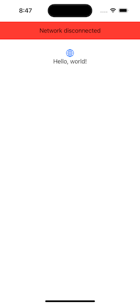
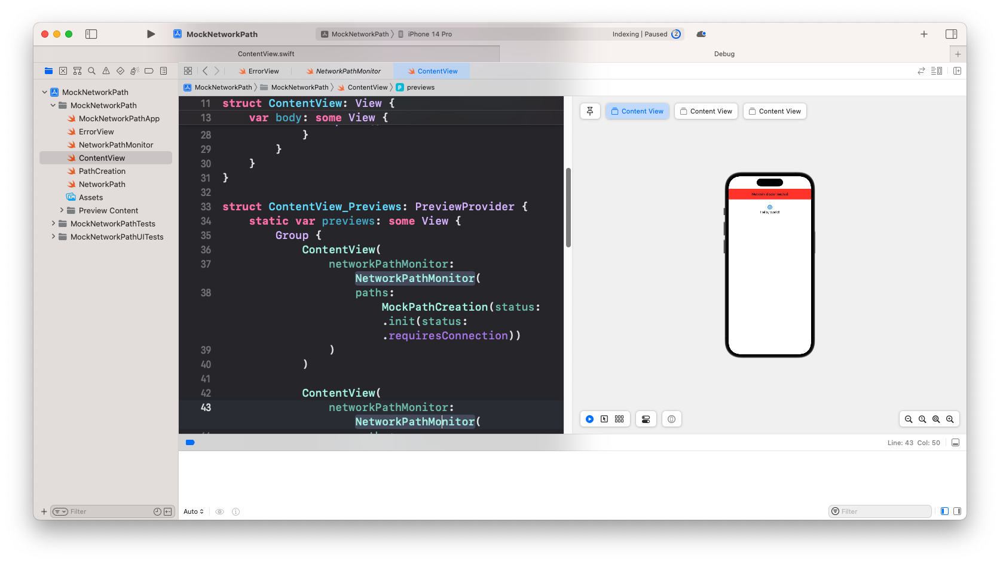
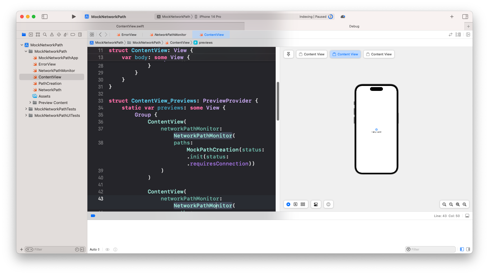
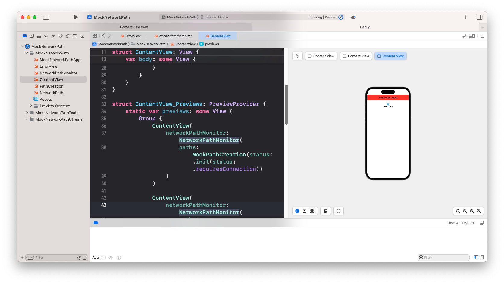

# Mocking NWPathMonitor() in Swift
## With a sample SwiftUI Project

Yeah. As might be seen as typical, people give simple explanations of `NWPathMonitor` as a one and done on the Internet.

Then you want to put it into production, and you realise that you can't mock the code.

You can't check your user interface when using `NWPathMonitor` without turning on and off your wifi on the host machine. That sucks.

So I wanted to mock this properly. Here is the resultant blog post.



# The simple implementation of NWPathMonitor()
In the repo accompanying this blog post I've included a playground which (despite some warnings from YouTubers) seems to work in a Playground. The code is:

```swift
import Network

let pathMonitor = NWPathMonitor()

pathMonitor.pathUpdateHandler = { path in
    if path.status == .satisfied {
        print("Connected")
    } else {
        print("Not connected")
    }
}
pathMonitor.start(queue: .main)
```

# The Problem
Usually I'd create a protocol for `NWPathMonitor`, conform the class to it and then create a mock which also conforms to that protocol. 

Let's see what happens.

The docs https://developer.apple.com/documentation/network/nwpathmonitor have us covered. We'll need something for start and current path

The protocol:

```swift
protocol NetworkPathMonitorProtocol {
    func start(queue: DispatchQueue)
    var currentPath: NWPath { get }
    var pathUpdateHandler: ((_ newPath: NWPath) -> Void)? { get }
}

extension NWPathMonitor: NetworkPathMonitorProtocol {}
```

Awesome! However, constructing a mock is a big issue here. We would want to construct a mock such that we can select which `NWPath` is given as the `currentPath` (at will).

That NWPath is an issue. You can look at the [documentation](https://developer.apple.com/documentation/network/nwpath). This is an issue as
`'NWPath' cannot be constructed because it has no accessible initializers`.

Is that the end of the article? Of course it is not.

# Mocking
So our first issue is `NWPath`. We need some form of NetworkPath which we can construct.

```swift
public struct NetworkPath {
    public var status: NWPath.Status
    
    public init(status: NWPath.Status) {
        self.status = status
    }
}

extension NetworkPath {
    public init(rawValue: NWPath) {
        self.status = rawValue.status
    }
}

extension NetworkPath: Equatable {}
```

The `NetworkPath` struct can be used to check the current network connection status and to track changes in network connectivity while allowing us to construct the value.

**PathCreation**
We can then create a class which will publish a sequence of values which will never fail (so it optionally completes, and this publisher can't fail). This class will use this new `NetworkPath` value which it will output. Here is the implementation:

```swift
protocol PathCreationProtocol {
    var networkPathPublisher: AnyPublisher<NetworkPath, Never>? { get }
    func start()
}

final class PathCreation: PathCreationProtocol {
    public var networkPathPublisher: AnyPublisher<NetworkPath, Never>?
    private let subject = PassthroughSubject<NWPath, Never>()
    private let monitor = NWPathMonitor()
    
    func start() {
        monitor.pathUpdateHandler = subject.send
        networkPathPublisher = subject
            .handleEvents(
                receiveSubscription: { _ in self.monitor.start(queue: .main) },
                receiveCancel: monitor.cancel
            )
            .map(NetworkPath.init(rawValue:))
            .eraseToAnyPublisher()
    }
}
```
The function `start()` begins the monitor, and is required to do so as `NWPathMonitor` has such a function.

**The wrapped object**
We can now construct our `NetworkPathMonitor` object which will take in anything that conforms to `PathCreationProtocol`.

```swift
final class NetworkPathMonitor: ObservableObject {
    @Published var isConnected = true
    
    private var pathUpdateCancellable: AnyCancellable?
    let paths: PathCreationProtocol
    init(
        paths: PathCreationProtocol = PathCreation()
    ) {
        self.paths = paths
        paths.start()
        self.pathUpdateCancellable = paths.networkPathPublisher?
            .sink(receiveValue: { [weak self] isConnected in
                self?.isConnected = isConnected == NetworkPath(status: .satisfied)
            })
    }
}
```

Which is nice. We default `isConnected` to true, and we are only `isConnected` if the `NetworkPath` is satisfied.

So we can use this `NetworkPathMonitor`.

**The SwiftUI View**

```swift
struct ContentView: View {
    @ObservedObject var networkPathMonitor: NetworkPathMonitor
    var body: some View {
        VStack {
            if !networkPathMonitor.isConnected {
                ErrorView()
            }
            VStack {
                
                Image(systemName: "globe")
                    .imageScale(.large)
                    .foregroundColor(.accentColor)
                Text("Hello, world!")
            }
            .padding()
            if !networkPathMonitor.isConnected {
                Spacer()
            }
        }
    }
}
```

Nothing much to see here. `@ObservedObject var networkPathMonitor: NetworkPathMonitor` does the heavy lifting here and if we're not connected the `ErrorView` will show.

What `ErrorView`? This one:

```swift
struct ErrorView: View {
    var body: some View {
        ZStack {
            Color.red
                .frame(height: 50)
            HStack {
                Spacer()
                Text("Network disconnected")
                    .padding()
                Spacer()
            }
        }
    }
}
```

**Using a mock**
We can create a mock that conforms to `PathCreationProtocol`.

```swift
final class MockPathCreation: PathCreationProtocol {
    var status: NetworkPath
    var networkPathPublisher: AnyPublisher<NetworkPath, Never>?
    func start() {
        networkPathPublisher = .init(Just(status))
    }
    
    init(status: NetworkPath = NetworkPath(status: .requiresConnection)) {
        self.status = status
    }
}
```
 
 Just emits a single output, then finishes (no failure there!). This does indeed conform to `PathCreationProtocol` so no issue there.
 
 We can now inject that mock into our previews!
 
 ```swift
 struct ContentView_Previews: PreviewProvider {
    static var previews: some View {
        Group {
            ContentView(
                networkPathMonitor: NetworkPathMonitor(
                    paths: MockPathCreation(status: .init(status: .requiresConnection))
                )
            )
            
            ContentView(
                networkPathMonitor: NetworkPathMonitor(
                    paths: MockPathCreation(status: .init(status: .satisfied))
                )
            )
            
            ContentView(
                networkPathMonitor: NetworkPathMonitor(
                    paths: MockPathCreation(status: .init(status: .unsatisfied))
                )
            )
        }
    }
}
 ```
 
 We are giving the view the various states in the `MockPathCreation`!
 
 As you can see we have successfully injected `MockPathCreation` and we no longer need a network connection in order to see the states of the view. Nice!
 




 # Conclusion
 I hope this code has in some sense helped you, and I hope you have a lovely day!
