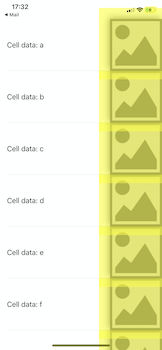

# Offscreen Rendering in iOS
## Performance!


<sub>Image by Ryan Spaulding @ryanspaulding</sub>

# Before we start
Difficulty: Beginner | **Easy** | Normal | Challenging<br>
This article has been developed using Xcode 12.2, and Swift 5.3

## Prerequisites
* You'll need to either be able to write [an iOS application](https://medium.com/swlh/your-first-ios-application-using-xcode-9983cf6efb71) or write some Swift code in [Playgrounds](https://medium.com/@stevenpcurtis.sc/coding-in-swift-playgrounds-1a5563efa089)

## A suggestion
If you wish to understand anything about performance of you code, you should do so on a device rather than on a simulator. If not, you are measuring the performance of your code through a translation process, or through a different speed and spec of CPU. Wouldn't it be even better if you chose to test on a device that most of your users will use (hint: This often isn't the latest device, don't be that developer).

## Keywords and Terminology
Offscreen rendering: The rendering of part of a layer into an offscreen buffer, before rendering to the screen. Powered by the CPU rather than the GPU
Storyboard: A visual representation of the User Interface of an Application

# This article
## Background
Performance is extremely important when developing iOS Applications. You may have used the Graphical Debugger 

This performance problem is flagged up by Xcode when using the Visual Debugger
.

So what is happening?

## Performance considerations
Some visual effects have a performance impact, and this can ultimately cause side-effects like choppy scrolling for scroll-views. This isn't ideal!

## Onscreen or offscreen
The issue with offscreen drawing isn't the drawing itself, as you might think. When the drawing destination is switch to offscreen, the CPU takes over drawing and the GPU is idle. That is, offscreen rendering is actually software rendering which has to be performed before the work is handed back to the GPU to be drawn on screen. 

We should understand that modern iOS devices have an extremely powerful GPU, and generally speaking offscreen rendering does not use any hardware acceleration for the images produced.

## When might you get offscreen rendering?
There are quite a few cases where offscreen rendering is used. This isn't intended to be an exhaustive list, but will give you some idea of the causes of this performance hog
* CALayer corner radius
* CALayer shadow
* CALayer mask
* Custom drawing using CGContext
* CALayer with shouldRasterize set to YES

## How do you know is something is drawn offscreen?
This is an important part of making sure that your code is running in an efficient manner.

Xcode has a rather wonderful option for this: Running on a device you can select *Debug>View Debugging>Rendering>Color Offscreen-Rendered Yellow.

## The example
I've set up a `UITableView` like in the following [example article](https://stevenpcurtis.medium.com/the-uitableview-example-54e6a804b919) and added a shadow around the `UIImageView` on the left-hand side.

```swift
let cell = tableView.dequeueReusableCell(withIdentifier: "cell", for: indexPath)
cell.textLabel?.text = "Cell data: \(data[indexPath.row])"
cell.imageView?.layer.shadowRadius = 8
cell.imageView?.layer.shadowOffset = CGSize(width: 3, height: 3)
cell.imageView?.layer.shadowOpacity = 0.5
cell.imageView?.layer.cornerRadius = 20
cell.imageView?.image = UIImage(named: "PlaceholderImage")
return cell
```

Now when we turn on the `Color Offscreen-Rendered Yellow` (one a device, please!) you'll see a problem. 



A big problem.

The yellow shows offscreen rendering.

## Avoiding offscreen rendering
We are going to create a `UITableViewCell` subclass, which then allows access to `layoutSubviews()`. Rather than dynamically drawing the shadow we can use `UIBezierPath` and even cache that path on a property called `var shadowPathCache: CGPath?`.

This gives us the following `UITableViewCell` subclass:

```swift
class CustomTableViewCell: UITableViewCell {
    
    /// A cache for the shadow path
    var shadowPathCache: CGPath?
    
    lazy var rightImage: UIImageView? = {
        let imgView = UIImageView()
        imgView.contentMode = .scaleAspectFit
        imgView.translatesAutoresizingMaskIntoConstraints = false
        return imgView
    }()

    override init(style: UITableViewCell.CellStyle, reuseIdentifier: String?) {
        super.init(style: style, reuseIdentifier: reuseIdentifier)
        backgroundColor = .white
        addSubview(rightImage!)
        
        NSLayoutConstraint.activate([
            rightImage!.topAnchor.constraint(equalTo: topAnchor),
            rightImage!.bottomAnchor.constraint(equalTo: bottomAnchor),
            rightImage!.rightAnchor.constraint(equalTo: rightAnchor),
            rightImage!.widthAnchor.constraint(equalTo: rightImage!.heightAnchor),
        ])
    }
    
    func setupCell(image: String) {
        rightImage?.image = UIImage(named: image)
    }
    
    override func layoutSubviews() {
        super.layoutSubviews()
        
        if let shadowPath = self.shadowPathCache {
            rightImage!.layer.shadowPath = shadowPath
        } else if let rect = rightImage?.bounds {
            self.shadowPathCache = UIBezierPath(rect: rect).cgPath
        }
        
        rightImage?.layer.shadowRadius = 8
        rightImage?.layer.shadowOffset = CGSize(width: -3, height: -3)
        rightImage?.layer.shadowOpacity = 0.5
    }
    
    required init?(coder: NSCoder) {
        fatalError("init(coder:) has not been implemented")
    }
}
```

With this implementation you have a way of implementing this shadow, and if you run on a device that yellow flag for offscreen rendering will never flag - the screen will now be the normal colours.

If you want to see how this is implemented in a `UITableView` please do take a look at the [repo]() as there is this complete example app just waiting for you to take a look !

# Conclusion

Offscreen rendering can have a major impact on the performance of iOS applications, and it's important for developers to be aware of its causes and effects. Some common causes of offscreen rendering include the use of corner radius, shadow, mask, custom drawing, and CALayer with shouldRasterize set to YES. 
To check whether your app is using offscreen rendering, Xcode provides a useful tool that lets you toggle the option of rendering offscreen colors yellow. To avoid offscreen rendering, you can create a UITableViewCell subclass that allows access to layoutSubviews() and use UIBezierPath to draw shadows, caching the shadow path on a property. 
By implementing performance techniques, you can significantly improve the performance of your app and ensure a smoother user experience. Who wouldn't want to do that?

If you've any questions, comments or suggestions please hit me up on [Twitter](https://twitter.com/stevenpcurtis) 
