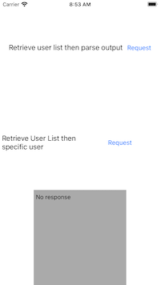
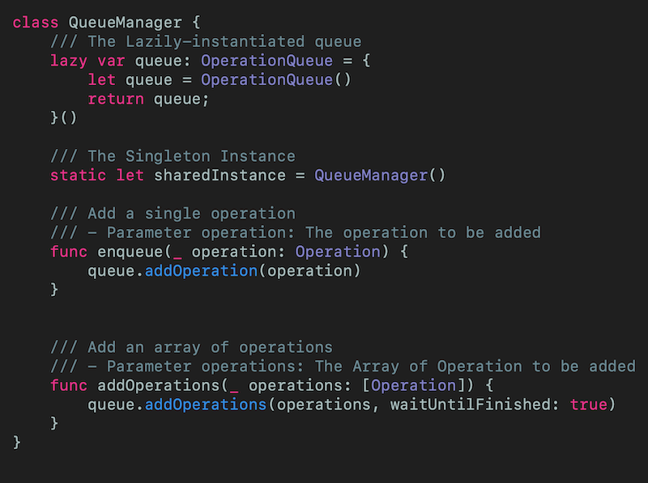
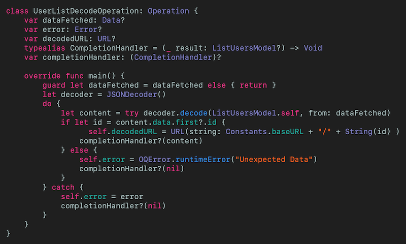
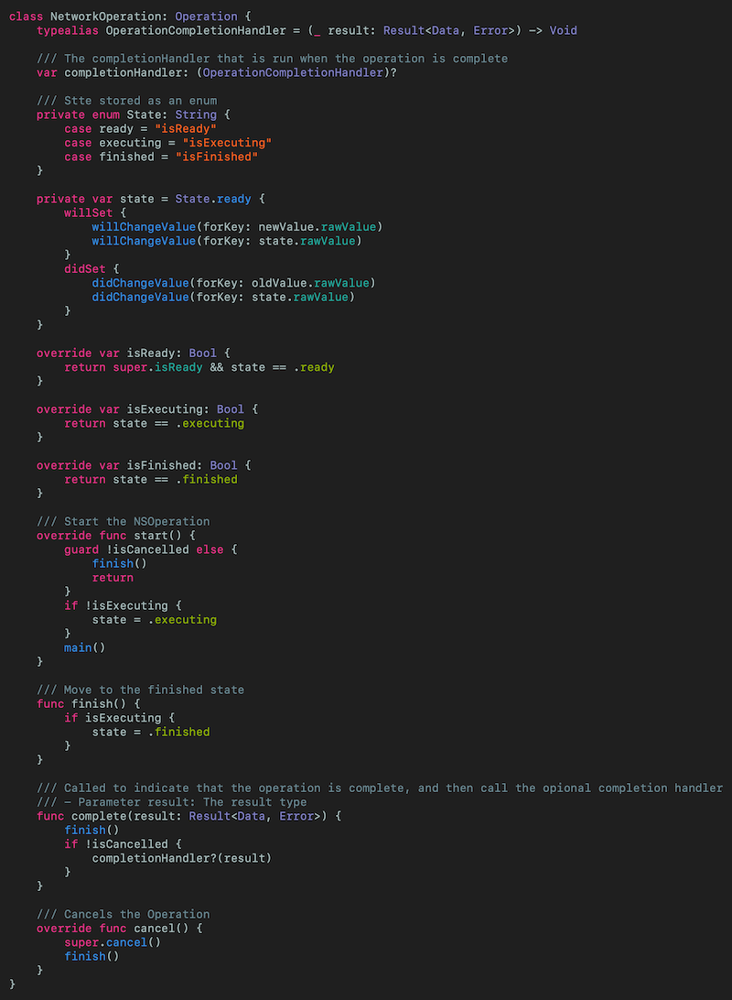
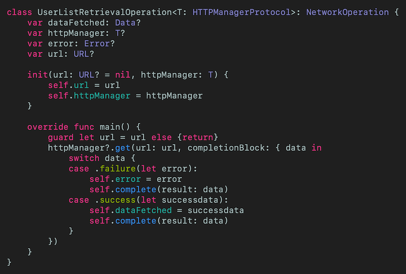
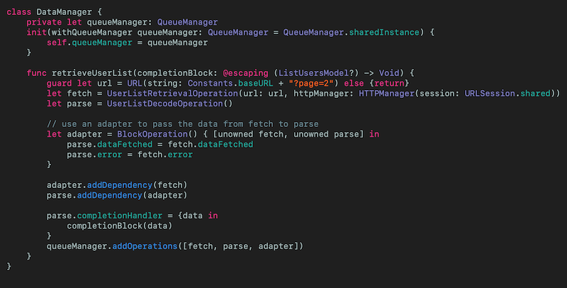
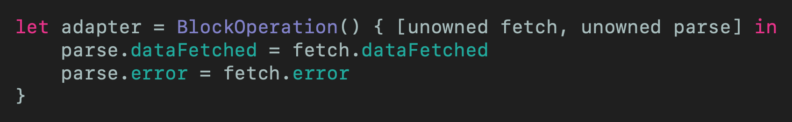

# Use OperationQueue to Chain API Calls in Swift
## Now, THIS is important

 
Photo by Ryan Moreno on Unsplash

Let us make an API call, followed by another. Wouldn't that be nice?

Difficulty: Beginner | Easy | **Normal** | Challenging 
This article has been developed using Xcode 11.5, and Swift 5.2.4

## Prerequisites: 
* You need to either be able to make a [Single View Application](https://medium.com/swlh/your-first-ios-application-using-xcode-9983cf6efb71) in Swift, and this article relies on my [HTTP Manager](https://medium.com/@stevenpcurtis.sc/my-basic-httpmanager-in-swift-db2be1e340c2)
* There are other bits and pieces here that are used. However, you can probably get by without detailed knowledge of [typealias](https://medium.com/@stevenpcurtis.sc/type-alias-for-readability-in-swift-b5d60de4aee1)), [GCD](https://medium.com/swift-coding/concurrency-and-grand-central-dispatch-in-swift-gcd-f0ae063973c2), [Singleton](
https://medium.com/@stevenpcurtis.sc/singleton-in-swift-8da9bea06339), [Dependency Injection](https://medium.com/@stevenpcurtis.sc/learning-dependency-injection-using-swift-c94183742187), and [Protocols](https://medium.com/@stevenpcurtis.sc/protocols-in-swift-f46c31283b18)

# Why would you need to chain API calls?
## The example
So here is the deal. I want to download the list of users from [an API provided by regres.in](https://reqres.in) . Once we have that, we want to download the full data from that user.

When we use  [regres.in](https://reqres.in) we will have to hit the following API endpoints:
* /api/users
* /api/users/#

and in between the two? We are going to need to decode the JSON `String`.

Each of these `Operation`s need to be complete before the preceding one. In order to do so we are going to need a great tutorial. That tutorial? That is the one you're reading!

### What the code is, and what it isn't
This isn't a theoretical discussion of `Operation` and `OperationQueue`, and is a practical example of both. It does include tests, however I'm not going to claim that the testing is perfect (it's up to 78% code coverage so it's not *awful* but does give an indication of how testing can take place). The architecture of this project...this isn't an article about architecture and I usually use [MVVM](https://medium.com/@stevenpcurtis.sc/mvvm-in-swift-19ba3f87ed45) myself but here we just whack the result in the view controller (come at me!).
Error handling has begin, but the `Error` where there is one isn't passed to the the view controller and isn't handled. The testing does cover errors though (partially).
I'd recommend that you look through the code repo as you read - it's right [here for download](https://github.com/stevencurtis/OperationQueueDependentAPICalls)

# Code Dependencies
In order to download, we are going to use `urlsession`. Now luckily I've already developed a nice [HTTP Manager class](https://medium.com/@stevenpcurtis.sc/my-basic-httpmanager-in-swift-db2be1e340c2), which I'll drag and drop into the project. 

# Wait, what? What's this going to look like?
They'll be a couple of buttons on a viewcontroller that performs the two following actions:
* Download a list of users (Operation 1), and then decode it (Operation 2)
* Download a list of users (Operation 1), and then decode it (Operation 2), and then download a specific user (Operation 3) and then decode the eventual user

The eventual result is then displayed on a textview.  

 

# Operation class
## The high-level description
`Operation` provides us with ways to perform operations concurrency in association with `OperationQueue`, built on top of [GCD](https://medium.com/swift-coding/concurrency-and-grand-central-dispatch-in-swift-gcd-f0ae063973c2) - and since `Operation` allows us to add dependency among operations (and even cancel or suspend them) it is a perfect example for our little project without needing to delve into the detail of threading or your device cores. Excellent.
## So...
**QueueManager**
This is a queue that controls the order of execution of the operations contained within the queue (this is actually a *priority queue* ). An `OperationQueue` attempts to execute as many operations in parallel as the host device can support. 

In order to manage that there is a `QueueManager` that allows any number of `Operation` to be added to the queue. To ensure that we always add to the same queue the `QueueManager` will be a
[Singleton](
https://medium.com/@stevenpcurtis.sc/singleton-in-swift-8da9bea06339) instance.

 
[Click for Gist](https://gist.github.com/stevencurtis/6f6f9e9a744267dd64d6186dded79a44) 

Now the tests for `QueueManager` probably go further than they should do, as they start to test the functions of `OperationQueue` (so not my finest hour) but are visible through the [repo code](https://github.com/stevencurtis/OperationQueueDependentAPICalls) if you download it, and take a look.

### `Operation`
`Operation` is an abstract class that is subclassed in order to perform specific tasks. A given `Operation` usually runs on a different thread from the one that created it. 

**UserListDecodeOperation**
First we will cover decoding a JSON String. This `UserListDecodeOperation` is subclassed from `Operation`. The `main()` function is where the decoding will take place, but we set a property with an `Error` that can be passed through the different `Operation` objects so that these can be dealt with at an appropriate point.

 
[Click for Gist](https://gist.github.com/stevencurtis/488911fbc14fc5a6b1305ef9bed55799)

The content is passed back through the completion handler (using [typealias](https://medium.com/@stevenpcurtis.sc/type-alias-for-readability-in-swift-b5d60de4aee1))

yet the data used is passed through the `dataFetched` property which is populated after the Retrieval operation is made.

The other property, `decodedURL` is the URL that will be fetched when we choose the retrieve the individual user.

**UserListRetrievalOperation**
Operations can either be *Concurrent* or *Non-concurrent*, and there is an important distinction. The network call is a *Concurrent* async operation, meaning that `Operation` does not automatically know when it is complete (like in **UserListDecodeOperation** above).
The solution to this is to create a base class that will call `finish()` when the `Operation` is complete (or when the `Operation` is cancelled. 

 
[Click for Gist](https://gist.github.com/stevencurtis/71b27522cd3e1452301751fc006160bd)

So our `UserListRetrievalOperation` class subclasses `NetworkOperation`, and then the `OperationQueue` will behave properly when the network request is made!

 
[Click for Gist](https://gist.github.com/stevencurtis/4b6408b4da7195979311a17c8575bb29)

This does of course call my [HTTP Manager](https://medium.com/@stevenpcurtis.sc/my-basic-httpmanager-in-swift-db2be1e340c2)  and return the data (or an error). The dataFetched is populated which can then be used by the `UserListDecodeOperation`. To do this...use the `DataManager` (shown below).

I've also created similar `UserRetrievalOperation` and `UserDecodeOperation` which are in the [Repo](https://github.com/stevencurtis/OperationQueueDependentAPICalls)) for clarity (as they are similar to the classes described here) and aren't rolled into a generic class to make this a little easier to understand (I hope). The tests are in the [Repo](https://github.com/stevencurtis/OperationQueueDependentAPICalls)) too!

# Scheduling operations
## The high-level description
The DataManager is responsible for scheduling operations, and is defined below.

## DataManager
The `DataManager` is going to be a class that is responsible for scheduling these `Operation` objects.

Let us look at the `DataManager` with the function `retrieveUserList` that retrieves the UserList, and then decodes it.

 
[Click for Gist](https://gist.github.com/stevencurtis/090effaf3be15fb0a826158b92e622b3)

The initializer allows us to connect to any `QueueManager` instance (this would be a good opportunity to look at any `QueueManager` conforming to a Protocol in order to use [Dependency Injection](https://medium.com/@stevenpcurtis.sc/learning-dependency-injection-using-swift-c94183742187) using [Protocols](https://medium.com/@stevenpcurtis.sc/protocols-in-swift-f46c31283b18)) 

Diving into the `retrieveList` function we can see that there are two `operation` objects, `fetch` and `parse` that do (pretty much) what we would expect.

Now the real issue is how do we pass the data from the `fetch` `Operation` to the `parse` `operation`? 

This is where an *adaptor* comes into use. 

 
[Click for Gist](https://gist.github.com/stevencurtis/388bdb3946316b2efcc2225567370e5f)

This links the properties for `dataFetched` and `error`, using `BlockOperation` (which is handy as it means the `Operation` instance does not have to be subclassed. They are `unowned` since the references will never become nil (so will never cause a disturbing runtime crash).

Also of note is the idea of *Dependencies* - the adapter has a dependency of `fetch`, and the `parse` has a dependency of the `adapter`. How?

`adapter.addDependency(fetch)`
`parse.addDependency(adapter)`

which can then be added to the `QueueManager` instances operation queue through `queueManager.addOperations([fetch, parse, adapter])`.

The data is returned to the caller through a *completionHandler*, that is awesome (probably).

# Improvements
This code isn't *production ready* but is indicative of what can be achieved using `Operation` and `OperationQueue` and how such an implementation might be tested.

There are obvious improvements - why have `UserDecodeOperation` and `UserListDecodeOperation` when one class could decode both? The answer is this is a minimal example, and has been written for this guide - it is not production-ready in any way. 

Equally there is a `QueueManagerMock` class that is just a `QueueManager`. This is true, and it's there so I can choose to improve this guide in the future (did you know I update these guides?), although this might be a good opportunity to use [Dependency Injection](https://medium.com/@stevenpcurtis.sc/learning-dependency-injection-using-swift-c94183742187)). 

The way that URLs have been built, frankly makes me feel sick. It's written like this for speed, rather than using my own method of [building urls in Swift](https://medium.com/swlh/building-urls-in-swift-51f21240c537).

# Conclusion
This is quite an article. Moving to using `OperationQueue` and `Operation` rather than closures to chain API calls has been a challenge of subclassing and understanding exactly what is happening under the hood for these classes.

Worth it? 

Well you have the option of having control over these `operation` objects, and that means you can cancel subsequent API calls if a previous one fails. This can be done from within the operation (see that I've done this in `UserDecodeOperation`  in the [Repo](https://github.com/stevencurtis/OperationQueueDependentAPICalls)) but can also be done from outside the class - providing great flexibility. 

As ever, the developer needs to decide the approach using the tools at their disposal. I hope that this article has helped you add these tools into your tool kit.

If you've any questions, comments or suggestions please hit me up on [Twitter](https://twitter.com/stevenpcurtis) 

