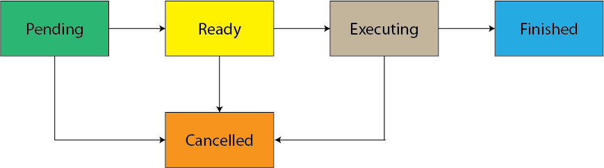
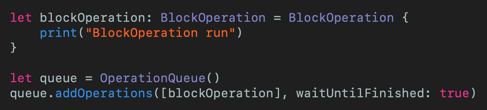
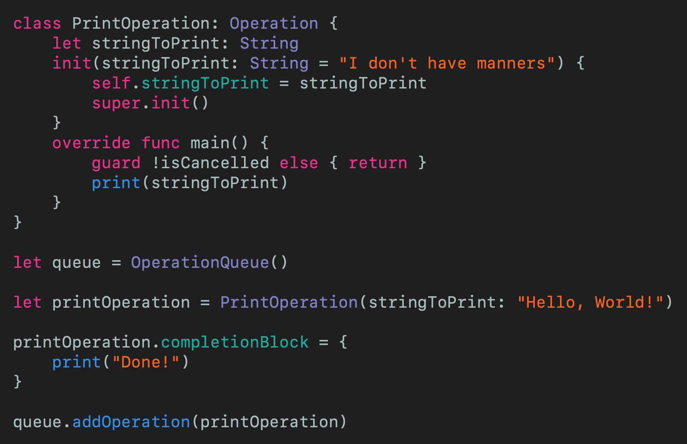
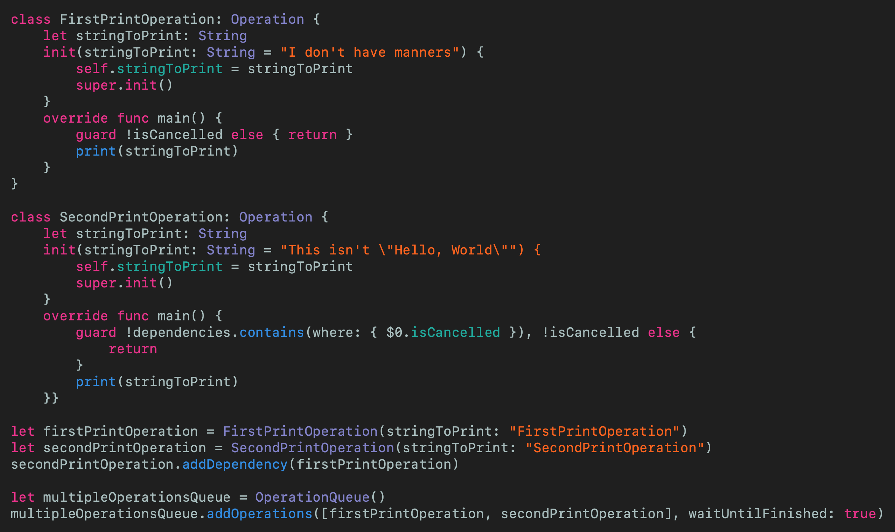
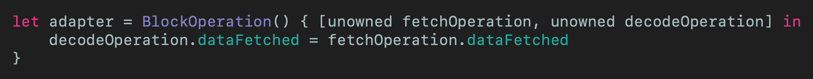
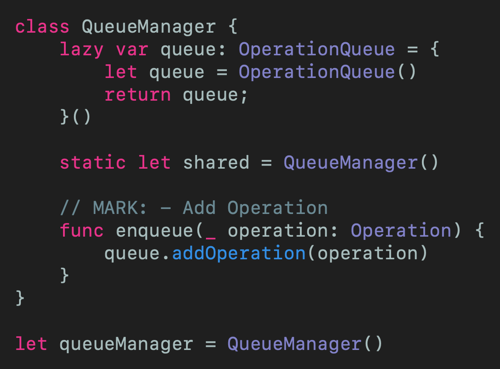

# Parallel Programming with Operation and OperationQueue in Swift
## Do it at the same time

 
Photo by Sharon McCutcheon on Unsplash

You might have read my previous article on [GCD](https://medium.com/swift-coding/concurrency-and-grand-central-dispatch-in-swift-gcd-f0ae063973c2), and want to explore the higher-level tools at your disposal in Swift. 

You might want a deep-five into those higher-level tools. If you do, this is the article for you!

Welcome to the article!

Difficulty: Beginner | Easy | **Normal** | Challenging 
This article has been developed using Xcode 11.5, and Swift 5.2.4

## Prerequisites: 
* This article is written in a [Playground](https://medium.com/@stevenpcurtis.sc/coding-in-swift-playgrounds-1a5563efa089) but I'm assuming you are comfortable with [Initialization](https://medium.com/@stevenpcurtis.sc/swift-initializers-fc12908a9106)
* You might benefit from understanding the [difference between parallelism and concurrency](https://medium.com/swift-coding/concurrency-and-grand-central-dispatch-in-swift-gcd-f0ae063973c2) and [GCD](https://medium.com/swift-coding/concurrency-and-grand-central-dispatch-in-swift-gcd-f0ae063973c2) through those articles
* Later in the article a real example is used, that is [Decoding JSON](https://medium.com/@stevenpcurtis.sc/decode-json-with-swift-test-e2d26dfafd6d) and the internal workings of this are kind of skipped over

## Terminology
Queue: A data structure in which elements are removed in the same order in which they were entered
Operation: A class representing a single task. As an abstract class you should subclass it, or us `NSInvocationOperation` or `BlockOperation` to perform the task. Operations are performed one time and cannot be executed again.
OperationQueue: A priority queue that regulates the order of operations

# The theory
## Operation
### Operation is an abstract class
Operation is usually subclassed in order to complete a specific task. 

### Operation Lifecycle
Each operation is in one of several possible states

*Pending* when an operation is added to an `OperationQueue` is is in a pending state, waiting for preconditions. 
*Ready* once the preconditions are fulfulled, an operation is ready. If there is an open space on the `OperationQueue` the `Operation` will execure (move to the next state)
*Executing* this state represents that the `Operation` is running
*Finished* this state represents that the `Operation` has been completed, and should be removed from the `OperationQueue`. 
*Cancelled* If an `Operation` has been cancelled it should stop execution, discard all conditions and enter the finished state.

An operation can *always* be be cancelled - so long as it is not finished (or has already been cancelled, obvs.). The only way to remove an `Operation` from the `OperationQueue` is by entering the finished state. 

### Concurrency in operations
`Operations` can be *Concurrent* or *Non-concurrent*.

*Concurrent* operations can perform their work on different threads so we assume the responsibility for moving the `Operation` between the Ready, Executing and Finished states.

*Non-concurrent* operations perform their work on the same thread and when the main method returns the operation is moved into the Finished state. 

## Operation dependencies
If you need to execute operations in a particular order (for example downloading JSON and then decoding it) this can be set up as a dependent operation. There can (of course) be more than one dependent operation, and an operation object with dependencies will not be executed until all of it's dependent operations have finished executing. 

Remember one thing though - *If an operation is cancelled then it is still marked as finished* - therefore this has some impact on error tracking and error handling.

## Executing operations manually
It is possible to execute operations manually by calling the `start()` function. [Apple say](https://developer.apple.com/documentation/foundation/operation) that care must be taken to make sure that the operation is in the ready state before doing this - at risk of a runtime exception (and this can be checked with the `isReady` property). 

# The minimal example!
Here we are going to create the minimal example for `Operation` and `OperationQueue`. What is that example going to be? I'm goint to make a *Hello, World!* example that will make this as simple as possible.

At last! Let's get started!

## Using BlockOperation
Instead of subclassing operation we can use `BlockOperation` to manage the concurrent execution of blocks.
Concurrent? That means operations running in the same time-space as each other. A diagram?
 

 
[Click for Gist](https://gist.github.com/stevencurtis/f6f2cbd6ca0bfad4bd9331071aee0626) 

## Using a custom operation
You should check if the operation has been cencelled before doing any work, and handily we have an [isCancelled property](https://developer.apple.com/documentation/foundation/operation/1408418-iscancelled), which can be checked as we enter the `main` function. 
Here is the minimal example:
 
[Click for Gist](https://gist.github.com/stevencurtis/5f5f07f25a0b4d62096bd9f927007fc8) 

Here we are subclassing `Operation`, and when we initialize the class we set a property for a `stringToPrint`. When the `Operation` is called from the `OperationQueue` the `main()` function is called which checks to see if the operation is cancelled, and if it sn't print the message "Hello, World!". Incidently, before adding this `printOperation` to the queue I've added a `completionBlock` that prints a *Done!* message when we've finished.

We can check that the cancelling mechianism works by cancelling the operation before adding it to the queue using `printOperation.cancel()`, which sets the `isCancelled` boolean to true. 

This example uses `queue.addOperations([blockOperation], waitUntilFinished: true)` but  `queue.addOperation(blockOperation) `would do just as well.

### Remember
You should remember, since you can cancel an operation with a reference to that operation that it only makes sense to add an `Operation` to a single `OperationQueue`. If not you get a rather nasty `NSException` error. 

# Dependencies
A dependency means that we can ensure one `Operation` takes place before a subsequent operation. Cool beans.
## Using dependencies
From this point onwards, we are going to use the cusom subclassed operation to be able to make use of one of the benefits of using `Operation` and `OperationQueue`. 

Extending our example of using print we can set up a dependency between two `Operation` objects. 

By *dependency* we mean that an `Operation` object cannot execute until all of it's dependent operations have finished. The example here will show a single dependency to create a minimal example. (Yes, this uses [default parameters](https://medium.com/@stevenpcurtis.sc/default-arguments-in-swift-b5f3740e2259), but the code is not too tricky) - we create a `SecondPrintOperation` and a `FirstPrintOperation` that are both almost the same as the `PrintOperation` above - so they aren't doing anything to earth moving (I think) at this point. I'm going to whack these into an `operationQueue` called *multipleOperationQueue*

We can therefore add a dependency with: `secondPrintOperation.addDependency(firstPrintOperation)`

We have to make sure that the dependency *isn't* cancelled, and do this by checking the dependencies of `SecondPrintOperation` in the `main()` function.

 
[Click for Gist](https://gist.github.com/stevencurtis/2fc025cf99e946cfdb5271f0084fc839)

## Passing data between dependencies
In order to pass data between dependencies using an extra dependency that itself is a `BlockOperation`, which means that no subclassing is required here. 

There isn't any real reason to use out existing `Operation` classes to pass date, so imagine that the first class downloads some data and the second decodes it.

This decoding is similar to [this article](https://medium.com/@stevenpcurtis.sc/decode-json-with-swift-test-e2d26dfafd6d), so go there for more explaination of the decoding process.

### Creating an adaptor
We can use the `BlockOperation` to link properties within a `fetchOperation` and a `decodeOperation`  allowing us to bridge in between the two. This adaptor looks like the following:

 
[Click for Gist](https://gist.github.com/stevencurtis/597ef7996327cb9b865b22cf7db7d20c)

which of course relies on your `Operation` objects (in this case) containing a `dataFetched` property of the same type (this will be a `Data` type).

### Getting data back from the object
To get data back from an object we can use any of the normal ways we might use in Swift - KVO perhaps. However, in this example I'm going to use [closures](https://medium.com/swift-coding/swift-closures-c14cb7aa2170) which here I'm combining with a [typealias](https://medium.com/@stevenpcurtis.sc/type-alias-for-readability-in-swift-b5d60de4aee1).

Take a look at the implementation below to see how this is implemented

### Implementing the adaptor

So here we are going to define the UserModel for the hard-coded data in a data object witch is just the `String` representation of a *JSON String*.

It is true that this implementation doesn't *actually* download anything from an API call - but for this particular article that would be a little too in-depth as it would combine extra concepts. For no, hard coded Strings is absolutely fine. 

 
[Click for Gist](https://gist.github.com/stevencurtis/fbd6121f390a98e8f0327e1c8363ab92)

# Doing better: Creating a queue manager
The above solution kind of leaves the instantiation of the `OperationQueue` up in the air. One way to solve this is to create a [Singleton](https://medium.com/@stevenpcurtis.sc/singleton-in-swift-8da9bea06339) class (which also incorporates [lazy variables](https://medium.com/@stevenpcurtis.sc/the-lazy-variables-what-and-why-in-swift-619cb951ee0f)) so this can be used safely in various parts of an application ensuring that `Operations` are always added to the same queue.

A `QueueManager` manages a particular queue `OperationQueue` in space and time (although it could hold multiple queues, perhaps one which is for user-driven events and one used for system events). 

This leaves a responsibility to create, configure and schedule operations on a queue and perhaps handle all networking events for a particular endpoint. 

The queue manager will look something like the following:

 
[Click for Gist](https://gist.github.com/stevencurtis/517475c3015876f2f93548687ade017d)

# Conclusion
You might like to explore Apple's documentation on this one. Both [OperationQueue](https://developer.apple.com/documentation/foundation/operationqueue) and [Operation](https://developer.apple.com/documentation/foundation/operation) have their own documentation and are worth looking through.

`Operations` can be quite tricky, but are a great tool to use concurrency within your App, but their use should be weighed up against the potential use of GCD (which might be better for switching threads for example, due to ease of use).

As ever, put the tools in your toolbox and make the best decisions for your own project. Happy coding!

If you've any questions, comments or suggestions please hit me up on [Twitter](https://twitter.com/stevenpcurtis)
