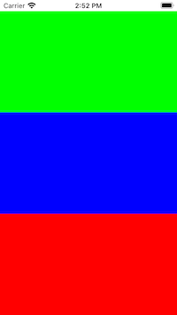

# Pass Parameters in Tap Gestures
## Also known as stop casting / stop using tags

## Before we start
Difficulty: Beginner | Easy | **Normal** | Challenging
This article has been developed using Xcode 13.0, and Swift 5.3

## Prerequisites
- It will be useful if you are [familiar with subclassing](https://medium.com/r/?url=https%3A%2F%2Fstevenpcurtis.medium.com%2Fsubclassing-uiview-in-swift-d372c67b7f3) in Swift

# This project
## The answer
If you've several `UIView` instances in a view and wish to easily identify which is in a `UIViewController`. So the end result look something like the following:



Isn't that nice! There are three different views here and we would like to differentiate between each one when the user taps them. Surely this is an easy task?

Now remember, there isn't any [MVVM](https://medium.com/r/?url=https%3A%2F%2Fstevenpcurtis.medium.com%2Fmvvm-in-swift-19ba3f87ed45) or great architecture here so I've crammed everything into the ViewController - this article is about the Gestures rather than anything else!

Now our multiple views using the same tap gesture recognizer

```swift
@objc func showAlert(_ sender: UITapGestureRecognizer){
    // Code to identify sender.view printed to the console
}
```

Can we reuse this?
Well, since gesture recognizers can only be attached to a single view (a one-to-one relationship) so we will deal with this as we progress on this project.

## Use the tag
`UIView` classes in Swift have a [tag property](https://medium.com/r/?url=https%3A%2F%2Fdeveloper.apple.com%2Fdocumentation%2Fuikit%2Fuiview%2F1622493-tag%3Flanguage%3Dobjc), which can either be set through the Storyboard or programatically (which is done in this sample code).

```swift
let gesture = UITapGestureRecognizer(target: self, action: #selector(logToConsole))
firstView.addGestureRecognizer(gesture)
firstView.tag = 1
```

We can then retrieve using a `logToConsole` function and print the tag

```swift
@objc func logToConsole(_ sender: UITapGestureRecognizer){
    print("The sender is : \(sender.view?.tag)")
}
```

which is rather fantastic isn't it? Job done!

**But you shouldn't be using tags to uniquely identify your views at all**

So, there must be a better way!
Luckily there is!

## Subclass the view

```swift
class SubclassedView: UIView {
    var number: Int?
    // init from code
    override init(frame: CGRect) {
        super.init(frame: frame)
        setupView()
    }
    // init from xib or storyboard
    required init?(coder aDecoder: NSCoder) {
        super.init(coder: aDecoder)
        setupView()
    }
    // common setup code
    private func setupView() {
        backgroundColor = .green
    }
}
```

Of course the number can changed using the initialiser etc. but in this case we will reach in and use the property directly:

```swift
let gestureTwo = UITapGestureRecognizer(target: self, action: #selector(logToConsole))

secondView.addGestureRecognizer(gestureTwo)

(secondView as? SubclassedView)?.number = 2
```

Now I don't love the way that the Integer has been set here, but never mind. 

We can then declare `logToConsole` using the following code:

```swift
@objc func logToConsole(_ sender: UITapGestureRecognizer){
    if let numberSender = sender.view as? SubclassedView {
        print("The sender is: \(numberSender.number)")
    }
}
```

here if the sender is of `SubclassedView` type. 

But that Conditional cast `if let numberSender = sender.view as? SubclassedView`? I really don't like it. What if the type is not `SubclassedView`? This is all bad times.

## Subclassed UITapGestureRecognizer
We can overcome this! We can subclass `UITapGestureRecognizer` to get the following:

```swift
class SubclassedTapGestureRecognizer: UITapGestureRecognizer {
    let number: Int
    init(target: AnyObject, action: Selector, number: Int) {
        self.number = number
        super.init(target: target, action: action)
    }
}
```

This gives us the option of creating the following code:

```swift
let gestureThree = SubclassedTapGestureRecognizer(target: self, action: #selector(logToConsoleCustom), number: 3)
thirdView.addGestureRecognizer(gestureThree)
```

which, the attentive reader will have noticed - calls `logToConsoleCustom`

```swift
@objc func logToConsoleCustom(_ sender: SubclassedTapGestureRecognizer){
    print(sender.number)
}
```

which, as you see enables us to use `SubclassedTapGestureRecognizer` which carries with the class an Integer. As this subclass has been initialized with the number `3`, of course it will print `3` to the console.

Note that we've avoided the conditional casting madness, and therefore presented the best solution to this problem (at least from the solutions presented here).

# Conclusion

Some might say that it is impossible to pass parameters. This article has presented solutions to the problem, and has presented this solution in situ in the attached repo. I hope this helps everyone who is reading this article!

Subscribing to Medium using [this link](https://medium.com/r/?url=https%3A%2F%2Fstevenpcurtis.medium.com%2Fmembership) shares some revenue with me.

If you've any questions, comments or suggestions please hit me up on [Twitter](https://medium.com/r/?url=https%3A%2F%2Ftwitter.com%2Fstevenpcurtis)
