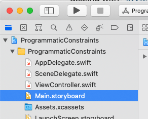
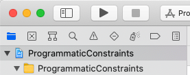
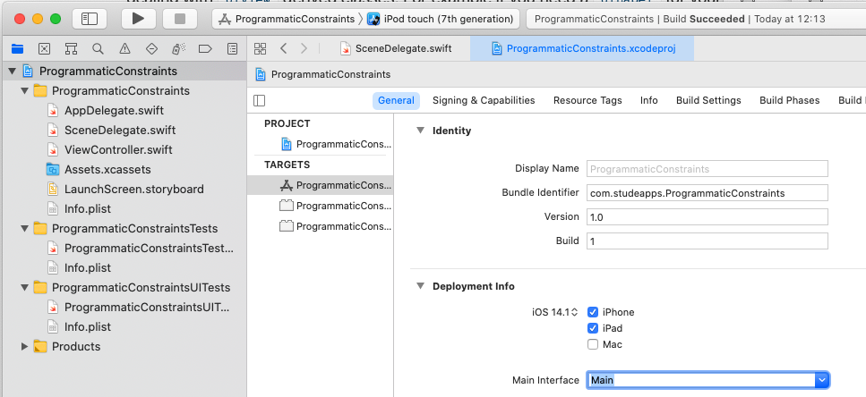
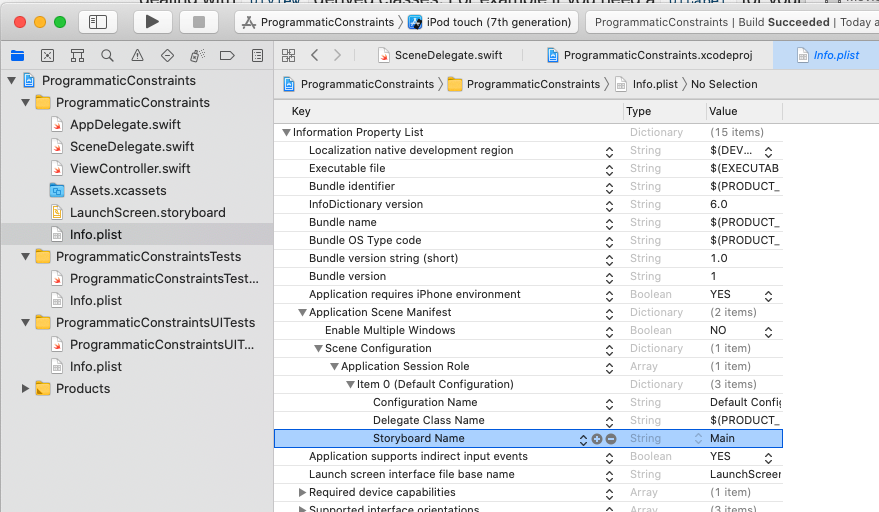

# Write Programmatic Constraints for Swift Projects
## We can do it good!


<sub>Photo by John Towner @heytowner</sub>

Difficulty: **Beginner** | Easy | Normal | Challenging<br/>
This article has been developed using Xcode 12.1, and Swift 5.3

## Prerequisites:
* You will be expected to be aware how to make a [Single View Application](https://medium.com/swlh/your-first-ios-application-using-xcode-9983cf6efb71) in Swift.
* This article assumes that you are coding 100% programatically, and are using loadView [for which I use this technique](https://medium.com/@stevenpcurtis.sc/write-clean-code-by-overriding-loadview-ac4f172163d0)
* This article uses a [UINavigationController](https://stevenpcurtis.medium.com/the-uinavigationcontroller-and-uinavigationbar-in-swift-4d9c6c96d946)
* A [guard](https://medium.com/@stevenpcurtis.sc/precondition-assert-fatal-error-or-guard-in-your-swift-code-5f9297658be0) is mentioned in this article
* [Closures](https://medium.com/swift-coding/swift-closures-c14cb7aa2170) are mentioned in passing

## Terminology
Storyboard: A way to graphically layout the UI in Xcode

# Removing the Storyboard
Although this isn't really part of this tutorial (there is a full guide on this [here](https://medium.com/@stevenpcurtis.sc/write-clean-code-by-overriding-loadview-ac4f172163d0) but essentially you can select `Main.storyboard` in the project inspector


then pressing the delete key (on your keyboard!)

Then the reference must be removed, the easiest way is to select the top level project file in the project inspector (mine is called ProgrammaticConstraints)



and then delete the **Main Interface** (which is usually set to *Main*) which can be deleted once again with the use of the delete key on the keyboard



The third stage of this is deleting the reference in the .plist file.

To do so select `Info.plist` from the project inspector, and delete the storyboard name from the plist file. A gentle press of the delete key (when the name is selected) will do it!



Now of course running a project with ⌘R will be slightly disappointing, as there isn't a preprepared view to be displayed within the view controller.

In this particular project, I've created a simple menu that then traverses using a `UINavigationController`, which means that we will pop view controllers onto the view hierarchy using that particular control. For more details take a look at the [UINavigationController]() article.

I won't cover the creation of this menu in this particular article, but it does give access to another implementation of some lazy controls which is avaliable in the [repo](https://github.com/stevencurtis/SwiftCoding/tree/master/ProgrammaticConstraints) for you to download!

## The ordinary view controller
We are going to add a simple `UILabel` into the middle of the host view controller. But how to add the property and perform the configuration of the same? In this article, we are going to perform the configuration in `loadView()` which means that the compiler doesn't see the `UILabel` instance as complete until the loadView as finished - so the `UILabel` property is naturally an optionaL

There are a couple of ways of dealing with this - one is to make the label an optional. To solve the problem of potentially [force-unwrapping](https://medium.com/@stevenpcurtis.sc/avoiding-force-unwrapping-in-swift-6dae252e970e) in this example I've used a [guard](https://medium.com/@stevenpcurtis.sc/precondition-assert-fatal-error-or-guard-in-your-swift-code-5f9297658be0).

```swift
class OrdinaryViewController: UIViewController {
    var label: UILabel?
    override func loadView() {
        let view = UIView()
        view.backgroundColor = .white
        self.view = view

        label = UILabel()
        label?.text = "This is a great label!"
        label?.textAlignment = .center
        label?.translatesAutoresizingMaskIntoConstraints = false
        
        guard let label = label else {return}
        view.addSubview(label)
        
        NSLayoutConstraint.activate([
            label.topAnchor.constraint(equalTo: self.view.safeAreaLayoutGuide.topAnchor),
            label.bottomAnchor.constraint(equalTo: self.view.safeAreaLayoutGuide.bottomAnchor),
            label.leadingAnchor.constraint(equalTo: self.view.safeAreaLayoutGuide.leadingAnchor),
            label.trailingAnchor.constraint(equalTo: self.view.safeAreaLayoutGuide.trailingAnchor)
        ])
    }
}
```

which really is OK. An alternative is to use an implicitly-inwrapped optional (that is, set up the `UILabel` instance as a property with `var label: UILabel!`. Some dislike this approach, but it is functionally identical to the code shown above

```swift
class OrdinaryViewController: UIViewController {
    var label: UILabel!
    override func loadView() {
        let view = UIView()
        view.backgroundColor = .white
        self.view = view

        label = UILabel()
        label.text = "This is a great label!"
        label.textAlignment = .center
        label.translatesAutoresizingMaskIntoConstraints = false
        
        view.addSubview(label)
        
        NSLayoutConstraint.activate([
            label.topAnchor.constraint(equalTo: self.view.safeAreaLayoutGuide.topAnchor),
            label.bottomAnchor.constraint(equalTo: self.view.safeAreaLayoutGuide.bottomAnchor),
            label.leadingAnchor.constraint(equalTo: self.view.safeAreaLayoutGuide.leadingAnchor),
            label.trailingAnchor.constraint(equalTo: self.view.safeAreaLayoutGuide.trailingAnchor)
        ])
    }
}
```

Arguably we have the same issue in both these implementations - the configuration of the `UILabel` is right in the `loadView` - so can we abstract that away somehow?

## The lazy view controller
We can make the `UILabel` instance a lazy property. This means that we can use a closure to config the instance only when it is first used. So the configuration only happens on the first load of the property.

The (similar code to those above) is shown here:

```swift
class LazyViewController: UIViewController {
    var label: UILabel = {
        let lab = UILabel()
        lab.text = "This is a great label!"
        lab.textAlignment = .center
        lab.translatesAutoresizingMaskIntoConstraints = false
        return lab
    }()
    
    override func loadView() {
        let view = UIView()
        view.backgroundColor = .white
        self.view = view        
        view.addSubview(label)
        
        NSLayoutConstraint.activate([
            label.topAnchor.constraint(equalTo: self.view.safeAreaLayoutGuide.topAnchor),
            label.bottomAnchor.constraint(equalTo: self.view.safeAreaLayoutGuide.bottomAnchor),
            label.leadingAnchor.constraint(equalTo: self.view.safeAreaLayoutGuide.leadingAnchor),
            label.trailingAnchor.constraint(equalTo: self.view.safeAreaLayoutGuide.trailingAnchor)
        ])
    }
}
```


# Conclusion
This isn't a complete guide to layout for iOS. However, I hope this particular article has given you a good start and an idea of how I implement constraints in my projects where I've decided the `UIStoryboard` is not quite the right way to go for whatever reason.

Good luck, as ever!

If you've any questions, comments or suggestions please hit me up on [Twitter](https://twitter.com/stevenpcurtis) 
