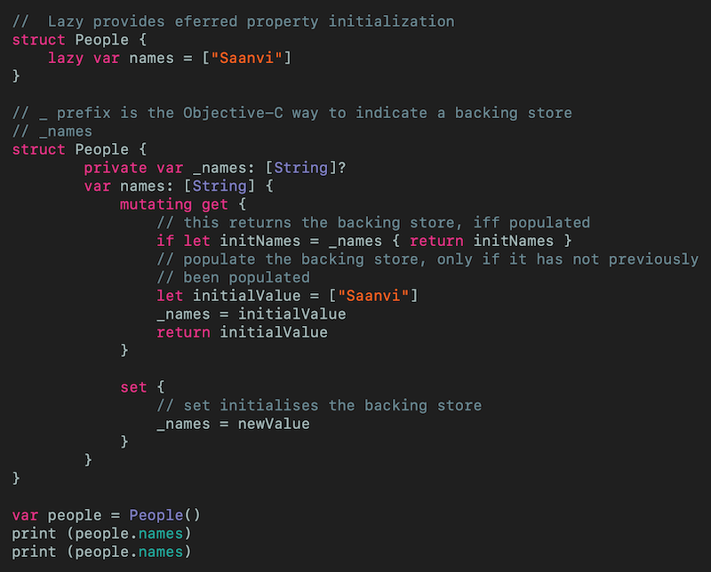
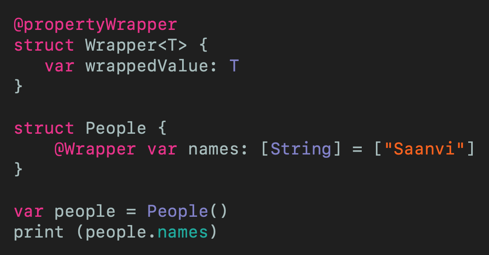
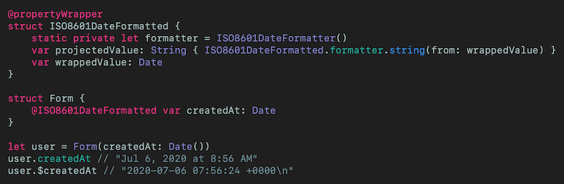

# Understanding Swift's Property Wrappers
## Don't be so lazy

 
Photo by Jf Brou on Unsplash

Difficulty: Beginner | Easy | **Normal** | Challenging 
This article has been developed using Xcode 11.4.1, and Swift 5.2.2

## Prerequisites: 
* You will be expected to be aware how to make a [Single View Application](https://medium.com/swlh/your-first-ios-application-using-xcode-9983cf6efb71) in Swift or a [hello, world equivalent](https://medium.com/swlh/your-first-ios-application-using-xcode-9983cf6efb71)
* It would be helpful to understand something about [lazy variables](https://medium.com/@stevenpcurtis.sc/the-lazy-variables-what-and-why-in-swift-619cb951ee0f) would be useful
* Property Wrappers rely on [Generics](https://medium.com/better-programming/generics-in-swift-aa111f1c549) in Swift

## Terminology
lazy variables: A technique in that a property is only created when it is needed
Property Wrappers: A property wrapper adds a layer of separation between code that manages how a property is stored and the code that defines a property

# Why use property wrappers?
Using **Lazy** in Swift is useful as it defers initialization of a value until its first access. This is equivalent functionality to wrapping a value in a computed get - **lazy** makes your code more elegant, easy to read and of course maintainable.

Here is an example of the lay instantiation of a struct (if you follow along with the Playground, make sure you comment out one of the `People` instances at a  time or the compiler will tell you that you have an invalid declaration of '`People`')

 
[Click for Gist](https://gist.github.com/stevencurtis/9e308e798dac9ca99cbb873b0e27fd7c)

Effectively for each property on the `struct` you'd need to have one of these sets of getters and setters. What if you could use a repeatable peice of code that yould allow you to be able to reuse code.

# Using property wrappers
## Basic example
The idea here is that we can reuse the `Wrapper` for as many properties as we would like on the `People` `struct`. This gives the following code:

 
[Click for Gist](https://gist.github.com/stevencurtis/e1364d8e99c3ddf5f0c6decf00526ae9)

Effectively we are abstracting the `@propertyWrapper` away from our `struct` or `class` instances. The `Wrapper` provides transparency since when we are using the `Wrapper` using generics we are simply using an `Array` of `String`. 

## ISO8601DateFormatter
It is really common to use `ISO8601DateFormatter` to provide a standardized way of presenting Data and Time. Since this can be reused in many `struct` and `class` instances, this is certainly is great use of Swift's Property Wrappers.

 
[Click for Gist](https://gist.github.com/stevencurtis/a85e78e35b8fcf7545cf60ff26936ae3)

### projectedValue
Let us look here:
`user.createdAt` 
`user.$createdA`

Each of the two examples above gives us two different outputs - since the second of the two is a `projectedValue`.

So the `$` indicates that we want to access the property wrapper itself rather than the property that it is wrapping.

`type(of: user.createdAt) // Foundation.Date.Type
type(of: user.$createdAt) // String.Type`

Now of course to use `projectedValue` we need to have a `var projectedValue` property in our `propertyWrapper`. 

# Conclusion
Property wrappers are a Swift feature that can help you write easy to read and mainable code in Swift. They have been avaliable since Swift 5.1, and have particular power when coupled with SwiftUI - so this is certainly something you should look at as you enhance your understanding of Swift and iOS/iPadOS. 

When creating code you should always think about reusability, what a great use of abstraction in the constructs of the language!

The code from this is included in the attached [Repo](https://github.com/stevencurtis/SwiftCoding/tree/master/PropertyWrappers). 

If you've any questions, comments or suggestions please hit me up on [Twitter](https://twitter.com/stevenpcurtis) 
