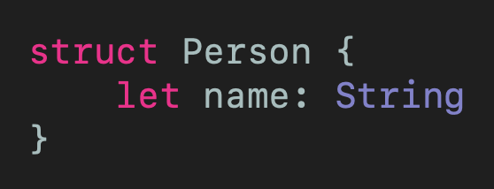
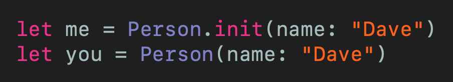
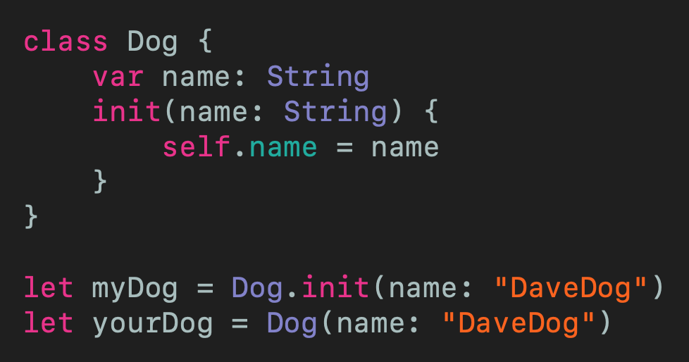
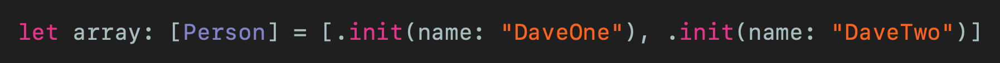
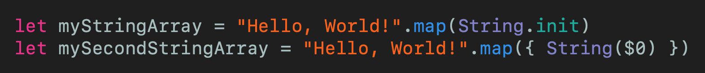

# What's the Difference in Creating an Object with () and init()
## Deal if your JSON contains an array

 
Photo by Tevarak Phanduang on Unsplash

Difficulty: Beginner | **Easy** | Normal | Challenging 
This article has been developed using Xcode 11.5, and Swift 5.2.4

## Prerequisites: 
* You can follow along with this in Swift Playgrounds [Guide to Playgrounds](https://medium.com/@stevenpcurtis.sc/coding-in-swift-playgrounds-1a5563efa089)

# The Question
You might have seen the two alternatives that follow for instantiating a `class`: `Person(name: "Dave")` and `Person.init(name: "Dave")` . What is the difference, and which should we use?

This article seeks to give the solution

# An Example

Imagine you have a `struct`. This `struct` is going to store a person's name. 

If you need a reminder about initializers please do take [a look at this guide](https://medium.com/@stevenpcurtis.sc/swift-initializers-fc12908a9106) . I'll wait. 

Are you back?

Right.

This struct can be created in Swift by using:

now there are two alternative ways to create an instance of this object in Swift:

now this means *the same thing*. If you print out the two `struct` instances defined, exactly the same thing will be printed.

When we say that this is a question of *style*. Now in Swift we usually use the former initializer style, that is `Person(name: "Dave")` if we wish to intiialize a person with the name Dave, rather than `Person.init(name: "Dave")` . 
Now the reason behind this is that it resembles the constructor syntax in other languages - great!

Does the same apply to `class` declarations? Of course, yes it does!

Now you do need to create your own initializer since this is a `class` in Swift. No problem for the more experienced of you:

 If you print out the two `class` instances defined, exactly the same thing will be printed.
 
 # Reasons for using .init()
 So I've just said that it's a question of style. But there are other reasons that you might use `.init()`
 
 You can use Swift's great type inference to make the instantiation of an [`Array`](https://medium.com/swlh/the-array-in-swift-d3e0fb04a0dd) somewhat easier - by using `.init()`. Look at the following example:
 
 
 
 Now it is arguable (and you can tell me I'm wrong on [Twitter](https://twitter.com/stevenpcurtis) ) that the second is better in terms of understanding - particularly with more complex classes (and I DO appreciate that I've picked a rather simple example here).
 
Another example, using [mapping in Swift](https://medium.com/@stevenpcurtis.sc/mapping-in-swift-a6d6132a38af) allows us to convert a `String` into an array of `String` (that is, `[String]`)
Here are two possible solutions to this problem: 
 
 Now you can see that the first option initializing with `.init()` would be a nicer option.
 
 Although, yes it is true this once again comes down to style.
 
# Conclusion
You might well think of style in programming to be an inessential nice-to-have that you can get away without considering. I'd say that isn't since the point in studying a language is to work with other people, and perhaps even creating great software that meets business needs.

In order to do just that...you'll need to think of your programming style. Isn't it time you thought about that?

If you've any questions, comments or suggestions please hit me up on [Twitter](https://twitter.com/stevenpcurtis) 

