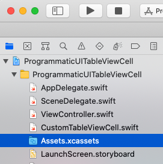
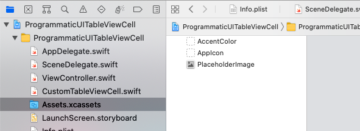
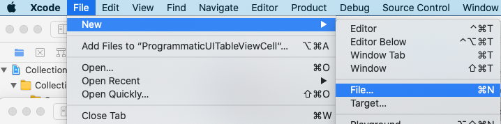
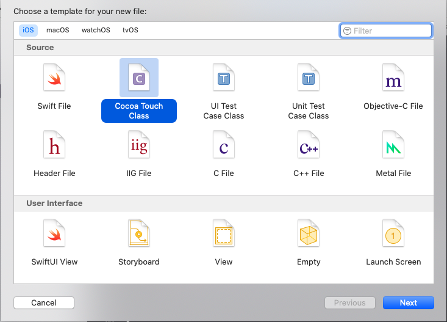
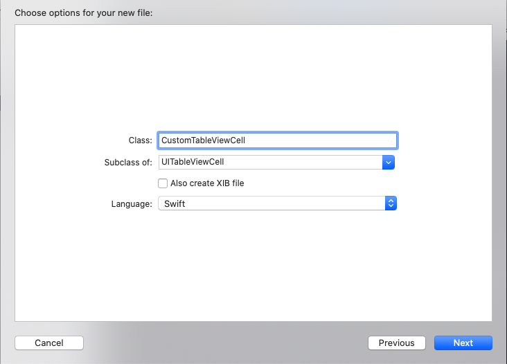

# Create a UITableViewCell programmatically
## Use the functions, but well


<sub>Photo by Halacious</sub>
Difficulty: **Beginner** | Easy | Normal | Challenging<br/>
This article has been developed using Xcode 12.1, and Swift 5.3

This project is intended to create a `UITableViewCell` in an entirely programmatic fashion. Read on to find out about this!

## Prerequisites:
* You will be expected to be aware how to make a [Single View Application](https://medium.com/swlh/your-first-ios-application-using-xcode-9983cf6efb71) in Swift.

## Terminology
UIViewController: A view controller is an intermediary between the views it manages and the data of your app

## Load the ViewController
So in the SceneDelegate add the following:

```swift
    func scene(_ scene: UIScene, willConnectTo session: UISceneSession, options connectionOptions: UIScene.ConnectionOptions) {
        guard let windowScene = (scene as? UIWindowScene) else { return }

        window = UIWindow(frame: windowScene.coordinateSpace.bounds)
        window?.windowScene = windowScene
        
        self.window = UIWindow(windowScene: windowScene)

        let vc = ViewController()
        let rootNC = UINavigationController(rootViewController: vc)

        self.window?.rootViewController = rootNC
        self.window?.makeKeyAndVisible()
    }
```

which will load a simple `UIViewController` called ViewController.

Now we will need to delete the Storyboard, and remove the reference from the project and the plist. The whole process is described in the following [guide](https://medium.com/@stevenpcurtis.sc/write-clean-code-by-overriding-loadview-ac4f172163d0)

## Adding an image to Assets
I've added a placeholder image called `PlaceholderImage.png`. This is a relatively simple process, we can drag and drop the image into the asset catalog. To do so we can select the Asset catalog from the project inspector:

and then can drag and drop the image into the catalog:



This will then be referred to later in this article (and in the attached [repo](https://github.com/stevencurtis/SwiftCoding/tree/master/ProgrammaticUITableViewCell)

## Creating a custom `UITableViewCell`
I've called mine `CustomTableViewCell`(sorry about the originality).
Create a new file



Choose Cocoa Touch Class



We then choose the name of the `UITableViewCell` 



## Adjusting the `UITableViewCell`
You are provided with `awakeFromNib` and `setSelected`.

Unfortunately `awakeFromNib` is called once the `CustomTableViewCell` as been loaded from an Interface Builder archive, or nib file. `setSelected` allows the appearance of the cell when the state of the cell is changed (that is, when it is selected). 

In the case of this particular implementation I will not use either of these functions, so in this case I'll remove them.

Now in a standard `UITableViewCell` the image goes on the left hand side. In my custom version I want this to go on the right-hand side.

So we will use the initializer `init(style: UITableViewCell.CellStyle, reuseIdentifier: String?)` since (from the documentation) it initializes a table cell with a style and a reuse identifier and returns it to the caller. In this case I'll set the background color and of course put the image on the right hand side of the scren.

Now since we are overriding `UITableViewCell` we do get a `UILabel` text for free in the middle of the cell - so we can use that. However, we want to make the `UITableViewCell` reusable (for any possible image) so we set up a function in order to setup the particular cell.

Here is my full `CustomTableViewCell` `UITableViewCell` implementation:

```swift
class CustomTableViewCell: UITableViewCell {
    lazy var rightImage: UIImageView = {
        let imgView = UIImageView()
        imgView.contentMode = .scaleAspectFit
        imgView.translatesAutoresizingMaskIntoConstraints = false
        return imgView
    }()

    override init(style: UITableViewCell.CellStyle, reuseIdentifier: String?) {
        super.init(style: style, reuseIdentifier: reuseIdentifier)
        backgroundColor = .red
        addSubview(rightImage)
        NSLayoutConstraint.activate([
            rightImage.topAnchor.constraint(equalTo: topAnchor),
            rightImage.bottomAnchor.constraint(equalTo: bottomAnchor),
            rightImage.rightAnchor.constraint(equalTo: rightAnchor),
            rightImage.widthAnchor.constraint(equalTo: rightImage.heightAnchor)
        ])
    }
    
    func setupCell(image: String) {
        rightImage.image = UIImage(named: image)
    }
    
    required init?(coder: NSCoder) {
        fatalError("init(coder:) has not been implemented")
    }
}
```

Note that this class is not designed to be used with a `UIStoryboard` instance, and this is mandated through the use of `fatalError` as shown above.

## Setting up the `UIViewController`
I prefer to set up the view controller in the loadView function, and this is the cannonical way when instantiating `UIViewController` instances programatically [here is a full explanation](https://medium.com/@stevenpcurtis.sc/write-clean-code-by-overriding-loadview-ac4f172163d0)

```swift
class ViewController: UIViewController {
    var tableView: UITableView!
    var data: [String] = ["a", "b", "c", "d", "e", "f"]

    override func viewDidLoad() {
        super.viewDidLoad()
        setupTableView()
    }

    override func loadView() {
        tableView = UITableView(frame: .zero)
        self.view = tableView
    }
    
        func setupTableView(){
        tableView.register(CustomTableViewCell.self, forCellReuseIdentifier: "cell")
        tableView.delegate = self
        tableView.dataSource = self
    }
}

extension ViewController: UITableViewDelegate {}
extension ViewController: UITableViewDataSource {
    func tableView(_ tableView: UITableView, numberOfRowsInSection section: Int) -> Int {
        data.count
    }
    
    func tableView(_ tableView: UITableView, cellForRowAt indexPath: IndexPath) -> UITableViewCell {
        if let cell = tableView.dequeueReusableCell(withIdentifier: "cell", for: indexPath) as? CustomTableViewCell {
            cell.textLabel?.text = data[indexPath.row]
            cell.setupCell(image: "PlaceholderImage")
            return cell
        }
        fatalError("could not dequeueReusableCell")
    }
}
```

Of course my instance of the `UIViewController` will only display the `Strings` "a", "b", "c", "d", "e" and "f" - but this is a rather simple implementation.

# Conclusion
I hope this article has been of help to you! I certainly enjoyed writing this for you, and I hope you enjoy your coding journey.

If you've any questions, comments or suggestions please hit me up on [Twitter](https://twitter.com/stevenpcurtis) 

