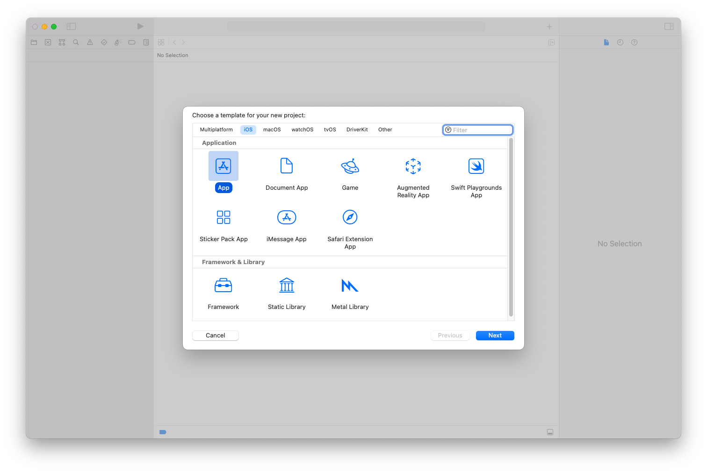
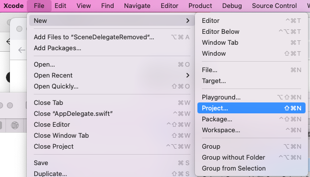
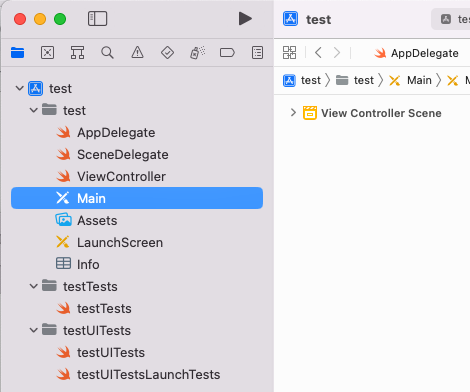
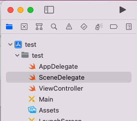
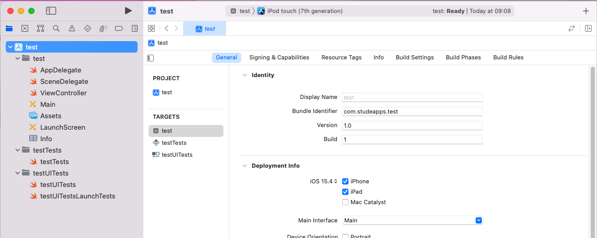
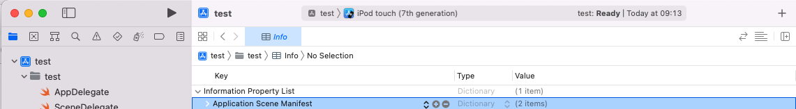
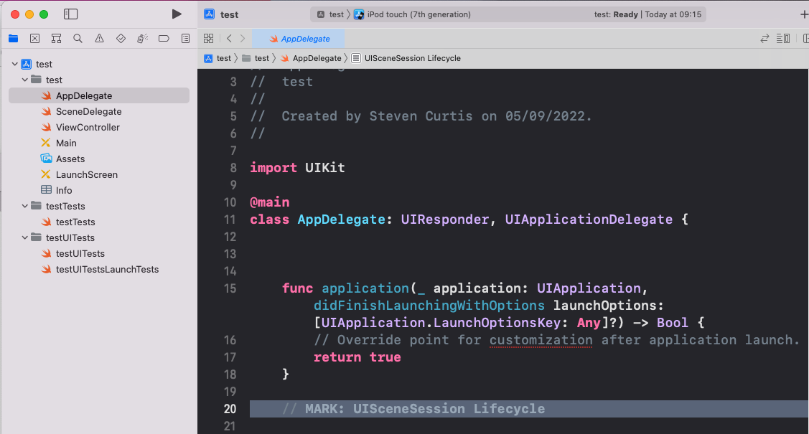
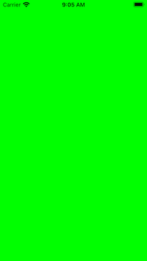

# Zap the SceneDelegate in iOS 12 and just use the AppDelegate
## Useful for Tech Tests

You might be doing a tech test, now that the summer is over. In order to pass that test you'll need to make this project one of your better ones. 
One particular rating of quality is avoiding repeated code. To repeat code in the AppDelegate and the SceneDelegate is one way that you might not have the best outcome from your tech test.
This short guide will tell you how you might create a new project that doesn't need a SceneDelegate at all so has a single entry point for your application.
It will be smart, and make things easier to deal with if you have complex configuration for your Application.
Oh, this will only work in iOS12 and later so if your particular tech test requests iOS 11 (and some are still around) this isn't the guide for you.
Sure, some people like articles. Some people like tutorials. You're in the right place for both of them as the video is here and the tutorial is right after the video (if you scroll!)

# Create a New Project
You will need to create a nice new project from scratch. I'd go to Xcode and do `File>New Application`


Of course we wish to create an iOS App!


# Delete the Storyboard


# Setup The ViewController
**A programmatic view controller**
I usually like to use programatic view controllers. 
This requires a programmatic initializer, one for storyboard use (even though we deleted the storyboard) and a loadView function. This function is going to simply set a single view as the background. So we can see it, I'm going to make the background green.

```swift
import UIKit
class ViewController: UIViewController {
    init() {
        super.init(nibName: nil, bundle: nil)
    }
    required init?(coder: NSCoder) {
        fatalError("init(coder:) has not been implemented")
    }
    override func loadView() {
        let view = UIView()
        view.backgroundColor = .greenself.view = view
    }
}
```
# Setup AppDelegate
We still need to have the function didFinishLaunchingWithOptions to create our viewcontroller.

```swift
import UIKit

@main
class AppDelegate: UIResponder, UIApplicationDelegate {
var window: UIWindow?
func application(_ application: UIApplication, didFinishLaunchingWithOptions launchOptions: [UIApplication.LaunchOptionsKey: Any]?) -> Bool {
    let viewController = ViewController()
    self.window = UIWindow(frame: UIScreen.main.bounds)
    self.window!.rootViewController =     UINavigationController(rootViewController: viewController)
    self.window?.makeKeyAndVisible()
    return true
    }
}
```
# Remove SceneDelegate

Delete that pesky SceneDelegate file from the App bundle. We won't be needing it!



# The Main Interface Should Be Set To Nothing
We need to delete the Main Interface from the target. It's just at the bottom of the print-screen below



# Delete From plist Application The Scene Manifest section



# Delete past // MARK: UISceneSession Lifecycle on The AppDelegate File


# Click run and…
You're left with a green screen (YAY)


#Conclusion
I hope this article was if use to you! Thank you for reading!

If you've any questions, comments or suggestions please hit me up on Twitter
Subscribing to Medium using this link shares some revenue with me.
You might even like to give me a hand by buying me a coffee https://www.buymeacoffee.com/stevenpcuri.
If you've any questions, comments or suggestions please hit me up on Twitter
