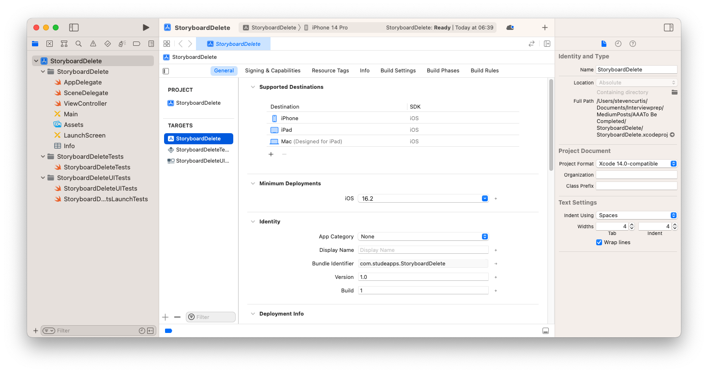
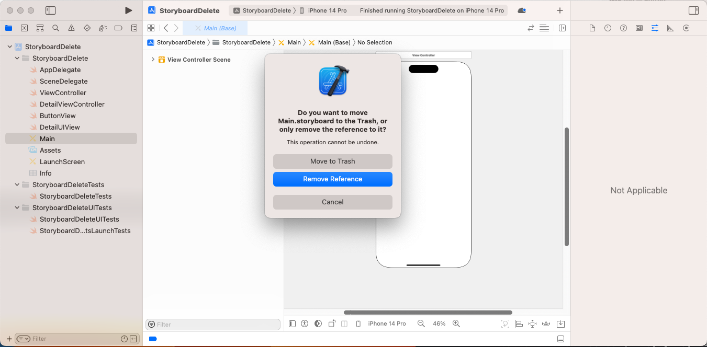
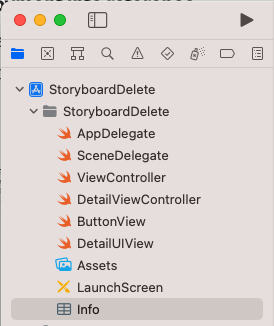

# Delete Storyboard (Xcode 14 edition)
## I do this all the time!

Difficulty: **Beginner** | Easy | Normal | Challenging<br/>

I've written an [article](https://medium.com/swlh/write-clean-code-by-overriding-loadview-ac4f172163d0) detailing the advantages of using `loadView()` instead of storyboards.

You know what, I love using programmatic interfaces while making my Apps. I wrote an [article](https://betterprogramming.pub/avoid-storyboards-in-your-apps-8e726df43d2e) about removing them, but since I tend to do this so often I thought this 

This article has been developed using Xcode 14.2 and Swift 5.7.2

Prerequisites:
This article has been written to allow you to write code using loadView() like in my [article](https://medium.com/@stevenpcurtis.sc/write-clean-code-by-overriding-loadview-ac4f172163d0) featuring Playgrounds, and one suitable for Xcode versions [previous to 14](https://betterprogramming.pub/avoid-storyboards-in-your-apps-8e726df43d2e). In this article, you’ll be expected to be aware of how to make a Single View Application in Swift.

## Getting Started
Once you’ve created a [Single View Application](https://medium.com/swlh/your-first-ios-application-using-xcode-9983cf6efb71), you’re presented with something like the following image:



What’s the problem? Can you see on the left-hand side? Beside your projects? We have a storyboard there — and the whole point is we aren’t going to be using it. If we delete it, we won’t get any further than a blank screen on the simulator followed by an **NSInvalidArgumentException**.
That’s not great at all.

# Step by Step
I’m going to arrange my classes much like I did in the loadView() article.

## The classes
I can list the code for these classes (now I prefer to download these from the repo, but there you go), but I’m leaving the explanation with the original article, as these are basically just created to give us some code to test during the process. In other words, don’t panic!

**ViewController**

```swift
final class ViewController: UIViewController {
    
    override func viewDidLoad() {
        super.viewDidLoad()
    }
    
    override func loadView() {
        let view = ButtonView()
        view.button.addTarget(self, action: #selector(buttonDidTap), for: .touchUpInside)
        self.view = view
    }
    
    @objc
    private func buttonDidTap() {
        let controller = DetailViewController()
        present(controller, animated: true, completion: nil)
    }
}
```

**DetailViewController**
```swift
final class DetailViewController: UIViewController {
    
    override func loadView() {
        let view = DetailUIView()
        view.button.addTarget(self, action: #selector(buttonDidTap), for: .touchUpInside)
        self.view = view
    }
    
    @objc
    private func buttonDidTap() {
        dismiss(animated: true, completion: nil)
    }
}
```

**ButtonView**
```swift
final class ButtonView: UIView {
    let button = UIButton(type: .custom)
    
    override init(frame: CGRect) {
        super.init(frame: frame)
        createSubviews()
    }

    required init?(coder aDecoder: NSCoder) {
        super.init(coder: aDecoder)
        createSubviews()
    }

    func createSubviews() {
        self.backgroundColor = .green
        button.frame = CGRect(x: 0, y: 0, width: 200, height: 20)
        button.setTitle("Tap to go to Detail View", for: .normal)
        button.setTitleColor(.black, for: .normal)
        button.isUserInteractionEnabled = true
        self.addSubview(button)
        
        button.translatesAutoresizingMaskIntoConstraints = false
        button.centerYAnchor.constraint(equalTo: self.centerYAnchor).isActive = true
        button.centerXAnchor.constraint(equalTo: self.centerXAnchor).isActive = true
    }
}
```

**DetailUIView**
```swift
final class DetailUIView: UIView {
    let button = UIButton(type: .custom)

    override init(frame: CGRect) {
        super.init(frame: frame)
        createSubviews()
    }

    required init?(coder aDecoder: NSCoder) {
        super.init(coder: aDecoder)
        createSubviews()
    }

    func createSubviews() {
        self.backgroundColor = .orange
        button.frame = CGRect(x: 0, y: 0, width: 200, height: 20)
        button.setTitle("Tap to dismiss view", for: .normal)
        button.setTitleColor(.black, for: .normal)
        button.isUserInteractionEnabled = true
        
        self.addSubview(button)
        
        button.translatesAutoresizingMaskIntoConstraints = false
        button.centerYAnchor.constraint(equalTo: self.centerYAnchor).isActive = true
        button.centerXAnchor.constraint(equalTo: self.centerXAnchor).isActive = true
        
        self.addSubview(button)
    }
}
```

## Get rid of the storyboard

In order to do this, we can delete the Main.storyboard file with the friendly-looking backspace key on your keyboard. Just select the file, and then press delete. I know you can do it. Go on!

You will need to respond to the reference or move to trash question. Since we want to get rid of it forever, move that guy to trash!



## Remove References to the Storyboard
There is a link to the storyboard in the `info.PLIST` file. We don’t want this reference so we’re going to get rid of them with our delete-me-do button.

Select `Info` on the left-hand side of the project navigator.



You'll need to expand sections of the `plist` file, using the caret > on the left hand side.

Expand `Application Scene Manifest`, `Scene Configuration`, `Application Session Role`, `Item 0 (Default Configuration)` and you'll finally see `Storyboard Name` as one of the line items in the plist.

An image makes this a little clearer.


So that `Storyboard Name` line item? It's that one that requires deleting, but using that same friendly delete-me-do button. There's no confirmation on this one so at least there's that.

## Point the code to the ‘rootViewController’
`scene(_:willConnectTo:options:)` needs to be adjusted. By adjusted, I do, of course, mean that we need to change the entire body of the function. The function lives in the `SceneDelegate.swift` file, which can also be selected from the files on the left-hand side of the project.
When you've got that selected, our target function will be at the top of the file —  replace it with the following:
 
 ```swift
 func scene(_ scene: UIScene, willConnectTo session: UISceneSession, options connectionOptions: UIScene.ConnectionOptions) {
    guard let windowScene = (scene as? UIWindowScene) else { return }
    let window = UIWindow(windowScene: windowScene)
    window.rootViewController = ViewController() // Where ViewController() is the initial View Controller
    window.makeKeyAndVisible()
    self.window = window
}
 ```
 
# Conclusion
TBH I'm doing this all the time, and it has helped me to document it. Will it help you? I certainly hope so!

Happy coding!

Subscribing to Medium using [this link](https://medium.com/r/?url=https%3A%2F%2Fstevenpcurtis.medium.com%2Fmembership) shares some revenue with me.
You might even like to give me a hand by [buying me a coffee] (https://www.buymeacoffee.com/stevenpcuri).
If you've any questions, comments or suggestions please hit me up on [Twitter](https://twitter.com/stevenpcurtis)
