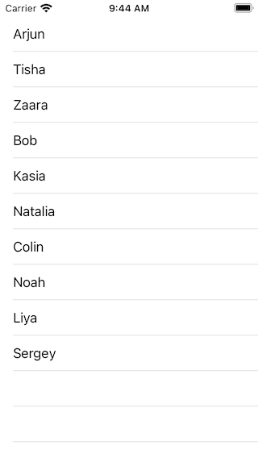

# The UITableView Example
## Implementing the UITableView with a Storyboard


<sub>Image of the completed project</sub>

This is a project that will help us to create a list of names as an iOS application.
This article has been developed using Xcode 12.2, and Swift 5.3

# Create a New Project
Use Xcode's menu to create a new project, making sure to choose Swift as the language and using UIKit.
[detailed guide](https://medium.com/swlh/your-first-ios-application-using-xcode-9983cf6efb71)

# Add the Code
Replace the code in **ViewController.swift** with the following:
```swift
import UIKit
class ViewController: UIViewController {
    
    // The data, an Array of String. Each Intended to be displayed in a single TableViewCell
    let people = ["Arjun", "Tisha", "Zaara","Bob", "Kasia", "Natalia", "Colin", "Noah", "Liya", "Sergey"]
    
    // The hollow circle on the left will become solid when joined to the Storyboard
    @IBOutlet var tableView: UITableView!

    // A String to identify a cell, and enable cells that scroll outside of the view to be reused
     let cellReuseIdentifier = "cell"
    
    // Called after ViewController is loaded into memory
    override func viewDidLoad() {
        // Super should always be called, as viewDidLoad() is overridden
        super.viewDidLoad()
        setUpTable()
    }
    
    func setUpTable() {
        // register the class of the UITableViewCell, and the identifier for reuse
        tableView.register(UITableViewCell.self, forCellReuseIdentifier: cellReuseIdentifier)
        // the delegate will be this class
        tableView.delegate = self
        // the data source will be this class
        tableView.dataSource = self
    }
}

// Use an extension for the ViewController to conform to the UITableViewDelegate
// and UITableViewDataSource, keeping this code separate from the rest of the
// UIViewController instance
extension ViewController: UITableViewDelegate, UITableViewDataSource {
    
    // the number of rows in the table
    func tableView(_ tableView: UITableView, numberOfRowsInSection section: Int) -> Int {
        // returns the number of items in the people array, works without the return keyword
        // where there is a single line
        people.count
    }
    
    // which cell should be used for which row? Return it!
    func tableView(_ tableView: UITableView, cellForRowAt indexPath: IndexPath) -> UITableViewCell {
        // if there is an existing cell, reuse it. If not create a new cell
        if let cell = tableView.dequeueReusableCell(withIdentifier: cellReuseIdentifier) {
            // which row are we working on?
            let currentRow = indexPath.row
            // set the text from the data array
            cell.textLabel?.text = people[currentRow]
            // return the completed cell
            return cell
        }
        // if no cell can be reused or created, something is seriously wrong so crash
        // the device (this should therefore not happen)
        fatalError("Could not dequeue cell")
    }
}

```

# Add a UITableView instance to the Storyboard
Go to **Main.storyboard**

Press the plus (+) sign at the top of the Xcode window there is a plus (+) sign.


Select the tableview, dragging this into the ViewController (the white rectangle) on the storyboard.<br>


Drag the handles to make it the same size as the ViewController.

# Connect the outlets
Use the keyboard shortcut `⌃ + ⌥ + ⌘ + T. (Control + Option + Command + T)` to be able to see both the Storyboard and the ViewController on the screen at the same time (you must have the Storyboard on the screen for this shortcut to work).

Use the key `⌃Control` to drag from the hollow circle on the left of the `@IBOutlet var tableView: UITableView!` to the `UITableView` on the `UIStoryboard`. 

# Run the Project
You can use the keyboard shortcut `⌘ + R` to run the project in the simulator, and see the `UITableView` instance displayed on the screen.

Nice!

# Conclusion
A UITableView is an essential part of UIKit, and this guide should help you see how the project might work. Feel free to change the `UITableView` data - that is the `String` instances stored in the `people` array to whatever you like!

The [Repo](https://github.com/stevencurtis/SwiftCoding/tree/master/QuickGuide/TableViewproject) makes things rather easier to follow in this project, and I do recommend you download the project to make things that bit easier for you.

If you've any questions, comments or suggestions please hit me up on [Twitter](https://twitter.com/stevenpcurtis) 
