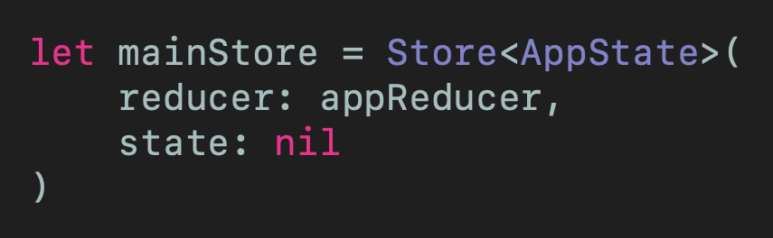
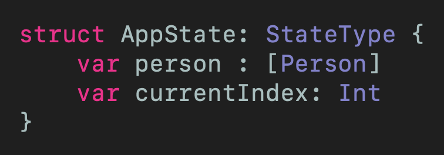
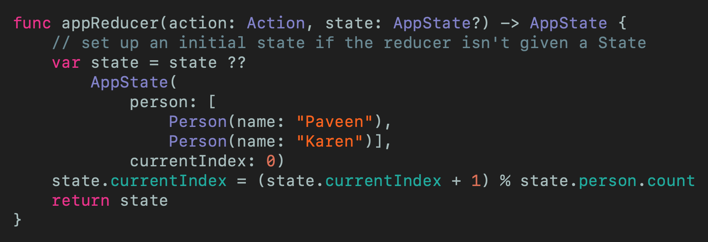
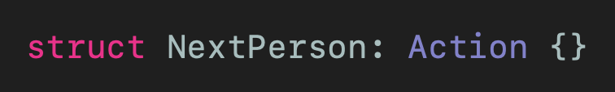
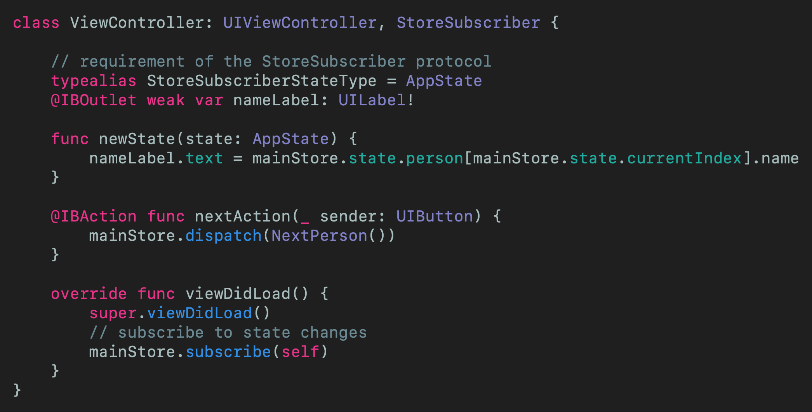

# Using Redux and Swift
## Reeeewind

 
Photo by Daniel Schludi on Unsplash

Redux is a state management system. Intrigued? Read on

Difficulty: Beginner | Easy | **Normal** | Challenging

This article has been developed using Xcode 11.4.1, and Swift 5.2.2
This article has been updated for Xcode 12.4, and Swift 5.3.2

## Prerequisites:
Coding in Swift Playgrounds (guide [HERE](https://medium.com/@stevenpcurtis.sc/coding-in-swift-playgrounds-1a5563efa089))

## Terminology
Redux: an open-source JavaScript library for managing application state

# Using Redux in Projects
## Advantages
* Pure reducer functions make business logic easy to test
* Centralising the state makes debugging easy to perform
* Data normalization is encouraged. The end result is that that you don't end up with multiple, independent copies of the same data that are unaware of one another and cannot easily be updated
* State can be persisted to local storage, which can then be used to boot from or return to the App to that state
* Because redux is strict about code organisation, we have the advantages that brings for code maintenance
* Easy to debug

## Disadvantages
* The state itself is immutable, and can only be updated by the reducer. This in itself could put increased memory demands on the system
* Restricted design with boilerplate code
* The rigidness and complexity that make redux suitable for very large projects means it is often not suitable for many small projects
* Actions are disconnected from their effects (which is stored in the Reducer)

## Do you even require Redux?
One main disadvantage of Redux is that you might not actually require it in your project (at least, not yet). So how do you know if your App would actually require Redux?
* You have a large application state required in many parts of your App
* Your application state is updated frequently
* Your application state is complex to update
* Your App has a medium to large-sized codebase that is worked on by many people
* You need to see how the state is updated over time

## Redux Components
State: The state of the application which is considered the source of truth. Although there can only be a single state, it can be divided into sub-states.

Actions: Objects that describe what the system can do. Dispatched by the view as intentions to change the state of the application.

Reducers: The main logic of the application and create a new state for the application given an action and the current state. They must be pure functions with no side effects, and synchronous (this is touched on in the conclusion, but this is why this sample project does not contain any networking features).

## The connection with MVI
There is a connection with Android and more specifically MVI here. 

So Redux actually is MVI because the reducer is the model, actions are the intent and the state is … redux

## UI Component Management
Updating a UI component can either be done with the Redux store, perhaps storing text within a label.

Redux:
* Call an action
* Pass data to a reducer
* Update the store

Imperative:
* maintain a local state variable

The decision is what to keep in store, and what to choose to keep in state (and even thinking of this as a battle between [declarative and imperative programming](https://medium.com/@stevenpcurtis.sc/imperative-vs-declarative-swift-programming-7e3c77309f76)). The temptation to keep everything in state is strong - but for (trivial?) UI elements it doesn't make sense to overload the state with each and every component.

# The Example project
## Creating the project
We create a Single View Project, and then we use [Swift Package Manager](https://medium.com/@stevenpcurtis.sc/use-swift-package-manager-to-add-dependencies-b605f91a4990?sk=adfd10c7d96557b37ba6ea0443145eb4) to include the dependency from [https://github.com/ReSwift/ReSwift](https://github.com/ReSwift/ReSwift) (up to next major).

## The functionality of the App
This particular App will have a an array of people:

`let people: [Person] = [Person(name: "James"), Person(name: "Ahmed")]`

and will display the Person's name one at a time starting with the initial person. When the next button is pressed, the `next` person in the list is displayed.

 

Yes it is ugly.

Yes it is just a `UILabel` on an view controller with a `UIButton` at the bottom. There's nothing exciting here - this is intended to be an architecture article so please do bear with me.

## The code
Note that most (if not all) of these classes will need to `import ReSwift `- so with that said let's get our feet wet!

There is a main store, that I put into a `Constants.swift` file. This is where a `middleware` could also be declared.

 
[Click for Gist](https://gist.github.com/stevencurtis/fd087d0724103591b73683bc50330e40)

The AppState is where the main meat of this project lies - here we have an `array` of person and a `currentIndex` that acts as a pointer to the relevant person in the list.

 
[Click for Gist](https://gist.github.com/stevencurtis/822f8f6ae3064a78259a78e7b53b6838)

This connects to a `Person` `struct` simply contains the name of each `Person`

 
[Click for Gist](https://gist.github.com/stevencurtis/fd942a6a52b51a5dba7604a21fb51dfa)

The reducer is the business logic of the App, and also initializes the intial state if one is not provided when the `reducer` is called.

 
[Click for Gist](https://gist.github.com/stevencurtis/eb55a7bd99c6c679aff2a74cfb9cc1f0)

The action is a rather trivial `struct`, as shown in the following code snippet.

 
[Click for Gist](https://gist.github.com/stevencurtis/ad41fbbf35ef4028cb0d88da81f10bc3)

this is tied together through the following `ViewController`. Note how it conforms to the `StoreSubscriber` `protocol` that means we are required to add a `typealias` as shown in the code snippet. The button action creates a `dispatch` action that hits the reducer - fantastic! When the reducer performs it's work, it hits the `newState` function and as the code below shows - but unfortunately this returns the whole state (rather than a slice of the state). 

Oh, and we must have made sure that we have subscribed to the `mainStore` within `viewDidLoad()` here through the `mainStore` call `mainStore.subscribe(self)` that binds the view controller to the `mainStore`.

 
[Click for Gist](https://gist.github.com/stevencurtis/a61a93f946b81c970a00bb813939de77)

# Conclusion
The next stage to this would be to add middleware, which provides an extension point between dispatching an action and that action reaching the reducer which would then bring us on to thinking about [redux-thunk](https://github.com/reduxjs/redux-thunk). Put simply, the reducers here should be pure functions (without side-effects) meaning API calls can't be done within a reducer - this is getting a little complicated and would therefore need an article itself!

Looking back on this article we can see that ReSwift doesn't (yet) do a diff on the state - so just returns newState when the state changes which means that (in this particular implementation) this would need to be handled in the view, something that clearly wouldn't be great.

Would I use ReSwift in a production App? Well, [SwiftUI](https://medium.com/@stevenpcurtis.sc/hello-world-swiftui-92bcf48a62d3) might be the most productive way forwards in managing state and making progress in this area, rather than looking to the web or Android for solutions. 

If you've any questions, comments or suggestions please hit me up on [Twitter](https://medium.com/r/?url=https%3A%2F%2Ftwitter.com%2Fstevenpcurtis)

Feel free to sign up to my [newsletter](https://medium.com/r/?url=https%3A%2F%2Fslidetosubscribe.com%2Fembed%2Fswiftcoding%2F)

