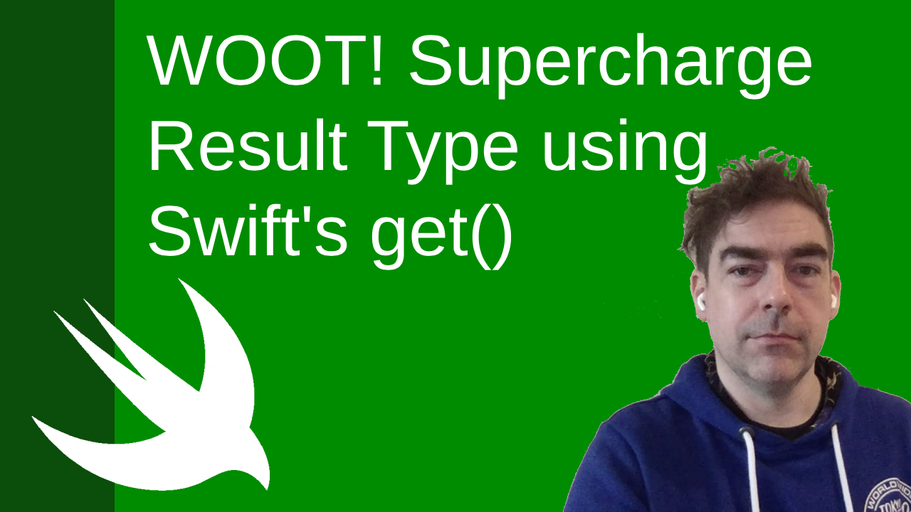

# WOOT! Supercharge Result Type using Swift's get() 
## Cope with these results!

<br/>
<sub>Photo by Hermes Rivera on Unsplash<sub>

Swift's [result type](https://medium.com/swlh/result-type-in-swift-1b4e2a84f2c2) has been a tricky one for many Swift programmers, and it has got to the point where many programmers are used to using it. But what if you could supercharge your work by using get() to return the value if a successful value exists, and throws an error otherwise.

# Before we start
Difficulty: Beginner | Easy | **Normal** | Challenging<br/>

# Video link
Here is a [link to the YouTube guide](https://youtu.be/q3CiYzJlJkk)

## Prerequisites:
* It would be much easier if you had understanding of Swift's [result type](https://medium.com/swlh/result-type-in-swift-1b4e2a84f2c2)<br>
* .get uses [try](https://betterprogramming.pub/error-handing-in-swift-dda6e3fb1c65), so some knowledge of that would be useful<br>

## Keywords and Terminology:
JSON: JavaScript Object Notation, a lightweight format for storing and transporting data
Swift: An open source programming language for macOS, iOS, watchOS and tvOS

# The Background
## Calling a network
You might well use a ViewModel to make a network call, and then use a completion closure to retreive the result. To do so, you may well choose to use a result type such as `(Result<Users, Error>) -> Void`.

Focussing on the code in the ViewController (the complete code is fully below) you might develop something like the following:

```swift
override func viewDidAppear(_ animated: Bool) {
    viewModel.getData(completion: { result in
        switch result {
        case .success(let users):
            print(users)
        case .failure: break
        }
    })
}
```

now essentially you would want to deal with the error in the `.failure` condition of the switch above. Sometimes, however, you would deal with the error elsewhere or (perhaps? I don't know how you work) not deal with the error at all. 

You'd therefore aways have that rather awkward case where the `.failure` block is executed, yet you don't actually want to run any code in that case.

What should you do? 

In fact, we can rewrite the code above to use `.get()` in Swift, and this would look something like the following: 

```swift
override func viewDidAppear(_ animated: Bool) {
    viewModel.getData(completion: { result in
        if let users = try? result.get() {
            print (users)
        }
    })
}
```
Which gets rid of that rather awkward pattern.

# The code
The example below uses reqres, and the specific URL used is `https://reqres.in/api/users?page=2`, which provides us a free API to use and decode in our iOS front-end. 

## SceneDelegate
```swift
class SceneDelegate: UIResponder, UIWindowSceneDelegate {
    var window: UIWindow?

    func scene(_ scene: UIScene, willConnectTo session: UISceneSession, options connectionOptions: UIScene.ConnectionOptions) {
        guard let windowScene = (scene as? UIWindowScene) else { return }
        window = UIWindow(windowScene: windowScene)
        let viewController = ViewController(viewModel: ViewModel())
        
        window?.rootViewController = viewController
        window?.makeKeyAndVisible()
    }

    func sceneDidDisconnect(_ scene: UIScene) {}
    func sceneDidBecomeActive(_ scene: UIScene) {}
    func sceneWillResignActive(_ scene: UIScene) {}
    func sceneWillEnterForeground(_ scene: UIScene) {}
    func sceneDidEnterBackground(_ scene: UIScene) {
        (UIApplication.shared.delegate as? AppDelegate)?.saveContext()
    }
}
```

## ViewController
```swift
class ViewController: UIViewController {

    override func viewDidLoad() {
        super.viewDidLoad()
    }

    override func loadView() {
        let view = UIView()
        view.backgroundColor = .red
        self.view = view
    }
    
    let viewModel: ViewModel
    
    init(viewModel: ViewModel) {
        self.viewModel = viewModel
        super.init(nibName: nil, bundle: nil)
    }
    
    override func viewDidAppear(_ animated: Bool) {
        viewModel.getData(completion: {
            let result = try! $0.get()
        })
    }
    
    required init?(coder: NSCoder) {
        fatalError("init(coder:) has not been implemented")
    }
}
```

## ViewModel
```swift
class ViewModel {
    enum Constants {
        static let urlString = "https://reqres.in/api/users?page=2"
    }
    init() {
    }
    var res: Result<Users, Error>?

    func getData(completion: @escaping (Result<Users, Error>) -> Void) {
        let url = URL(string: Constants.urlString)!
        let task = URLSession.shared.dataTask(with: url, completionHandler: { data, response, error in

            let decoder = JSONDecoder()
            decoder.keyDecodingStrategy = .convertFromSnakeCase
            let decoded = try! decoder.decode(Users.self, from: data!)
            print(decoded)
            
            completion(.success(decoded))
        })
        task.resume()
    }
}
```

## Users
```swift
struct Users: Codable {
    let page: Int
    let perPage: Int
    let total: Int
    let totalPages: Int
    let data: [UserData]
    let support: Support
    
    struct UserData: Codable {
        let id: Int
        let email: String
        let firstName: String
        let lastName: String
        let avatar: String
    }
    
    struct Support: Codable {
        let url: String
        let text: String
    }
}
```

# Conclusion
This is intended as a way to make your life easier, and with the explanation above you may also benefit from downloading the repo@ https://github.com/stevencurtis/SwiftCoding/tree/master/ReturnSuccessOfThrowingWithGet. I hope this does indeed help you out!

If you've any questions, comments or suggestions please hit me up on [Twitter](https://twitter.com/stevenpcurtis), and while I've got you why not take a look at my [YouTube Channel](https://www.youtube.com/channel/UCsC5HhKw6CmLAKYMJ42KF8w)
