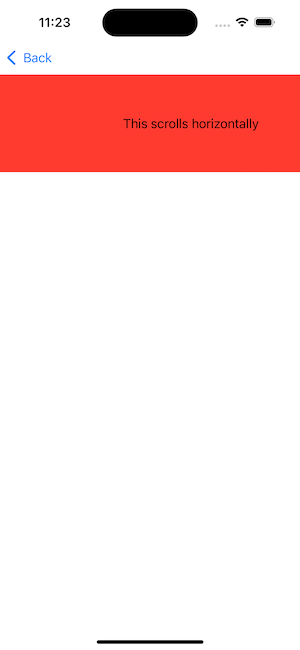
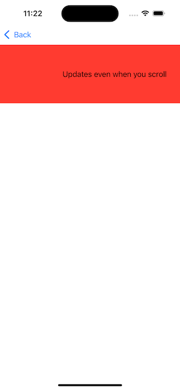

# Deciding Between RunLoop.main and the Main Thread with Combine in Swift
## Difficult Choice


I've understood for some time that in iOS development ensuring UI updates occur on the main thread is crucial. If you do not ensure UI updates occur on the main thread there may be a poor user experience, and ultimately there may be crashes for the user.
In this area there are two related but distinct concepts: Runloop.main and the main thread. When working with `Combine` and asynchronous events, understanding when to use `RunLoop.main` against the main thread (`DispatchQueue.main`) can ensure the correct UI behaviour and performance.

Let us explore this one.

# Terminology:
RunLoop: A loop that waits for events (like user input, timers, or system messages) and dispatches them to the appropriate code for handling, keeping the program running and responsive.
RunLoop.main: The main run loop associated with the main thread, responsible for handling events and input sources, ensuring the app remains responsive and processes events like touch inputs and timers on the main thread.
Main Thread: The primary thread where all UI updates and interactions occur, ensuring thread safety for UI operations.

# The Main Thread vs. RunLoop.main
## Main Thread
The main thread is the thread where UI updates must happen. We can choose to either use an asynchronous or synchronous thread for work that needs to be done on the main thread (using `DispatchQueue.main.async` or `DispatchQueue.main.sync` respectively).

Suitable for immediate execution of UI updates and other tasks that must be performed on the main thread.

## RunLoop.main
The main run loop is a loop that runs on the main thread and the runloop (automatically setup on the main thread) dispatches the event to a hander (something like `touchesBegan(_:with:)` for processing.

Suitable for scheduling events that need to be part of the main thread's run cycle, such as timed events or periodic tasks.

# Examples
The "simple" example using Combine can go some way to illuminating the difference between these two concepts.

The code snippets are right here:

## DispatchQueue.main
```swift
cancellable = publisher
   .receive(on: DispatchQueue.main)
   .sink { value in
       self.updateUI(with: value)
   }
```

## RunLoop.main
```swift
cancellable = publisher
    .receive(on: RunLoop.main)
    .sink { value in
        self.updateUI(with: value)
    }
```

Which, honestly isn't illuminating. It does appear that you can switch out `DispatchQueue.main` for `RunLoop.main` without any real difference between the two. 

We need a real example. In this case I'm going to implement a view controller with a scrollview.

# The Project
I've created two view controllers and they pretty much do the same thing.
I have created a scrollview that contains a label. You can scroll this horizontally, and after 2 seconds the label will update. It uses `Combine` to do so, and I hope nothing is too exciting about this!

<br>

After a delay of two seconds becomes

<br>

## Immediate Updates Using DispatchQueue.main
So my expectation would be that this updates immediately. This is coded in `DispatchQueueViewController`

```swift
import Combine
import UIKit

final class DispatchQueueViewController: UIViewController {
    var cancellable: AnyCancellable?
    let publisher = PassthroughSubject<String, Never>()
    @IBOutlet private weak var label: UILabel!

    override func viewDidLoad() {
        super.viewDidLoad()
        
        // Using DispatchQueue.main for immediate updates
        cancellable = publisher
            .receive(on: DispatchQueue.main)
            .sink { [weak self] value in
                self?.updateUI(with: value)
            }
        
        // Simulating a value being published
        DispatchQueue.global().asyncAfter(deadline: .now() + 2) {
            self.publisher.send("Updates even when you scroll")
        }
    }
    
    
    func updateUI(with value: String) {
        // Update your UI here
        label.text = value
        print("Received value on main thread: \(value)")
    }
}
```

So the interesting part is DispatchQueue.main, and this allows the immediate execution of UI events.

## Scheduled Events Using Runloop.main
If you would like the `UILabel` to update after the user has finished their interaction with the `UIScrollView` you can use `Runloop.main`.

```swift
import Combine
import UIKit

final class RunLoopMainViewController: UIViewController {
    var cancellable: AnyCancellable?
    let publisher = PassthroughSubject<String, Never>()
    @IBOutlet private weak var label: UILabel!
    
    override func viewDidLoad() {
        super.viewDidLoad()
        
        // Using RunLoop.main for updates that wait until other touches are finished
        cancellable = publisher
            .receive(on: RunLoop.main)
            .sink { [weak self] value in
                self?.updateUI(with: value)
            }
        
        // Simulating a value being published
        DispatchQueue.global().asyncAfter(deadline: .now() + 2) {
            self.publisher.send("Waits until you have finished scrolling")
        }
    }
    
    func updateUI(with value: String) {
        // Update your UI here
        label.text = value
        print("Received value on main thread: \(value)")
    }
}
```

The `UILabel` (after the 2 seconds delay has passed) will only update after you have stopped scrolling the `UIScrollView`.

# Nuances

## Summerization
The basic difference in behaviour can be summarized as below:

**Immediate Updates with DispatchQueue.main**
This approach ensures the UI updates as soon as the event is received, regardless of any ongoing user interactions. This is beneficial for scenarios where immediate feedback is crucial, such as updating a counter or reflecting an immediate state change.

**Scheduled Updates with RunLoop.main**
This approach schedules the update to occur after the current run loop cycle, allowing any ongoing user interactions (like scrolling) to complete first. This can be advantageous in scenarios where you want to avoid interrupting the user's actions, providing a smoother experience.

That's not all. 

## Performance Considerations

While both approaches ensure UI updates happen on the main thread, they can have different performance implications:

**DispatchQueue.main**
Might lead to more immediate updates but could potentially disrupt ongoing animations or user interactions if not used judiciously.

**RunLoop.main**
Provides a way to coalesce multiple updates into a single cycle, reducing the frequency of updates and potentially leading to smoother performance in certain scenarios.

# Conclusion
I hope this article has helped you, and you are able to get something from reading this. Choosing between RunLoop.main and DispatchQueue.main depends on the specific requirements of your App, and it's something to think about when designing your app. Anyway, I hope this helps.
