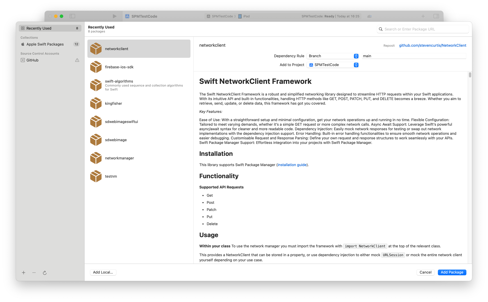
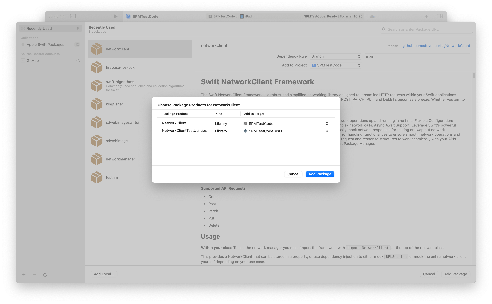

# Using Swift Package Manager to Structure Test-Only Code in Swift
## A Working Example? Yes!

This article is about my [NetworkClient](https://medium.com/r/?url=https%3A%2F%2Fgithub.com%2Fstevencurtis%2FNetworkClient), and how I've managed to add mock objects into my network client and (with thought) put them in the proper place so each of my projects can use it (which is nice].

# The Importance of Testing Code
I think unit testing code is really important, and helps us to confirm that our code fits a given specification. 
I've a network client and I've (gasp) been repeating the same mock code in each and every project.

Let me show you what that means.

## My technique
**Using Mocks in tests**

Each time I want to test a service I need to implement the following Mocks, and this is the same for each and every project I create.

```swift
import NetworkClient

final class MockNetworkClient: NetworkClient {
    var fetchResult: (any MockResult)?
    private(set) var fetchResultCalled = false
    
    func fetch<T>(
        api: URLGenerator,
        request: T
    ) async throws -> T.ResponseDataType? where T: APIRequest {
        fetchResultCalled = true
        return try fetchResult?.getResult() as? T.ResponseDataType
    }
}

protocol MockResult {
    associatedtype DataType
    func getResult() throws -> DataType?
}

struct MockSuccess<T>: MockResult {
    var result: T
    func getResult() throws -> T? { result }
}

struct MockFailure: MockResult {
    var error: Error
    func getResult() throws -> Never? { throw error }
}
```

**Testing a service**

These mocks can be used to test a service. Here is how I might test a particular service in a particular project. Note how `MockSuccess` and `MockFailure` are used to simulate network responses without actually hitting the server and making real requests.

```swift
import XCTest

final class AccountServiceTests: XCTestCase {
    private var sut: AccountService!
    private var mockAPIService: MockAPIService!
    
    override func setUp() {
        super.setUp()
        mockAPIService = MockAPIService()
        sut = AccountService(apiService: mockAPIService)
    }
    
    override func tearDown() {
        sut = nil
        mockAPIService = nil
        super.tearDown()
    }
    
    func test_fetchAccounts_returnsAccountModelDTO() async throws {
        // Given
        let mockAccounts: AccountModelDTO = .test()
        mockAPIService.performRequestResult = MockSuccess(result: mockAccounts)
        // When
        let accounts = try await sut.fetchAccounts()
        // Then
        XCTAssertEqual(accounts.accounts.count, 1)
        XCTAssertEqual(accounts.accounts.first?.accountType, mockAccounts.accounts.first?.accountType)
        XCTAssertEqual(accounts.accounts.first?.accountUid, mockAccounts.accounts.first?.accountUid)
        XCTAssertEqual(accounts.accounts.first?.currency, mockAccounts.accounts.first?.currency)
        XCTAssertEqual(accounts.accounts.first?.defaultCategory, mockAccounts.accounts.first?.defaultCategory)
        XCTAssertEqual(mockAPIService.performRequestCalled, true)
    }
    
    func test_fetchAccounts_throwsError_failure() async {
        let mockError = NSError(domain: "error", code: 500)
        mockAPIService.performRequestResult = MockFailure(error: mockError)
        // when
        do {
            let _ = try await sut.fetchAccounts()
            XCTFail("Unexpected success from \(#function)")
        } catch {
            // Then
            XCTAssertNotNil(error)
            XCTAssertEqual(mockAPIService.performRequestCalled, true)
        }
    }
}
```


So my `MockNetworkClient` is used in pretty much every project that I might create. One solution to this is simply to copy and paste this mock into each and every project. 
The problem is I want to have DRY (Don't Repeat Yourself) code. When I'm copy-pasting I might make a mistake, the code might have changed over time and it's just plain inefficient.

I guess I need to think different.

# Enabling Code Reuse

I've already got my complete network client (on GitHub as (NetworkClient)[https://medium.com/r/?url=https%3A%2F%2Fgithub.com%2Fstevencurtis%2FNetworkClient]) that can be imported into any project using Swift Package Manager (SPM).

I'd like to put my mock code into a test-only target that is created using Swift Package Manager.

Let me step you through the process.

**Defining the Package**
Here is my Package.swift file, and note that it contains a test-specific target now.

```swift
import PackageDescription

let package = Package(
    name: "NetworkClient",
    platforms: [
      .iOS(.v13)
    ],
    products: [
        .library(
            name: "NetworkClient",
            targets: ["NetworkClient"]),
        .library(
              name: "NetworkClientTestUtilities",
              targets: ["NetworkClientTestUtilities"]),
    ],
    dependencies: [],
    targets: [
        .target(
            name: "NetworkClient",
            dependencies: []),
        .target(
            name: "NetworkClientTestUtilities",
            dependencies: ["NetworkClient"]),
        .testTarget(
            name: "NetworkClientTests",
            dependencies: ["NetworkClient", "NetworkClientTestUtilities"]),
    ]
)
```
Let's run through this setup:

- `NetworkClient` is in the main target, and contains the production network client code
- `NetworkClientTestUtilities` is a separate target where the new mock will life
- `NetworkClientTests` is the test target where all the unit tests will live

## Organizing the File Structure

I needed to create `NetworkClientTestUtilities` (`File>New Folder` will get this done) to hold my mock objects.

So my entire file structure looks like:

```swift
NetworkClient/
├── Sources/
│   ├── NetworkClient/
│   └── NetworkClientTestUtilities/
├── Tests/
│   └── NetworkClientTests/
```

However at this point `NetworkClientTestUtilities` doesn't actually contain my mocks. So let's fix that right now.

## Create Mocks in the Test-Only Target

A quick `File>New>Empty File` will give us a new file. I called this file `Mocks.swift`.

These mocks will simulate network behaviour for unit tests without requiring live network calls. Here are my mocks:

```swift
import NetworkClient

public protocol MockResult {
    associatedtype DataType
    func getResult() throws -> DataType?
}

public struct MockSuccess<T>: MockResult {
    public private(set) var result: T
    public func getResult() throws -> T? { result }

    public init(result: T) {
        self.result = result
    }
}

public struct MockFailure: MockResult {
    public private(set) var error: Error
    public func getResult() throws -> Never? { throw error }
    
    public init(error: Error) {
        self.error = error
    }
}

final public class MockNetworkClient: NetworkClient {
    public var fetchResult: (any MockResult)?
    private(set) public var fetchResultCalled = false
    
    public func fetch<T>(
        api: URLGenerator,
        request: T
    ) async throws -> T.ResponseDataType? where T: APIRequest {
        fetchResultCalled = true
        return try fetchResult?.getResult() as? T.ResponseDataType
    }
    
    public init() {}
}
```

Note that I'm adjusted the access control to public here so that the mocks can be read from outside the module (which of course we would like, as we wish to use these mocks from our project).

## Add The Mocks to a Project
Adding the mocks to a new project is kind of the same process as adding my [NetworkClient](https://medium.com/r/?url=https%3A%2F%2Fgithub.com%2Fstevencurtis%2FNetworkClient) to the project. This is done through `Project>Package Dependencies>+`. This gives us the following screen



Then we can add the `NetworkClient` to the main project, and `NetworkClientUtilities` to the test target.

Something like the following:



We then can go and actually use these mocks!

## Writing Tests that Use Mocks

We can now move over to projects where we can use these mocks defined in `NetworkClientTests`.

Here is a code sample you might use in your unit test code.

```swift
import XCTest
import NetworkClient
import NetworkClientTestUtilities

final class NetworkClientTests: XCTestCase {
    func testSuccessfulFetch() async throws {
        // Create mock network client
        let mockClient = MockNetworkClient()
        mockClient.fetchResult = MockSuccess(result: "Mock Response")
        
        // Call fetch and verify result
        let response: String? = try await mockClient.fetch(api: MockAPI(), request: MockRequest())
        XCTAssertEqual(response, "Mock Response")
        XCTAssertTrue(mockClient.fetchResultCalled)
    }
    
    func testFailedFetch() async throws {
        // Create mock network client with failure
        let mockClient = MockNetworkClient()
        mockClient.fetchResult = MockFailure(error: URLError(.badServerResponse))
        
        // Call fetch and expect an error
        do {
            let _: String? = try await mockClient.fetch(api: MockAPI(), request: MockRequest())
            XCTFail("Expected failure but got success")
        } catch {
            XCTAssertTrue(error is URLError)
        }
    }
}
```
# Best Practices for Organizing Test-Only Code

Here are some best practices to follow when organizing your test-only code with SPM:

**Keep test utilities separate**
Always isolate mocks and other test utilities into a separate target like NetworkClientTestUtilities to prevent them from leaking into production.

**Use dependency injection**
Ensure that your mocks can be easily swapped with real implementations by using dependency injection in your production code.

**Test failure cases**
Make sure you test failure scenarios and edge cases, especially when testing network code.

**Maintain simplicity**
Your test utilities should be lightweight and simple to maintain. Avoid over-engineering the mocks.

# Conclusion

Using Swift Package Manager to separate test-only code into its own target is an excellent practice that keeps your codebase clean, maintainable, and modular. By isolating your mocks and utilities into a dedicated target, you ensure that your production code remains focused and that your tests are robust and easy to manage.

By following the steps outlined in this article, you can confidently set up your project for effective unit testing with SPM, enabling you to maintain a clear separation between your production and test code. This approach will not only streamline your test setup but also improve the maintainability and scalability of your project as it grows.
