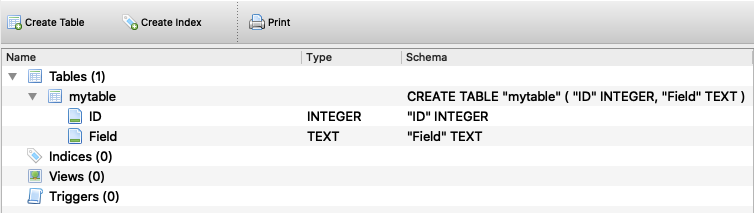
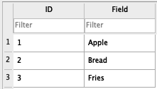

# Using SQLite Directly with Swift   
## Don't Core Data me

SQLite Manager

<br/>
<sub>Photo by Amy Hirschi on Unsplash<sub>

Difficulty: Beginner | Easy | *Normal* | Challenging
This article has been developed using Xcode 12.0.1, and Swift 5.3

# Terminology:
Sqlite: A cross-platform database format

# Prerequisites
- Be able to [create a basic Swift application](https://medium.com/swlh/your-first-ios-application-using-xcode-9983cf6efb71)
- I use [sqlitebrowser](http://sqlitebrowser.org) so downloading this little tool might well be useful for you

# Why Sqlite
There are many different ways of dealing with storage in iOS. One recommendation is [Core Data](https://medium.com/@stevenpcurtis.sc/core-data-basics-testing-39d127380680) which is a native solution, or the third-party Realm framework. 

Core Data is fast, well supported and can even be backed with an SQLite database. However, some people claim it is difficult to learn, and it is difficult to use the database cross-platform.

Realm is yet another framework, so in some workplaces may not be suitable. Plus you'd need to learn about Realm and perhaps you already have some database knowledge and don't want to learn about this particular framework.

SQLite's long history and cross-platform support might mean that you already have knowledge about it, and want to get going in iOS. Can't we just get going?

# Begin at the end
Testing is so important, and there is a right way and a wrong way to do this (if you have black and white thinking, that it).

In order to test an SQLite database I've decided to create an `SQLiteManager`. What is going to happen is that I'll open the database and then read out data.

I've added the `testDB.sqlite` file into the test target. 

Here is the database format:

<br/>

Here is the data

<br/>

So the `SQLiteManager` will need to point at the test database when tests are being performed.

This seems possible when there is are tests for opening the database and reading the database, and example tests are listed below:

```swift
func testOpenDB() {
    let expectation = XCTestExpectation(description: #function)
    let mgr = SQLiteManager("testDB")
    mgr.open(withdbpathfunc: TestHelpers().testPath, withCompletionHandler: { result in
        switch result {
        case .failure(let error):
            print(error)
        case .success(let success):
            XCTAssertNotNil(success)
            expectation.fulfill()
        }
    })
    wait(for: [expectation], timeout: 3.0)
}

func testReadDB() {
    let expectation = XCTestExpectation(description: #function)
    let mgr = SQLiteManager("testDB")

    mgr.open(withdbpathfunc: TestHelpers().testPath, withCompletionHandler: { result in
        switch result {
        case .failure(let error):
            print(error)
        case .success(let success):
            let result = mgr.readDB(from: "mytable", success!)
            XCTAssertEqual(result, [["1", "Apple"], ["2", "Bread"], ["3", "Fries"]])
            expectation.fulfill()
        }
    })
    wait(for: [expectation], timeout: 3.0)
}
```

where all is fine! Using the implementation (either in the repo, or look below) these tests pass!

**But there is a problem** - **A real problem**

The next test exposes our tests as the poor implementation that they are, that is when we delete one of the values the other.

This (and the solution) is documented in this rather nifty video: [SQLIteManager](https://youtu.be/qVu0ow0mats)

```swift
func testDeleteDB() {
    let expectation = XCTestExpectation(description: #function)
    let mgr = SQLiteManager("testDB")
    mgr.open(withdbpathfunc: TestHelpers().testPath, withCompletionHandler: { result in
        switch result {
        case .failure(let error):
            print(error)
        case .success(let success):
            try! mgr.delete(table: "mytable", deleteValues: PairedVals(column: "ID", data: .integer(2)), success!, completion: {
                let result = TestHelpers().readFromTable(table: "mytable", success!)
                XCTAssertEqual(result, [["1", "Apple"], ["3", "Fries"]])
                expectation.fulfill()
            }
            )
        }
    })
    wait(for: [expectation], timeout: 3.0)
}
 ```
 
 **The solution**
 We can wrap the SQLite3 by using a protocol 
 `Sqlite3WrapperProtocol`
 ```swift
 public protocol Sqlite3WrapperProtocol {
    @discardableResult
    func sqlite3_close(_ pointer: OpaquePointer!) -> Int32
    @discardableResult
    func sqlite3_finalize(_ pStmt: OpaquePointer!) -> Int32
    @discardableResult
    func sqlite3_step(_ pointer: OpaquePointer!) -> Int32
    @discardableResult
    func sqlite3_open_v2(_ filename: UnsafePointer<Int8>!, _ ppDb: UnsafeMutablePointer<OpaquePointer?>!, _ flags: Int32, _ zVfs: UnsafePointer<Int8>!) -> Int32
    @discardableResult
    func sqlite3_prepare_v2(_ db: OpaquePointer!, _ zSql: UnsafePointer<Int8>!, _ nByte: Int32, _ ppStmt: UnsafeMutablePointer<OpaquePointer?>!, _ pzTail: UnsafeMutablePointer<UnsafePointer<Int8>?>!) -> Int32
    @discardableResult
    func sqlite3_column_int(_ oP: OpaquePointer!, _ iCol: Int32) -> Int32
    func sqlite3_bind_int(_ oP: OpaquePointer!, _ first: Int32, _ second: Int32) -> Int32
    func sqlite3_bind_text(_ oP: OpaquePointer!, _ first: Int32, _ second: UnsafePointer<Int8>!, _ third: Int32, _ ptrs: (@convention(c) (UnsafeMutableRawPointer?) -> Void)!) -> Int32
    func sqlite3_column_text(_ op: OpaquePointer!, _ iCol: Int32) -> UnsafePointer<UInt8>!
}
 ```

and then make sqlite3 conform to this

```swift
public class Sqlite3Wrapper: Sqlite3WrapperProtocol {
    
    public func sqlite3_column_text(_ op: OpaquePointer!, _ iCol: Int32) -> UnsafePointer<UInt8>! {
        SQLite3.sqlite3_column_text(op, iCol)
    }
    
    public func sqlite3_bind_text(_ oP: OpaquePointer!, _ first: Int32, _ second: UnsafePointer<Int8>!, _ third: Int32, _ ptrs: (@convention(c) (UnsafeMutableRawPointer?) -> Void)!) -> Int32 {
        SQLite3.sqlite3_bind_text(oP, first, second, third, ptrs)
    }

    public func sqlite3_bind_int(_ oP: OpaquePointer!, _ first: Int32, _ second: Int32) -> Int32 {
        SQLite3.sqlite3_bind_int(oP, first, second)
    }

    public func sqlite3_column_int(_ oP: OpaquePointer!, _ iCol: Int32) -> Int32 {
        SQLite3.sqlite3_column_int(oP, iCol)
    }
    
   public func sqlite3_close(_ pointer: OpaquePointer!) -> Int32 {
        SQLite3.sqlite3_close(pointer)
    }
    
    public func sqlite3_finalize(_ pStmt: OpaquePointer!) -> Int32 {
        SQLite3.sqlite3_finalize(pStmt)
    }
    
    public func sqlite3_step(_ pointer: OpaquePointer!) -> Int32 {
        SQLite3.sqlite3_step(pointer)
    }
    
    public func sqlite3_open_v2(_ filename: UnsafePointer<Int8>!, _ ppDb: UnsafeMutablePointer<OpaquePointer?>!, _ flags: Int32, _ zVfs: UnsafePointer<Int8>!) -> Int32 {
        SQLite3.sqlite3_open_v2(filename, ppDb, flags, zVfs)
    }


    public func sqlite3_prepare_v2(_ db: OpaquePointer!, _ zSql: UnsafePointer<Int8>!, _ nByte: Int32, _ ppStmt: UnsafeMutablePointer<OpaquePointer?>!, _ pzTail: UnsafeMutablePointer<UnsafePointer<Int8>?>!) -> Int32 {
        SQLite3.sqlite3_prepare_v2(db, zSql, nByte, ppStmt, pzTail)
    }
    
    public init(){}    
    
}
```

and then we can set up a `MockSqlite3Wrapper` - awesome! I'm just including the beginning of this, you can see the repo for more details about this

```swift
class MockSqlite3Wrapper: Sqlite3WrapperProtocol {
    
    var columns = 0
    
    var outputStrings: [[String]] = [["1", "Hello", "World"], ["2", "a", "b"], ["3", "c", "d"]]
    
    func sqlite3_column_text(_ op: OpaquePointer!, _ iCol: Int32) -> UnsafePointer<UInt8>! {
        if columns < 3 {
            let outputString = outputStrings[counter][columns]
            let data = outputString.data(using: String.Encoding.utf8, allowLossyConversion: false)!
            let dataMutablePointer = UnsafeMutablePointer<UInt8>.allocate(capacity: data.count)
            data.copyBytes(to: dataMutablePointer, count: data.count)
            let dataPointer = UnsafePointer<UInt8>(dataMutablePointer)
            columns += 1
            return dataPointer
        }
        columns = 0
        return nil
    }
```

and now, yes now we can run the tests!

For brevity I'll only include the first couple of tests:

```swift
class SQLiteMangerInjectionTests: XCTestCase {

    var wrapper: MockSqlite3Wrapper!
    var mgr: SQLiteManager!
    
    override func setUpWithError() throws {
        // Put setup code here. This method is called before the invocation of each test method in the class.
        wrapper = MockSqlite3Wrapper()
        mgr = SQLiteManager("testDB", wrapper: wrapper)
    }

    override func tearDownWithError() throws {
        // Put teardown code here. This method is called after the invocation of each test method in the class.
    }

    func testOpenDB() {
        let expectation = XCTestExpectation(description: #function)
        mgr.open(withdbpathfunc: TestHelpers().testPath, withCompletionHandler: { result in
            switch result {
            case .failure(let error):
                print(error)
            case .success(let success):
                XCTAssertNotNil(success)
                expectation.fulfill()
            }
        })
        wait(for: [expectation], timeout: 3.0)
    }
    
    func testReadDB() {
        let expectation = XCTestExpectation(description: #function)
        mgr.open(withdbpathfunc: TestHelpers().testPath, withCompletionHandler: { result in
            switch result {
            case .failure(let error):
                print(error)
            case .success(let success):
                let result = self.mgr.readDB(from: "mytable", success!)
                XCTAssertEqual(result, [["1", "Hello", "World"], ["2", "a", "b"]])
                expectation.fulfill()
            }
        })
        wait(for: [expectation], timeout: 3.0)
    }
```

# So where is the real code?
Ok, no problem. I'll get that for you!

```swift
final public class SQLiteManager {
    private let dbName: String
    private var dbPointer: OpaquePointer?
    private let dbKey = "quizversion"
    private lazy var pathComponent = "/\(dbName).sqlite"
    private var wrapper: Sqlite3WrapperProtocol!

    func open(
        withdbpathfunc: (() -> String?)? = nil,
        withCompletionHandler completion: @escaping (Result<OpaquePointer?, Error>) -> Void) {
        var dbPath: String?
        if withdbpathfunc == nil {
            dbPath = createDBPath(dbName)
            dbPath = (self.copyDatabaseIfNeeded(databasePath: dbPath!, dbname: self.dbName))
        } else {
            dbPath = withdbpathfunc!()
        }
        if let db = openDatabase(dbPath!) {
            dbPointer = db
            completion(.success(db))
        } else {
            completion(.failure(ErrorModel.init(errorDescription: "Could not open database")))
        }
    }
  
    
    public init(_ dbName: String, wrapper: Sqlite3WrapperProtocol = Sqlite3Wrapper()) {
        self.dbName = dbName
        self.wrapper = wrapper
    }
    
    deinit {
        SQLite3.sqlite3_close(dbPointer)
    }
    
        
    public func clearDiskCache(databasePath: String, dbname: String) {
        let fileManager = FileManager.default
        let myDocuments = fileManager.urls(for: .documentDirectory, in: .userDomainMask).first!
        let diskCacheStorageBaseUrl = myDocuments.appendingPathComponent(pathComponent) //
        do {
            try fileManager.removeItem(at: diskCacheStorageBaseUrl)
        }
        catch {
            print("error during file removal: \(error)")
        }
    }
    
    private func provideDbVersion(withdbpathfunc: (() -> String?)?) -> Int {
        let dbPath: String?
        if withdbpathfunc == nil {
            dbPath = createDBPath(dbName)
        } else {
            dbPath = withdbpathfunc!()
        }
        if let db = openDatabase(dbPath!) {
            return ( versionOfDB(db) ?? 0 )
        }
        return -1
    }
    
    private func copyDatabaseIfNeeded(databasePath: String, dbname: String) -> String {
        var destPath = NSSearchPathForDirectoriesInDomains(.documentDirectory, .userDomainMask, true).first!
        destPath = destPath + pathComponent
        let currentDBVersion = provideDbVersion(withdbpathfunc: nil)
        do {
            try FileManager.default.copyItem(atPath: databasePath, toPath: destPath)
            UserDefaults.standard.set(currentDBVersion, forKey: dbKey)
        }
        catch {
            let err = error as NSError
            if err.code == 516 {
                let quizver = UserDefaults.standard.integer(forKey: dbKey) // default = 0
                if quizver < currentDBVersion {
                    // migrate previous DB for current - first run after an update
                    clearDiskCache(databasePath: databasePath, dbname: dbname)
                    UserDefaults.standard.set(Int.max, forKey: dbKey)
                    return copyDatabaseIfNeeded(databasePath: databasePath, dbname: dbname)
                }
            }
        }
        return destPath
    }
    
        
    private func openDatabase(_ databasePath: String) -> OpaquePointer? {
        var db: OpaquePointer? = nil
        if wrapper.sqlite3_open_v2(databasePath,&db, SQLITE_OPEN_READWRITE, nil) == SQLITE_OK {
            return db
        } else {
            return nil
        }
    }
    
    
        
    private func openDatabase(_ databasePath: String) -> OpaquePointer? {
        var db: OpaquePointer? = nil
        if wrapper.sqlite3_open_v2(databasePath,&db, SQLITE_OPEN_READWRITE, nil) == SQLITE_OK {
            return db
        } else {
            return nil
        }
    }
    
    private func createDBPath(_ dbname: String) -> String?
    {
        if let filePath = Bundle.main.path(forResource: dbname, ofType: "sqlite") {
            return filePath
        }
        fatalError("Database not found")
    }
    
    private func versionOfDB(_ dbpointer: OpaquePointer) -> Int? {
        var sqliteStatementTwo: OpaquePointer? = nil
        if wrapper.sqlite3_prepare_v2(dbpointer, "PRAGMA user_version;", -1, &sqliteStatementTwo, nil) == SQLITE_OK {
            while(wrapper.sqlite3_step(sqliteStatementTwo) == SQLITE_ROW) {
                let databaseVersion = sqlite3_column_int(sqliteStatementTwo, 0);
                return (Int(databaseVersion))
            }
        }
        return nil
    }
}

// Preparation
extension SQLiteManager {
    private func prepareSQLString(tableName: String, whereClause: String? = nil, fieldNames: [String] = ["*"]) -> String {
        let querySql = "select \(fieldNames.joined(separator: ", ")) from \(tableName) \(whereClause ?? "");"
        return querySql
    }
    
    private func prepareStatement(sql: String) throws -> OpaquePointer? {
        var statement: OpaquePointer?
        guard wrapper.sqlite3_prepare_v2(dbPointer, sql, -1, &statement, nil) == SQLITE_OK else {
            throw ErrorModel.init(errorDescription: "Could not prepare statement")
        }
        return statement
    }
    private func findColumnTypes(_ tableName:String, _ dbpointer: OpaquePointer) -> [(fieldName: NSString, type: SQLTypes)] {
        var sqliteStatement: OpaquePointer? = nil
        defer {
            wrapper.sqlite3_finalize(sqliteStatement)
        }
        let querySql = "PRAGMA table_info(" + tableName + ")"
        var queryResult = [[NSString]]()
        if wrapper.sqlite3_prepare_v2(dbpointer, querySql, -1, &sqliteStatement, nil) == SQLITE_OK {
            while(wrapper.sqlite3_step(sqliteStatement) == SQLITE_ROW) {
                var idx = 0
                var columnData = [NSString]()
                while let dta = wrapper.sqlite3_column_text(sqliteStatement, Int32(idx)) {
                    columnData.append( String(cString: dta) as NSString )
                    idx += 1
                }
                queryResult.append(columnData)
            }
        }
        var results: [(fieldName: NSString, type:SQLTypes)] = []
        for type in queryResult {
            if type[2] == "INTEGER" {
                results.append((type[1], .integer))
            } else {
                results.append((type[1], .text))
            }
        }
        return results
    }
}

// READ
extension SQLiteManager {
    func readDB(from tableName: String, _ dbpointer: OpaquePointer) -> [[String]] {
        var sqliteStatement: OpaquePointer? = nil
        let querySql = prepareSQLString(tableName: tableName)
        var queryResult = [[String]]()
        if wrapper.sqlite3_prepare_v2(dbpointer, querySql, -1, &sqliteStatement, nil) == SQLITE_OK {
            while(wrapper.sqlite3_step(sqliteStatement) == SQLITE_ROW) {
                var idx = 0
                var columnData = [String]()
                while let dta = wrapper.sqlite3_column_text(sqliteStatement, Int32(idx)) {
                    columnData.append( String(cString: dta) )
                    idx += 1
                }
                queryResult.append(columnData)
            }
        } else {
            // SQL statement could not be prepared
            return [[]]
        }
        wrapper.sqlite3_finalize(sqliteStatement)
        return queryResult
    }
}


// Insert
extension SQLiteManager {    
    private func prepareInsertString(table: String, fieldNames: [NSString]) -> String {
        let fields = (fieldNames.map{ String($0) }.joined(separator: ", ")  )
        var insertSQL = "Insert INTO \(table) (\(fields)) VALUES ("
        insertSQL.append(fieldNames.map{ _ in "?" }.joined(separator: ","))
        insertSQL.append(");")
        return insertSQL
    }
    
        func insert(table: String, insertValues: [PairedVals], _ dbpointer: OpaquePointer, completion: ()->()) throws {
        defer {
            completion()
        }
        let column = findColumnTypes(table, dbpointer)
        let databaseColumnNames = column.compactMap{ $0.fieldName }
        
        let updateColumns = insertValues.map{ $0.column }
       
        guard databaseColumnNames == updateColumns else {return }
        let insertStatementString = prepareInsertString(
            table: table,
            fieldNames: updateColumns
        )
        
        let insertStatement = try prepareStatement(sql: insertStatementString)

        defer {
            wrapper.sqlite3_finalize(insertStatement)
        }
        
        try bindValToStatement(pairedValues: insertValues, statement: insertStatement)
    }
    
        private func bindValToStatement(pairedValues: [PairedVals], statement: OpaquePointer?) throws {
        for pair in pairedValues.enumerated() {
            switch pair.element.data {
            case .integer(let val):
                guard wrapper.sqlite3_bind_int(statement, Int32(pair.offset + 1), val ) == SQLITE_OK else {
                    throw ErrorModel.init(errorDescription: "Binding failed")
                }
            case .text(let val):
                guard wrapper.sqlite3_bind_text(statement, Int32(pair.offset + 1), val.utf8String, -1, nil) == SQLITE_OK else {
                    throw ErrorModel.init(errorDescription: "Binding failed")
                }
            }
        }
        
        guard wrapper.sqlite3_step(statement) == SQLITE_DONE else {
            throw ErrorModel.init(errorDescription: "No step")
        }
    }
}


// Create
extension SQLiteManager {
    private var createStatement: String {
        return """
      CREATE TABLE Contact(
        Id INT PRIMARY KEY NOT NULL,
        Name CHAR(255)
      );
      """
    }
    
    func createTable(createStatement: String) throws {
        let sqliteStatement = try prepareStatement(sql: createStatement)
        
        defer {
            wrapper.sqlite3_finalize(sqliteStatement)
        }
        
        guard wrapper.sqlite3_step(sqliteStatement) == SQLITE_DONE else {
            throw ErrorModel.init(errorDescription: "Step failed")
        }
    }
}

// Update
extension SQLiteManager {
    private func prepareUpdateString(table: String, fieldNames: [NSString], condition: NSString) -> String {
        var updateSQL: String = "Update \(table) SET "
        updateSQL.append(fieldNames.map{ fieldName in "\(fieldName) = ?" }.joined(separator: ","))
        updateSQL.append(" WHERE \(condition) = ?;")
        return updateSQL
    }
    
    func update(table: String, updateValues: [PairedVals], whereValues: PairedVals, _ dbpointer: OpaquePointer, completion: ()->()) throws {
        defer {
            completion()
        }
        let column = findColumnTypes(table, dbpointer)
        let databaseColumnNames = column.compactMap{ $0.fieldName }
        
        let updateColumns = updateValues.map{ $0.column }
        guard databaseColumnNames == updateColumns else {return }
        
        let insertStatementString = prepareUpdateString(
            table: table,
            fieldNames: databaseColumnNames,
            condition: whereValues.column
        )
        
        let updateStatement = try prepareStatement(sql: insertStatementString)

        defer {
            wrapper.sqlite3_finalize(updateStatement)
        }
        var vals = updateValues
        vals.append(whereValues)
        try bindValToStatement(pairedValues: vals, statement: updateStatement)
    }
}

// Delete
extension SQLiteManager {
    private func prepareDeleteString(table: String, column: NSString) -> String {
        var updateSQL: String = "DELETE FROM \(table)"
        updateSQL.append(" WHERE \(column) = ?;")
        return updateSQL
    }
    
    func delete(table: String, deleteValues: PairedVals, _ dbpointer: OpaquePointer, completion: ()->()) throws {
        // defer operation if reverse of order, so this will be last
        defer {
            completion()
        }
        
        let deleteString = (prepareDeleteString(table: table, column: deleteValues.column))
        let deleteStatement = try prepareStatement(sql: deleteString)

        defer {
            wrapper.sqlite3_finalize(deleteStatement)
        }
        
        try bindValToStatement(pairedValues: [deleteValues], statement: deleteStatement)
    }
}

// table names
extension SQLiteManager {
    public func prepareTablesString() -> String {
        return "SELECT name FROM sqlite_master WHERE type=\'table\';"
//        SELECT name FROM sqlite_master WHERE type=\'table\'
    }
    
    func listTables() throws -> [String] {
        
        var tables: [String] = []
        
        let listString = prepareTablesString()
        if let listStatement = try prepareStatement(sql: listString) {
            while(wrapper.sqlite3_step(listStatement) == SQLITE_ROW) {
                var idx = 0
                while let dta = wrapper.sqlite3_column_text(listStatement, Int32(idx)) {
                    tables.append(String(cString: dta))
                    idx += 1
                }
            }
            wrapper.sqlite3_finalize(listStatement)
        }

        return tables
    }
}
```

Obviously if you want to see the whole code you're best off going to the repo!

# Conclusion
If you're interested in using backing storage for iOS you'd want to know something about Core Data - I'd recommend [my testable solution](https://medium.com/@stevenpcurtis.sc/core-data-basics-testing-39d127380680)

If you've any questions, comments or suggestions please hit me up on [Twitter](https://twitter.com/stevenpcurtis) 
