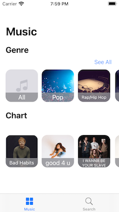
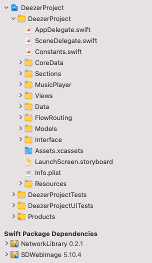
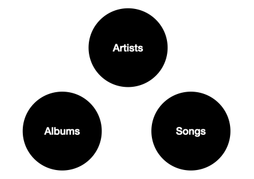
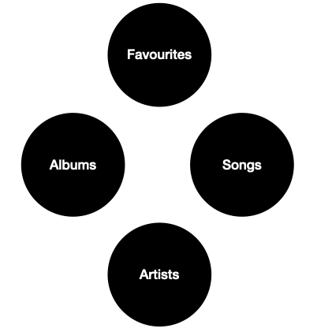
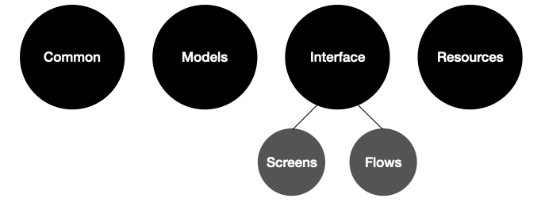

# A Screaming Swift Architecture
## Understand your Context

One of the biggest warning signs in software development, is the use of jargon and acronyms within an organisation.
I worked for a firm in the UK, and they had an acronym for platform tickets. When asked, colleagues didn’t know what this acronym stood for (it really was best not to ask questions in that particular organisation).
This is a trivial example, but imagine that your code lacks such clarity that new Hires need multiple training sessions before their first Pull Request.
You know what, [Uncle Bob thinks you should](https://blog.cleancoder.com/uncle-bob/2011/09/30/Screaming-Architecture.html) make sure you structure your code well. So how might we do that for iOS Swift code?

# The Opportunity
As software increases in size, complexity increases. It becomes harder to tell what the system does, and testability for the system decreases.

## Use-case Driven architecture

Your code should be driven by the user’s experience and the user’s journey through your App.
That is, your application should very visibly show the type of system that they are, rather than the programming language or App architecture that you happen to have chosen.
You shouldn’t get lost in the details, and you should not get lost in the idea of what you would like to create in your particular implementation that solves the problems you are trying to solve

## So…what can you do?
Choose…an…architecture…for the problems that you are trying to solve.
This means we need to think back to the purpose of an architecture, and what we are actually trying to achieve in our project.

# The example
This is where many of these type of articles stop. But here, I have an imperfect example, by own [DEEZER MVVM](https://github.com/stevencurtis/DeezerMVVMArchitectureExample) project.
So is it a Screaming architecture, or is this just an MVVM example, and it only goes as far as that in terms of demonstration?

## The functionality of the example
It’s a little music player! You can search Genre, Chart and Album. You can play that Ed Sheeran Album (or, perhaps, don’t). You can also save your favourites that go away into Core Data for you to explore later on.

 

You can, of course, download this little project from the [REPO](https://github.com/stevencurtis/DeezerMVVMArchitectureExample) — but do please bear in mind that the App can only play 30 seconds of each song, because you can’t have everything.

## Is it obvious: The files in the Project Navigator
It’s true. This could be better. Why aren’t those folders in Alphabetical order, for a start. But is it ovious what sort of software project this is? I’d say it is not that clear, although having MusicPlayer might give away the game, implementation details like Views and Models tell us something about the architecture used beyond that — it could be easier to read and understand for a new user. This means the actual project is obstruficated by how the project has been built.

Bearly a passing grade for this one, I’m afraid.

 

How *could* this be better structured? Well, we could think first about the User Journey through the App and the flows that might be used. So you could have a Login folder, and a MusicPlayer folder alongside a Favourites folder. Something that might make it much easier to understand for someone who has not followed the ins and outs of the implementation.

## Testable?
Do we need the network to be connected in order to unit-test our project? It contains a Core Data backing store, but do we need the database to be connected?
The answer in this particular project, for both of these questions, is no. The [Network Library](https://github.com/stevencurtis/NetworkManager) I’ve used is separate from the rest of our project and is itself tested — it has been kept at arm’s length from the project itself and therefore supports full Unit Testing.

More than that, it is fully possible to test your [Core Data implementation](https://stevenpcurtis.medium.com/core-data-basics-testing-39d127380680).

But you know what? Neither has been completed within this project. Yes, this project would fail any code review at work but in this particular example I’d say does not prevent the architecture from being a screaming one, but it is a rather incomplete implementation without those important unit tests.

## Creating a functional project organisation

It is more than possible to create a great project which embodies a functional organisation of your project files. How might that look?
It rather depends on how you might like to organise your work. What about organising into Artists, Albums and Songs.

 

This would work well for the models, but there would be a connection between the models — meaning this might not work brilliantly.
So what about flows in the project? This would make more sense…

 

But still, won’t this still have the same problem.
Which approach might I make for this? Well, take a look at the following idea:

 

Yes, we are splitting the interface into screens and flows. Yes, the top level of the folder is not too obvious about the purpose of the project.

## Your improvement
You can make your own ideas for a suitable architecture in the comments. I’d love to hear what you think, and how a screaming architecture might be applied to iOS — please do let me know!

# Conclusion
Software development can get rather confusing. Which architecture should we use, and how can we make our code more performant and easier to use? Under the hood, however, what counts is thinking about how we can get new developers quickly into our project and how well the project can be understood in a short amount of time.
If you’ve any questions, comments or suggestions please hit me up on Twitter

