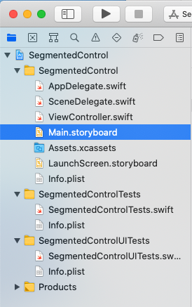
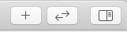
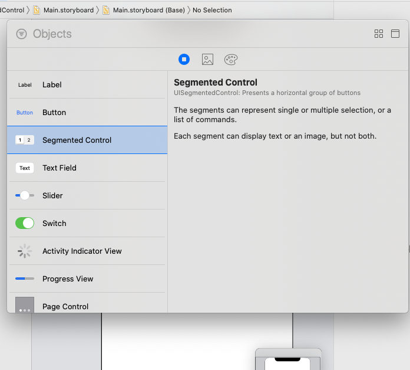
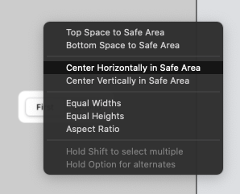
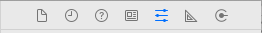
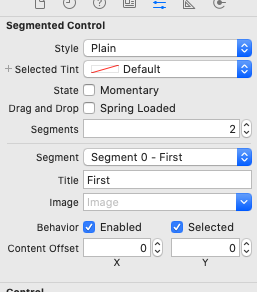
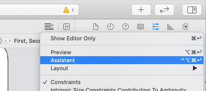
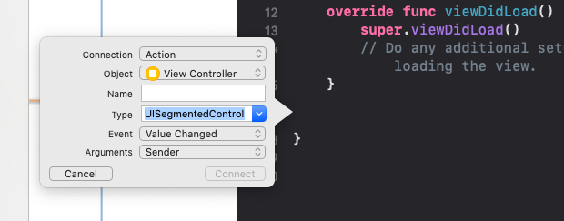

# Create a UIKit UISegmented Control
## How to!


<sub>Photo by Grand Canyon National Park, United States</sub>

Difficulty: Beginner | **Easy** | Normal | Challenging<br/>
This article has been developed using Xcode 12.1, and Swift 5.3

## Prerequisites:
* You will be expected to be aware of how to make a [Single View Application](https://medium.com/swlh/your-first-ios-application-using-xcode-9983cf6efb71) in Swift.

1). Create a New project as in the [Single View Application tutorial](https://medium.com/swlh/your-first-ios-application-using-xcode-9983cf6efb71) 
2). Select the `Main.storyboard` file from the project inspector on the left-hand side of the screen

3). Click on the plus on the top-right hand of the Xcode window

4). Select the "Segmented Control" and drag and drop it into the image of the phone on the main screen 

5). Control-drag (using both the keyboard and the mouse) from the segmented control to the background of the phone. A line will appear. 
In the first instance 

choose "Center Horizontally in Safe area"
6). Repeat the control-drag from step 5, choosing "Center Vertically in Safe area' instead. 

You will notice there is a small circle beside the option from the previous step: This means that the horizontal constraint has been set, so everything is going well!
7). By pressing the two keys: Command⌘ and R we can run the project. 
Congratulations: we can select either item of the `UISegmentedControl`! However, the controls do not do anything, and we have not edited the labels "First" and "Second" on the control itself.
8). There are several ways of editing the `UISegmentedControl` instance, which can be accessed by choosing the storyboard in the project inspector, and then selecting the options:

 In the second part the title of each segment can be changed:
 
 *When we change select the segments nothing can happen. Let's fix that!*
 9). Select the storyboard and then choose the assistant editor, or choose the assistant editor with control-option-⌘command-enter.
 
 
 Do remember to stop the current running project - if not the assistant editor seldom comes up with the correct class!
10). Select the `UISegmentedControl` instance and command-drag to the `UIViewController` class that should be attached to this storyboard. A lovely little selection of options comes up. I tend to change the type to `UISegmentedControl` as this action will only be used for this particular control. 

A suitable name for this Action is "segmentedControlAction"

This should produce the following action

```swift
@IBAction func segmentedControlAction(_ sender: UISegmentedControl) {
}
```
11). We are going to get the selected Index. To do so means that we are going to collect the property selected from the `UISegmentedControl`, and log this to the screen. 

The completed function is written out as below:

```swift
@IBAction func segmentedControlAction(_ sender: UISegmentedControl) {
    print("Selected Segment Index is : \(sender.selectedSegmentIndex)")
}
```

12). 
Command⌘ and R will run the project, and when you select one of the items in the segmented control the following should be printed"
```swift
Selected Segment Index is : 1
Selected Segment Index is : 0
```
which one of these is, of course, dependent upon which of the `UISegmentedControl` segments have been selected at any given time.

# Conclusion
I hope this article has given you some guidance on how to create a segmented control.

Good luck and see you next time!

If you've any questions, comments or suggestions please hit me up on [Twitter](https://twitter.com/stevenpcurtis) 
