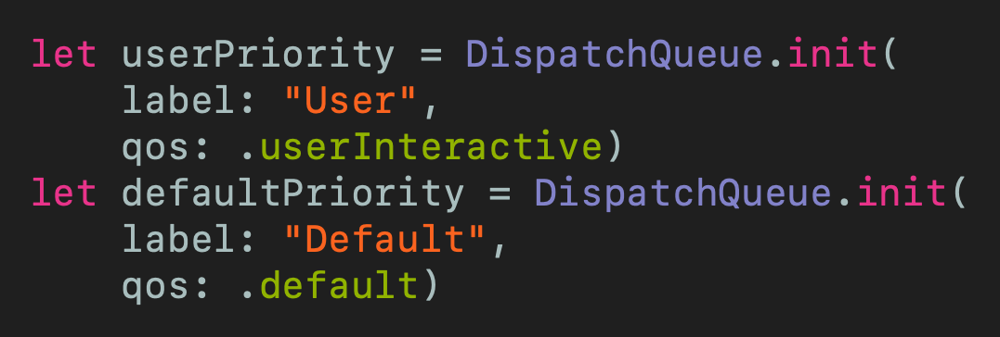
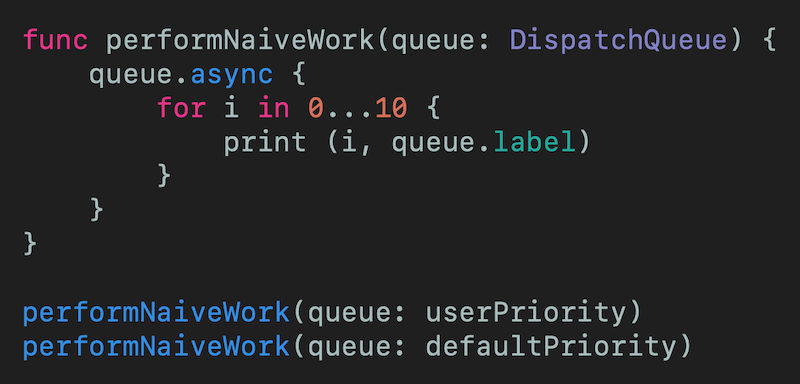
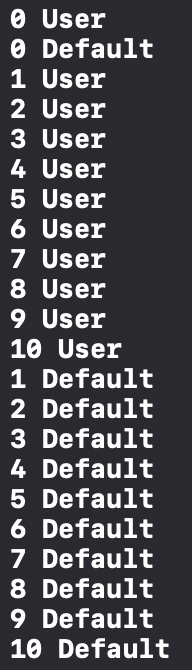
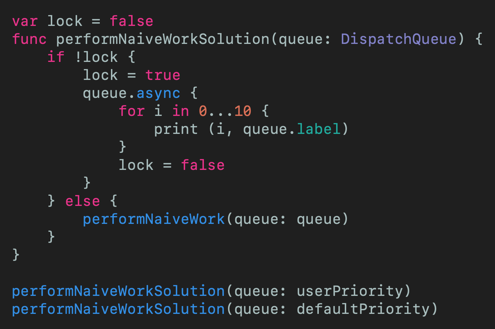
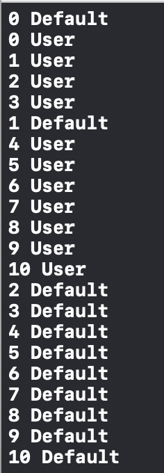
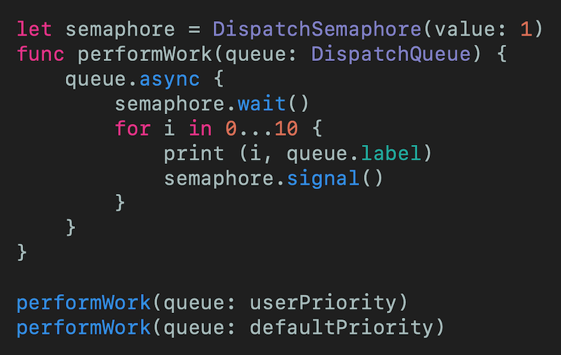
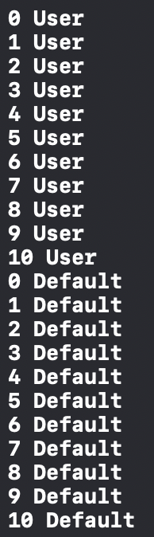

# Avoid Deadlock with Semaphores
## Stop-Wait-Go

 
Photo by Drew Hays on Unsplash

You might well be familar with [GCD](https://medium.com/swift-coding/concurrency-and-grand-central-dispatch-in-swift-gcd-f0ae063973c2), but what if you wish to make sure that you never enter a deadlocked state?

Read on!

Difficulty: Beginner | Easy | **Normal** | Challenging 
This article has been developed using Xcode 11.4.1, and Swift 5.2.2
Updated for Xcode 11.5

# The importance
The [Readers-Writers Problem](https://medium.com/@stevenpcurtis.sc/the-readers-writers-problem-995a2a89d0ab
) is an important one in Computer Science.

In your iOS application you may have several threads that wish to access a shared resource (the cannonical example for this is a file).

You would not want to be in a situation where the file can be written on at the same time as it is being read - imagine that *during* the reading process the file is written. This would mean that we couldn't be certain of what we were reading; perhaps half of the original file and half of the updated file - what a disaster!

# The practical example
For each of these examples two `queues` are going to be used as follows:

 
[Click for Gist](https://gist.github.com/stevencurtis/0947427ef08e9a8b7ed4740d7ce391b6)

now if you wish to follow along in [Playgrounds](https://medium.com/@stevenpcurtis.sc/coding-in-swift-playgrounds-1a5563efa089) you'll need to `import PlaygroundSupport` and add the indefiniteExecution line `PlaygroundPage.current.needsIndefiniteExecution = true`.

With that said, we can then create a naive function that attempts to write to the console from both queues (which usually use a single thread each, but this is not guarenteed):

 
[Click for Gist](https://gist.github.com/stevencurtis/36e46d268afcdaf3b15c40d9d08c81bd)

Now depending on your machine, what is going on in the world and other indecipherable variables you "might" get all of the `userInteractive` work items complete before the `default` priority items.

 
A sample output

*But this isn't guarenteed*. This isn't a good state to be in - and what if we *must* have `User` finished before `Default`?

# The naive solution

To control access (in this case printing to the console) be could block access using a Boolean. No problem!

 
[Click for Gist](https://gist.github.com/stevencurtis/f6d3aedcb24174c0f78b3371fbd80c09)

But there is a problem

 
The problem!

We aren't guaranteed that we are using the same thread when we access the function. Poor stuff!

This will *never* pass code review my friend!

# The solution: A semaphore
A `semaphore` limits the amount of concurrent work that can be completed at the same time. 

# The theoretical semaphore
A `semaphore` simply keeps a count (positive) and contains two operations which must be thread-safe as it empties a queue of threads awaiting the resource in question.
* wait: If the value is >0, decrement else block
* signal: If threads are waiting then unblock one, else increment the value

When we set up a semaphore we pass a an initial value to the Semaphone - in this example we will use 1. 

 
[Click for Gist](https://gist.github.com/stevencurtis/e5b7245b40e354fc2bf2fe8e873ca55b)

So `semaphore.wait` enables waiting for the resource to become avaliable, and then releases with `semaphore.signal()`

 

That's more like it!

# Conclusion

So a `semaphore` provides nothing more than a variable that can be incremented and decremented in a thread-safe manner. By helping you manage a multithreaded environment, a `semaphore` helps you manage complexity - and even provide an easy to use public API to build. 

Now you've got the tool, what are you waiting for?

If you've any questions, comments or suggestions please hit me up on [Twitter](https://twitter.com/stevenpcurtis) 

Why not sign up to my [newsletter](https://subscribe.to/swiftcodingblog/)
