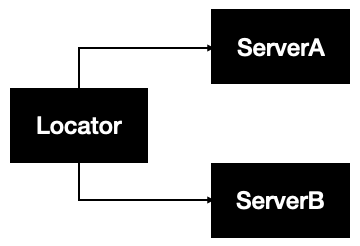

# The Service Locator Pattern in Swift
## Avoid Dependency Injection entirely!

<br/>
<sub>Photo by QuickOrder on Unsplash<sub>

The service locator pattern is designed to encapsulate the processes invovled in obtaining a service with a strong layer of abstraction.

Difficulty: Beginner | Easy | **Normal** | Challenging<br/>
This article has been developed using Xcode 12, and Swift 5.3

## Prerequisites:
* You will be expected to be aware how to make a [Single View Application](https://medium.com/swlh/your-first-ios-application-using-xcode-9983cf6efb71), or a [Playground](https://medium.com/@stevenpcurtis.sc/coding-in-swift-playgrounds-1a5563efa089) to run Swift code
* This article refers to the [Singleton](https://medium.com/@stevenpcurtis.sc/singleton-in-swift-8da9bea06339) pattern

# The explanation
Service locator has a central registry known as the service locator, that on request returns the data required to perform a task. The service locator returns instances of services when they are requested by the service consumers or service clients.

The Service Locator pattern does not describe how to instantiate serveices, rather it describes a way to register services and locate them.



# The Example
This example is written with a Playground in mind: In fact the tests are included (and will work ina Playground)

```swift
import UIKit
import XCTest

class ServerA {
    func serverAFunction() -> String {
        return "Running Server A"
    }
}

class ServerB {
    func serverBFunction() -> String {
        return "Running Server B"
    }
}

class ServiceLocator {
    private lazy var reg: [String: AnyObject] = [:]


    func addService<T>(service: T) {
        let key = "\(type(of: service))"
        reg[key] = service as AnyObject
    }

    func getService<T>() -> T? {
        let key = "\(T.self)"
        return reg[key] as? T
    }
}


class LocatorTests: XCTestCase {
    var serviceLocator = ServiceLocator()
    
    override class func setUp() {}
    
    func testService1() {
        let serv = ServerA()
        serviceLocator.addService(service: serv)
        XCTAssertEqual(serv.serverAFunction(), "ServiceA")
    }
    
    func testTwoServices() {
        let serv1 = ServerA()
        serviceLocator.addService(service: serv1)
        let srvc2 = ServerB()
        serviceLocator.addService(service: srvc2)
        XCTAssertEqual(serv1.serverAFunction(), "ServiceA")
        XCTAssertEqual(srvc2.serverBFunction(), "ServiceB")
    }

}
LocatorTests.defaultTestSuite.run()
```

What is happening here is that we are using a Dictionary to register services. These services can be added or removed from the list, and basically lets us "get" the services from this dictionary.

#Advantages and Disadvantages
Advantages:
 * Application optimize themselves by adding or removing items from the ServiceLocator
 * The only link between parts of the application becomes the registry of services
 
 Disadvantages:
 * The registry itself can be difficult to maintain
 * When dependencies are missing there may be run-time errors
 
 In fact it is common to set up the service locator itself as a Singleton, and then mocks can be inserted into the Service Locator (for example) with a code snippet:
 	
 ```swift
 ServiceLocator.shared.addService(MockServer())
 ```

This does, however
* Introduce a Singleton to your code
* it isn't clear is the client of a server is using the Mock instance or real instance - so your testing is not repeatable

# Conclusion
Service Locator is often considered to be an "Anti-Pattern", as are "Singletons". If you want to go in this direction you need to make sure that you understand what they are, and how they might impact your code.

I hope this article has gone some way in helping you decide this for yourself.

If you've any questions, comments or suggestions please hit me up on [Twitter](https://twitter.com/stevenpcurtis) 