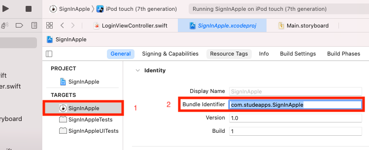
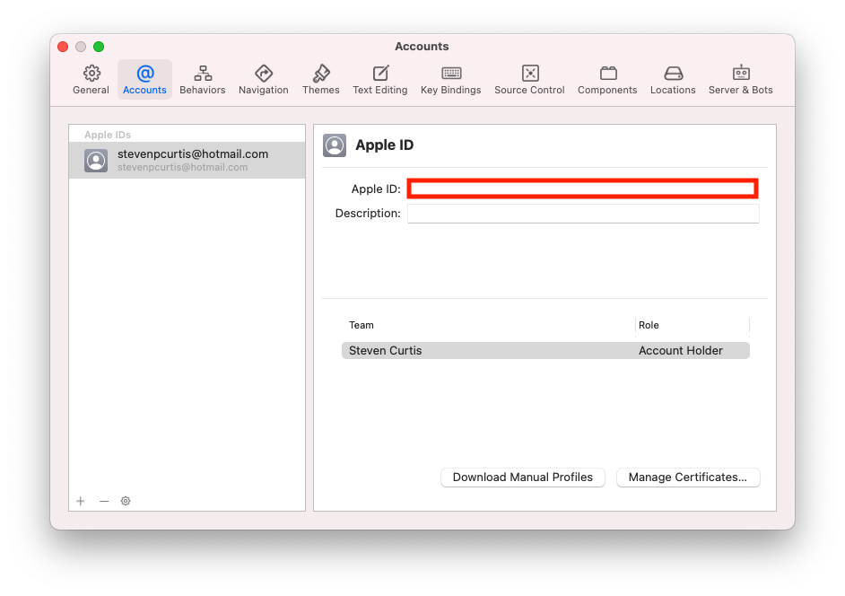
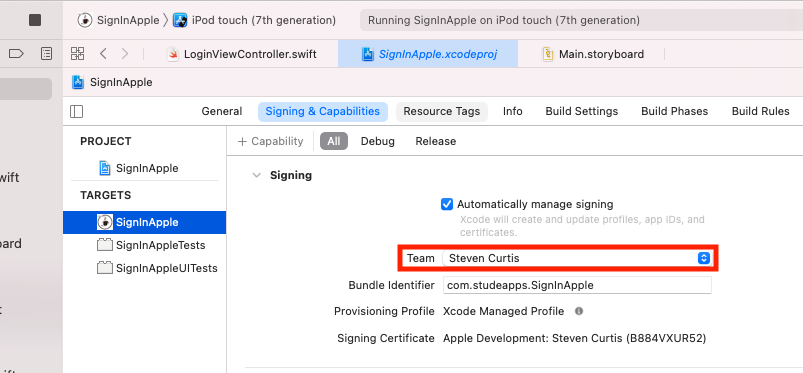
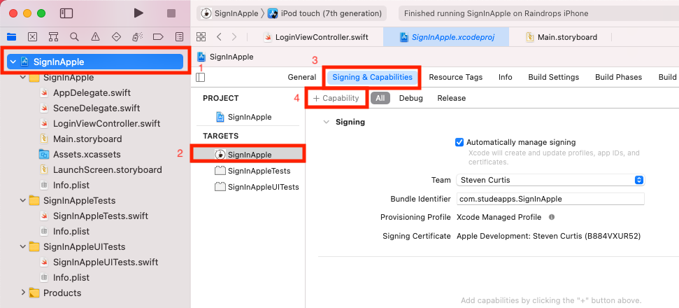
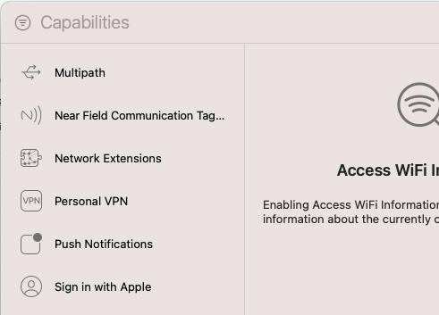
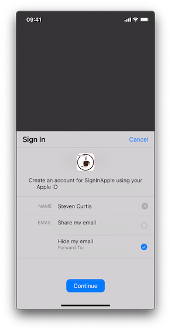

# Sign in with Apple
## Authorize this!

# Before we start
You might well want to make it easy for users to use your App. One way of doing that is to help users to use their Apple ID to sign in. 

This guide is intended to supplement [Apple's guide on the same topic](https://developer.apple.com/documentation/authenticationservices/implementing_user_authentication_with_sign_in_with_apple), with further explaination and comments that are not offered by that article.

Difficulty: Beginner | Easy | **Normal** | Challenging<br>
This article has been developed using Xcode 12.2, and Swift 5.3

## Keywords and Terminology
Authentication Services: Apple's framework for logging in to Apps and services
ASAuthorizationController: A controller that manages authorization requests created by a provider, that is the authorization interface that appears from the bottom of the screen

## The authorization process
You will need to have the help of a backend server to make sure an account exists for your App - if not there is no point in grabbing authorization tokens because where are you going to send them to?


## The two different authorization interfaces
There are two different interfaces that are presented to the user, and the logic for this is handled by iOS.

**The initial request**
You receive both the email and fullName, which are needed to create an account in the service. It makes sense that you should store the email and fullName in the keychain (not covered in this article), because if there is a crash during this initial flow you will not get that information on subsequent authorization interface interactions

**Subsequent requests**
You will receive the user identifier. If the App receives a successful response from the backend it would not need to store the email and fullName (once again not covered in this article).

## If the App user revokes permissions from the setting App
The App is responsible for managing the user session, and the user can revoke permissions from the settings App. 

However when the user disassociates the AppleID from the App the backend is not notified by Apple. 

Therefore prudent use of `getCredentialState(forUserID:completion:)` is required, and if the user has disassociated the App the App should return to the login screen (this is not a network call), and this can be checked in `applicationDidBecomeActive`.

# This project
## Background
Before we start you should be aware of the context. 

For fun this is an example of a coffee shop App. Good, eh?


In order for the sample project in the  to run you will have to perform several tasks.

## The setup
In order for the sample project in the [Repo](https://github.com/stevencurtis/SwiftCoding/tree/master/SignInApple) to dun you will have to perform several tasks.

1. Your bundle ID must be unique, so click on the target and then change the Bundle Identifier to something else (com.myApp.Signin, or a derivation of)


2. Xcode requires your account to be set in Xcode>Preferences... 

This is often your email address that you have registered

3. Assign the target to a team by selecting the target, and then the *Signing & Capabilities tab* to choose the team that you have registered with Apple.


4. It is easier to use a physical device that is signed into an Apple ID, and this can be chosen 


# Sign in With Apple using Swift
## The tutorial

**Turn on capabilities**
Project target> Signin & Capabiliites> + Capability

Then 

which when double-clicked adds the "Sign in with Apple" capability as below:


**The button**
The button needs to be added programatically, as it does not appear in the components in the Storyboard.

There is nothing special about the button itself, but the action is more interesting:

```swift
        // add a target for the UIButton
        authorizationButton.addTarget(self, action: #selector(handleAuthorizationAppleIDButtonPress), for: .touchUpInside)
        
        // add the UIButton
        self.view.addSubview(authorizationButton)
        
        // let the code that has been defined in this class set up the constraints
        authorizationButton.translatesAutoresizingMaskIntoConstraints = false
        
        // setup the constraints
        NSLayoutConstraint.activate([
            authorizationButton.centerXAnchor.constraint(equalTo: self.view.centerXAnchor),
            authorizationButton.centerYAnchor.constraint(equalTo: self.view.centerYAnchor)
        ])
```
which calls the following code when tapped:

```swift
@objc
func handleAuthorizationAppleIDButtonPress() {
    // setup the class to authenticate users using the AppleID
    let appleIDProvider = ASAuthorizationAppleIDProvider()
    // ask the authentication class to create the request
    let request = appleIDProvider.createRequest()
    // request the contact information, from a choice of the full name and email
    request.requestedScopes = [.fullName, .email]
    
    // Controller to manage the authorization requests
    let authorizationController = ASAuthorizationController(authorizationRequests: [request])
    // who to inform about the success or failure of the authorization
    authorizationController.delegate = self
    // present the authorization interface
    authorizationController.presentationContextProvider = self
    // perform the authorization requests
    authorizationController.performRequests()
}
```

essentially here we are setting the authorization interface, delegate and tell the newly set up ASAuthorizationAppleIDProvider to start requests.

**The ASAuthorizationControllerPresentationContextProviding**
When we try to log in with Sign in with Apple, an authorization interface appears from the bottom of the screen:


This is `ASAuthorizationControllerPresentationContextProviding`, and at the time of setting up the `ASAuthorizationController` we set the delegate to be (in this case) our `LoginViewController` class.

```swift
extension LoginViewController: ASAuthorizationControllerPresentationContextProviding {
    //Tells the delegate from which window it should present the authorization interface to the user.
    func presentationAnchor(for controller: ASAuthorizationController) -> ASPresentationAnchor {
        // force-unwrap because at this point the view must have a window
        return self.view.window!
    }
}
```

**The ASAuthorizationControllerDelegate**
We would wish to get information about the outcome of the authorization. In steps the ASAuthorizationControllerDelegate which contains (optional) functions to handle an error or success from the user using the authorization interface to log in (or to cancel the process).

Here I've attempted to keep the code as clear as possible, and as a result have chosen to use an  [extension](https://medium.com/@stevenpcurtis.sc/extensions-in-swift-68cfb635688e) to make that happen.

```swift
extension LoginViewController: ASAuthorizationControllerDelegate {
    func authorizationController(controller: ASAuthorizationController, didCompleteWithError error: Error) {
        // handle error, it is also possible the user cancelled this action
        print (error)
    }
    // this is fired when the authorization is completed successfully
    func authorizationController(controller: ASAuthorizationController, didCompleteWithAuthorization authorization: ASAuthorization) {
        // authorization is an ASAuthorization property, allowing access to credentials
                // which are then used to send to the backend for the authorization flow
        
        switch authorization.credential {
        case let appleIDCredential as ASAuthorizationAppleIDCredential:
            // optional JWT token
            if let authorizationCode = appleIDCredential.authorizationCode,
               let identifyToken = appleIDCredential.identityToken {
                let userIdentifier = appleIDCredential.user
                //appleIDCredential.fullName // optional
                // appleIDCredential.email // optional
                //First time user, submit authorization code and identity token to the
                //backnd for validation
                //TODO: Submit authorization code and identity token to the backend
                //TODO: Perform user login when a success received from the backend
                return
            }
        case let passwordCredential as ASPasswordCredential:
            // The user selects credentials which are already stored in the iCloud Keychain
            // passwordCredential.user
            // passwordCredential.password
            // call the server and check the username and password
            // the server and flow is outside the scope of this tutorial
            return
        default:
            break
        }
    }    
}
```

# Conclusion
Of course, if you want the full code you need to download from the [Repo](https://github.com/stevencurtis/SwiftCoding/tree/master/SignInApple) makes things rather easier to follow in this project, and I do recommend you download this project.

If you wish to use this great functionality in a production App, I would suggest you think about the keychain due to some of the issues discussed above, and if you would like to use a keychain manager do have a glance at [this article](https://medium.com/@stevenpcurtis.sc/secure-user-data-with-keychain-in-swift-337684d6488c) as it might help you

If you've any questions, comments or suggestions please hit me up on [Twitter](https://twitter.com/stevenpcurtis) 
