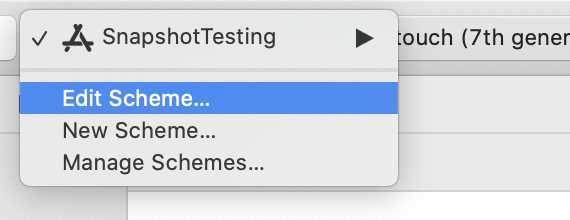
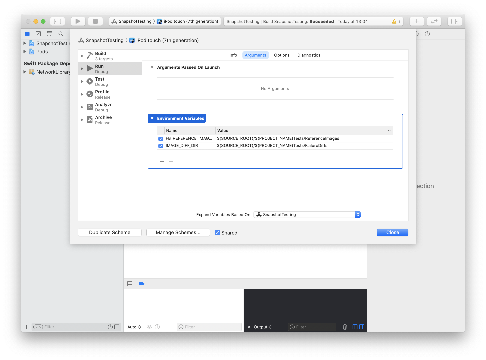
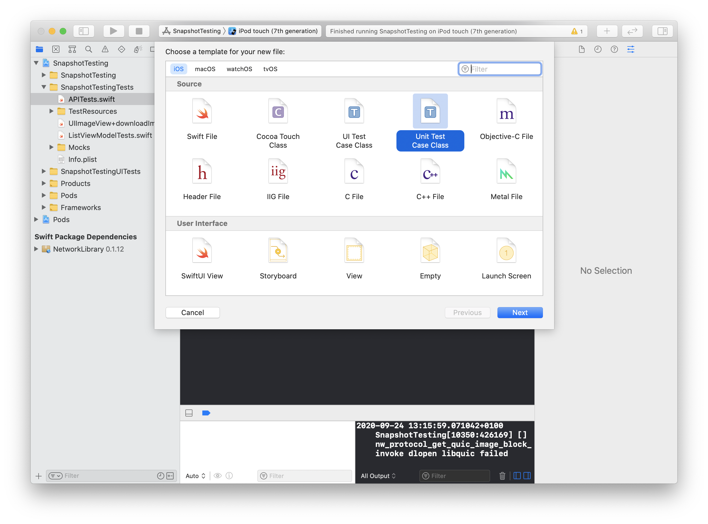
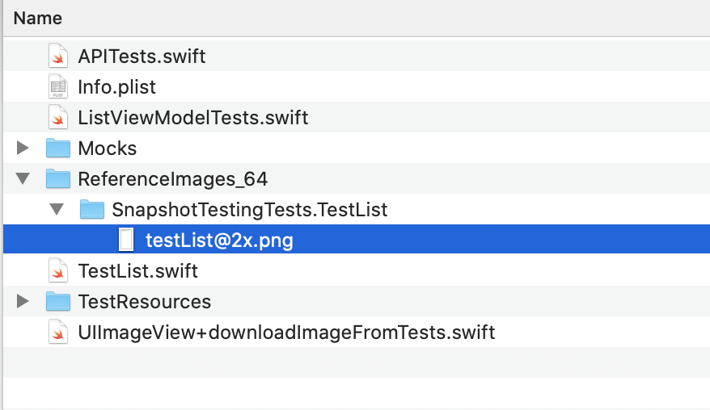

# Snapshot testing in Swift
## Make UI testing that bit easier!

<br/>
<sub>Photo by ShareGrid on Unsplash<sub>

Difficulty: Beginner | Easy | **Normal** | Challenging<br/>
This article has been developed using Xcode 12.0, and Swift 5.3

## Prerequisites:
* You will be expected to be aware how to make a [Single View Application](https://medium.com/swlh/your-first-ios-application-using-xcode-9983cf6efb71), or a [Playground](https://medium.com/@stevenpcurtis.sc/coding-in-swift-playgrounds-1a5563efa089) to run Swift code

## Terminology:
Snapshot testing: A way to test UI by rendering a UI component, take a snapshot, and then compare it to a reference snapshot file

UBER have [ios-snapshot-test-case](https://github.com/uber/ios-snapshot-test-case/). At the time of writing, this library does not support Swfit Package Manager - and as I result I used PODS to install this dependency (adding the following in my Podfile)

```swift
  target 'SnapshotTestingTests' do
    inherit! :search_paths
    # Pods for testing
  pod 'iOSSnapshotTestCase'
  end
```

meaning the reader should use `SnapshotTesting.xcworkspace` to open this project, and if you have downloaded the repo you are probably best served by performing a `pod update` in the downloaded/cloned folder.

The following needs to be added to the Run scheme

```
FB_REFERENCE_IMAGE_DIR = $(SOURCE_ROOT)/$(PROJECT_NAME)Tests/ReferenceImages
IMAGE_DIFF_DIR = $(SOURCE_ROOT)/$(PROJECT_NAME)Tests/FailureDiffs
```

So we get there by going to Project>Edit scheme



Then clicking `Run` 
The clicking `Arguments`
Then click the + under Environment Variables



We can then...

## Setup tests
Create a new Unit Test Case
`File>New>File...`



I called my file `TestList` and saved as usual.


Here is my sample test:
```swift
class TestList: FBSnapshotTestCase {
    
    override func setUp() {
        super.setUp()
        recordMode = true
    }

    func testList() {
        let networkManager = MockNetworkManager(session: URLSession.shared)
        networkManager.outputData = photoString.data(using: .utf8)
        let listVM = ListViewModel(manager: networkManager)
        let list = ListViewController(viewModel: listVM)
        FBSnapshotVerifyViewController(list)
    }

}
```

We get an error!

```swift
failed - Test ran in record mode. Reference image is now saved. Disable record mode to perform an actual snapshot comparison!
```

Oh dear!

But it isn't as bad as it might seem - reference images have been added in a rather fantastic folder! 



So to check against this reference image, we *remove* the recodeMode!

```swift
class TestList: FBSnapshotTestCase {
    
    override func setUp() {
        super.setUp()
        recordMode = false
    }

    func testList() {
        let networkManager = MockNetworkManager(session: URLSession.shared)
        networkManager.outputData = photoString.data(using: .utf8)
        let listVM = ListViewModel(manager: networkManager)
        let list = ListViewController(viewModel: listVM)
        FBSnapshotVerifyViewController(list)
    }

}
```
which will match, but if we now change the code to pull in `emptyString`:

```swift
class TestList: FBSnapshotTestCase {
    
    override func setUp() {
        super.setUp()
        recordMode = false
    }

    func testList() {
        let networkManager = MockNetworkManager(session: URLSession.shared)
        networkManager.outputData = emptyString.data(using: .utf8)
        let listVM = ListViewModel(manager: networkManager)
        let list = ListViewController(viewModel: listVM)
        FBSnapshotVerifyViewController(list)
    }

}
```

The code even "notices" if I change just one character in the screenshot.

you are even provided with diff images! 


What happens if you change device, though? Of course the test will fail!


# Conclusion
This is quite automatic - you just need to decide when to record the screenshots.

Your test team will thank you - they can just go through your screenshots and check if they are correct - fantastic!

Who else will thank you? You will thank you when you find those bugs that are hiding in your code!
 
 If you've any questions, comments or suggestions please hit me up on [Twitter](https://twitter.com/stevenpcurtis) 