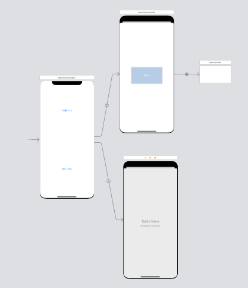

# Snapshot Individual Views in Swift  
## Snapshot testing is great!

<br/>
<sub>Photo by Ravi Singh on Unsplash<sub>

Difficulty: Beginner | Easy | **Normal** | Challenging

## Prerequisites:
* You will be expected to be aware how to make a [Single View Application](https://medium.com/swlh/your-first-ios-application-using-xcode-9983cf6efb71)
* You will need some experience of [Snapshot testing](https://medium.com/@stevenpcurtis/snapshot-testing-in-swift-6a37c96cfc00) 
The best solution uses the following:
* [Closures](https://medium.com/swift-coding/swift-closures-c14cb7aa2170)
* [Escaping closures](https://medium.com/@stevenpcurtis.sc/what-is-the-difference-between-escaping-and-nonescaping-closures-in-swift-3ba6a8276105)
* [Generics](https://medium.com/better-programming/generics-in-swift-aa111f1c549)

# Terminology:
Closures: A combination of functions and references to the surrounding context
Snapshot testing: A way to test UI by rendering a UI component, take a snapshot, and then compare it to a reference snapshot file

## The setup
As in my [Snapshot testing](https://medium.com/@stevenpcurtis/snapshot-testing-in-swift-6a37c96cfc00) article I set up the use of snapshot testing for Swift code.

The short version in that article is that we have environment variables for the following:

```swift
FB_REFERENCE_IMAGE_DIR = $(SOURCE_ROUTE)/$(PROJECT_NAME)Tests/ReferenceImages
IMAGE_DIFF_DIR = $(SOURCE_ROOT)/$(PROJECT_NAME)Tests/FailureDiffs
```

which is added on the scheme.

In the relevant Test cases remember to change `XCTestCase` to `FBSnapshotTestCase` as well as `import FBSnapshotTestCase`.

**The code**
In order to test different ways of snapshot testing. The following image shows three View Controllers. 



Note the use of a container view that contains (!) a `SimpleView`, and a (to overstate what it is) menu that contains two buttons.

So the strategies for snapshot testing that are going to be on display here will be:
* Snapshot a ViewController
* Snapshot an individual view
* Snapshot a UITableViewCell

Each of these increases in complexity as we go.

If we want to create a new image  `recordMode = true` needs to be included in the test.

## Snapshot a view controller
This involves (in this case, as I'm using the Storyboard) and this is performed using `let storyboard = UIStoryboard(name: "Main", bundle: Bundle.main)`.

```swift
func testMenu() {
    // For first run
    // recordMode = true
    let storyboard = UIStoryboard(name: "Main", bundle: Bundle.main)
    let vc = storyboard.instantiateViewController(withIdentifier: "menu") as! MenuViewController
    FBSnapshotVerifyView(vc.view)
}
```

## Snapshot a view
The `SimpleView` has been created to give us a view of `SimpleView`.

```swift
func testSimpleView() {
    // For first run
    // recordMode = true

    let view = SimpleView(frame: CGRect(x: 0, y: 0, width: 300, height: 100))
    view.backgroundColor = .green
    FBSnapshotVerifyView(view)
}
```

## Snapshot a UITableViewCell
There are a few issues with just trying to create a `UITableViewCell` separately from a `UITableView`.

One solution is to use the `UIViewController`, and then use a `DataSource`.

```swift
class TestDataSource: NSObject, UITableViewDataSource {
    func tableView(_ tableView: UITableView, numberOfRowsInSection section: Int) -> Int {
        return 1
    }
    
    func tableView(_ tableView: UITableView, cellForRowAt indexPath: IndexPath) -> UITableViewCell {
        if let cell = tableView.dequeueReusableCell(withIdentifier: "CustomCell", for: indexPath) as? CustomTableViewCell {
            
            cell.textLab?.numberOfLines = 0
            cell.textLab?.text = "aaaa"
            return cell
        }
        fatalError("Could not dequeue CustomCell")
    }
}
```  

which is then called from the tests using the following code:

```swift
func testCell() {
    // For first run
    // recordMode = true
    let vc = ViewController(nibName: nil, bundle: nil)
    let tv = UITableView.init(frame: CGRect(x: 0, y: 0, width: 375, height: 22), style: .plain)
    vc.tableView = tv
    tv.dataSource = ds
    vc.tableView.register(UINib(nibName: "CustomTableViewCell", bundle: Bundle.main), forCellReuseIdentifier: "CustomCell")
    FBSnapshotVerifyView(vc.tableView)
}
```

Now there are a few issues with this. You need to know in the test the height of the `UITableViewCell`, which is ... not too bad. 

However we do need to test `UITableViewCell` using an instance of `ViewController`, and for a test I'd usually be happy with this. However, when I look carefully at this code I can see an extremely important issue - the tableview needs to be externally accessible, if you make the property private then this test will not work. Incidentally, this property should be private.

There needs to be a better solution to this.

**The better solution** 
I'm sorry about the naming here, I've called this `TableViewTestView` which is a quite dreadful name. 

```swift
class TableViewTestView: UIView, UITableViewDataSource, UITableViewDelegate {
    private let tableView = UITableView()
    private var text: String?
    
    init(testText: String, height: Double) {
        super.init(frame: CGRect(x: 0, y: 0, width: 375, height: height))
        text = testText
        setUpTableView()
    }
    
    func setUpTableView() {
        addSubview(tableView)
        tableView.translatesAutoresizingMaskIntoConstraints = false

        NSLayoutConstraint.activate([
            tableView.topAnchor.constraint(equalTo: topAnchor),
            tableView.bottomAnchor.constraint(equalTo: bottomAnchor),
            tableView.leadingAnchor.constraint(equalTo: leadingAnchor),
            tableView.trailingAnchor.constraint(equalTo: trailingAnchor),
        ])
        
        tableView.register(UINib(nibName: "CustomTableViewCell", bundle: Bundle.main), forCellReuseIdentifier: "CustomCell")
        
        tableView.dataSource = self
        tableView.delegate = self
    }
    
    required init?(coder: NSCoder) {
        fatalError("init(coder:) has not been implemented")
    }
    
    
    func tableView(_ tableView: UITableView, numberOfRowsInSection section: Int) -> Int {
        return 1
    }
    
    func tableView(_ tableView: UITableView, cellForRowAt indexPath: IndexPath) -> UITableViewCell {
        if let cell = tableView.dequeueReusableCell(withIdentifier: "CustomCell", for: indexPath) as? CustomTableViewCell {
            
            cell.textLab?.numberOfLines = 0
            cell.textLab?.text = text
            return cell
        }
        fatalError("Could not dequeue CustomCell")
    }
}
```

This can be called with the following:

```swift
func testOnlyShortCell() {
    recordMode = true
    let cont = TableViewTestView(testText: "Short Text", height: 22)
    FBSnapshotVerifyView(cont)
}

func testOnlyLongCell() {
    recordMode = true
    let cont = TableViewTestView(testText: "There is a great deal of text in this particular cell, it will take up a great deal of space and perhaps go onto four lines", height: 60)
    FBSnapshotVerifyView(cont)
}
```

The problem here? Reusability - this only works for that singular `UITableViewCell`, which really isn't good enough. Can we do better?

Of course we can!

**The ultimate solution** 

I'm going to call my view `TableViewTestViewGeneralised`, as I'm awful at choosing names.

This uses [Generics](https://medium.com/better-programming/generics-in-swift-aa111f1c549),  [closures](https://medium.com/swift-coding/swift-closures-c14cb7aa2170) in the following code:

```swift
class TableViewTestViewGeneralised<Cell: UITableViewCell>: UIView, UITableViewDataSource, UITableViewDelegate {
    private let tableView = UITableView()
    
    init(height: Double, configureCell: @escaping (Cell) -> ()) {
        self.configureCell = configureCell
        super.init(frame: CGRect(x: 0, y: 0, width: 375, height: height))
        setUpTableView()
    }

    func setUpTableView() {
        addSubview(tableView)
        tableView.translatesAutoresizingMaskIntoConstraints = false

        NSLayoutConstraint.activate([
            tableView.topAnchor.constraint(equalTo: topAnchor),
            tableView.bottomAnchor.constraint(equalTo: bottomAnchor),
            tableView.leadingAnchor.constraint(equalTo: leadingAnchor),
            tableView.trailingAnchor.constraint(equalTo: trailingAnchor),
        ])
        
        tableView.register(UINib(nibName: "CustomTableViewCell", bundle: Bundle.main), forCellReuseIdentifier: "CustomCell")
        
        tableView.dataSource = self
        tableView.delegate = self
    }
    
        required init?(coder: NSCoder) {
        fatalError("init(coder:) has not been implemented")
    }
    
    func tableView(_ tableView: UITableView, numberOfRowsInSection section: Int) -> Int {
        return 1
    }
    
    private let configureCell: (Cell) -> ()

    func tableView(_ tableView: UITableView, cellForRowAt indexPath: IndexPath) -> UITableViewCell {
        if let dequeuedCell = tableView.dequeueReusableCell(withIdentifier: "CustomCell", for: indexPath) as? Cell {
            configureCell(dequeuedCell)
            return dequeuedCell
        }
        fatalError("Could not dequeue CustomCell")
    }
}
```

This can be called with the following:

```swift
func testOnlyShortGeneralCell() {
    recordMode = true
    let cont = TableViewTestViewGeneralised<CustomTableViewCell>(height: 22, configureCell: { cell in
        cell.textLab.numberOfLines = 0
        cell.textLab.text = "Short Text"
    })
    FBSnapshotVerifyView(cont)
}

func testOnlyLongGeneralCell() {
    // recordMode = true
    let cont = TableViewTestViewGeneralised<CustomTableViewCell>(height: 60, configureCell: { cell in
        cell.textLab.numberOfLines = 0
        cell.textLab.text = "There is a great deal of text in this particular cell, it will take up a great deal of space and perhaps go onto four lines"
    })
    FBSnapshotVerifyView(cont)
}
```

We still need to know how large we want the cell to be, but.. I can't see where I said this solution is actually perfect. But I've given it a go!

# Conclusion

Taking a snapshot of an individual view is a great way to create flexible and reusable solutions for making sure our code is good enough.

While there are still some challenges to overcome, such as determining the size of the cell, these strategies and techniques can help us create more robust and reliable tests for our iOS applications.

If you've any questions, comments or suggestions please hit me up on [Twitter](https://twitter.com/stevenpcurtis) 
