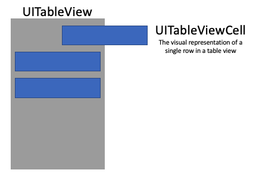
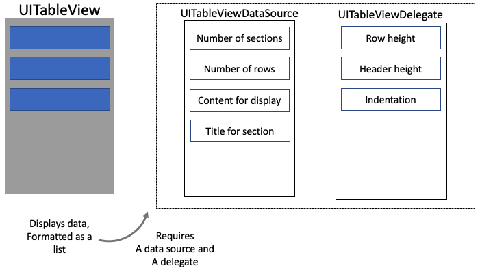
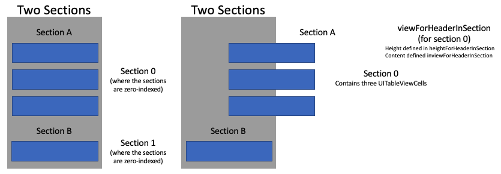

# Space UITableViewCells in a UITableView
## Put gaps between!

# Before we start
Difficulty: **Beginner** | Easy | Normal | Challenging<br>
This article has been developed using Xcode 12.2, and Swift 5.3

## Prerequisites
This article is based on the [UITableView Programmatic Example](https://stevenpcurtis.medium.com/the-programmatic-uitableview-example-e6936d5557af), and builds on that (although the code is given in this article
I usually remove the storyboard using [this technique](https://medium.com/@stevenpcurtis.sc/avoid-storyboards-in-your-apps-8e726df43d2e)

## Keywords and Terminology
Row: The content in a UITableview is ordered into rows
Section: A grouping of rows in a UITableView
UITableView: A view that presents data using rows arranged in a single column
UITableViewCell: The visual representation of a single row in a table view

# This project
## Background
Before we look at how to put spaces in between `UITableViewCells`, let us look at some of the background of `UITableView`.

When we use a `UITableView` the view is made up of `UITableViewCells` 
<br>

and the `UITableView` gets the information to be displayed from a datasource and delegate

<br>

However, we might want to add some sections - that is we will set up a header that can be displayed before some number of rows in a section. The following diagram shows Section A and Section B:

<br>

So how might this be set up?

## The simplified project
This project will display some data in the `UITableView`, which is made up of an `Array` of names. 

For clarity, this particular project is going to put spaces in between `UITableViewCell` instances.

This is part of the `UITableViewDelegate` which means that we are going to return `data.count` sections, and just 1 row in each of those sections. Therefore each section will have a `viewForHeaderSection` drawn above the relevant `UITableViewCell`.

So we create the header (here it will be blue):

```swift
// the header to display for a particular section
func tableView(_ tableView: UITableView, viewForHeaderInSection section: Int) -> UIView? {
    // set up a UIView
    let view = UIView.init(frame: CGRect(x: 0, y: 0, width: UIScreen.main.bounds.width, height: 44))
    // choose the colour to be blue
    view.backgroundColor = .blue
    // return the new view
    return view
}
```

with `data.count` sections, and 1 row in each section.

```swift
func tableView(_ tableView: UITableView, numberOfRowsInSection section: Int) -> Int {
    // set each section to have one single item. This works without the
    // return keyword where there is a dingle line
    1
}

// the number of sections in a UITableView
func numberOfSections(in tableView: UITableView) -> Int {
    // returns the number of items in the data array, works without the return keyword
    // where there is a single line
    data.count
}
```

With, of course the comments shown to help you out.

# The full, relevant code

```swift
import UIKit

class ViewController: UIViewController {
    
    // A property to reference a UITableView instance
    var tableView: UITableView!
    
    // The height that will separate the UITableViewCells
    let cellSpacingHeight: CGFloat = 5
    
    // The data, an Array of String. Each Intended to be displayed in a single TableViewCell
    var data: [String] = ["Arjun", "Tisha", "Zaara","Bob", "Kasia", "Natalia", "Colin", "Noah", "Liya", "Sergey"]

    // Called after ViewController is loaded into memory
    override func viewDidLoad() {
        // Super should always be called, as viewDidLoad() is overridden
        super.viewDidLoad()
        setupTableView()
    }
    
    // Creates the views that the view controller manages
    override func loadView() {
        tableView = UITableView(frame: .zero)
        self.view = tableView
    }
    
    func setupTableView(){
        // register the class of the UITableViewCell, and the identifier for reuse
        tableView.register(CustomTableViewCell.self, forCellReuseIdentifier: "cell")
        // the delegate will be this class
        tableView.delegate = self
        // the data source will be this class
        tableView.dataSource = self
    }
}
extension ViewController: UITableViewDataSource, UITableViewDelegate  {
    func tableView(_ tableView: UITableView, numberOfRowsInSection section: Int) -> Int {
        // set each section to have one single item. This works without the
        // return keyword where there is a dingle line
        1
    }
    
    // the number of sections in a UITableView
    func numberOfSections(in tableView: UITableView) -> Int {
        // returns the number of items in the data array, works without the return keyword
        // where there is a single line
        data.count
    }

    // which cell should be used for which row? Return it!
    func tableView(_ tableView: UITableView, cellForRowAt indexPath: IndexPath) -> UITableViewCell {
        // if there is an existing cell, reuse it. If not create a new cell
        if let cell = tableView.dequeueReusableCell(withIdentifier: "cell", for: indexPath) as? CustomTableViewCell {
            // which row are we working on?
            let currentRow = indexPath.row
            // set the text from the data array
            cell.textLabel?.text = data[currentRow]
            // return the completed cell
            cell.setupCell(image: "PlaceholderImage")
            return cell
        }
        // if no cell can be reused or created, something is seriously wrong so crash
        // the device (this should therefore not happen)
        fatalError("could not dequeueReusableCell")
    }
    
        // the header to display for a particular section
    func tableView(_ tableView: UITableView, viewForHeaderInSection section: Int) -> UIView? {
        // set up a UIView
        let view = UIView.init(frame: CGRect(x: 0, y: 0, width: UIScreen.main.bounds.width, height: 44))
        // choose the colour to be blue
        view.backgroundColor = .blue
        // return the new view
        return view
    }

    // give the height to use for a particular section
    func tableView(_ tableView: UITableView, heightForHeaderInSection section: Int) -> CGFloat {
        cellSpacingHeight
    }
}
```

# Conclusion
Of course, if you want the full code you need to download from the [Repo](https://github.com/stevencurtis/SwiftCoding/tree/master/SpaceUITableViewCells) makes things rather easier to follow in this project, and I do recommend you download this project.

Creating spaces around you `UITableView` will certainly make things look better, and will help you meet the standards of your designer. This is important, and I hope that this article has helped you out!

If you've any questions, comments or suggestions please hit me up on [Twitter](https://twitter.com/stevenpcurtis) 
