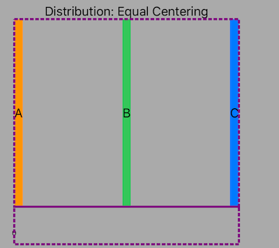
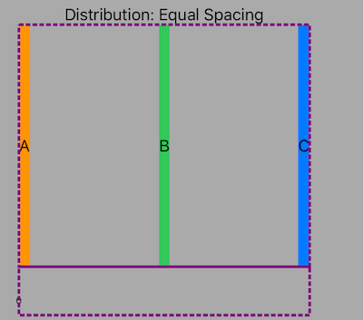
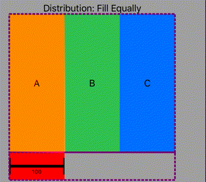
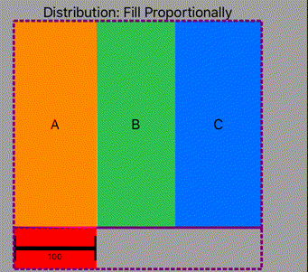
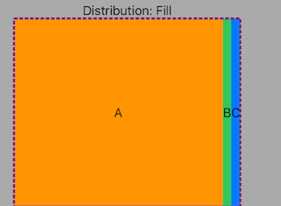

# The Only UIStackView Guide You Will Ever Need
## Swerve Auto Layout

<br/>
<sub>Photo by Kimberly Farmer on Unsplash<sub>

# Prerequisites:
- [Knowledge of how to create an iOS app is required for this tutorial](https://medium.com/swlh/your-first-ios-application-using-xcode-9983cf6efb71)
- Since a `UIStackView` is an Array, [knowledge of that data structure is assumed](https://medium.com/@stevenpcurtis.sc/the-array-in-swift-d3e0fb04a0dd)

# Terminology
UIStackView: An interface for laying out objects horizontally or vertically

The world of constraints and [Auto Layout](https://medium.com/@stevenpcurtis.sc/the-auto-layout-cheat-sheet-ee05dfd34d49) is tricky to some. The addition of constraints and layout can be tricky, and especially so if you require putting your views into a complex layout of some sort. The solution? Stack views (that is, the `UIStackView`) are there to rescue you.

You might prefer to use Interface Builder or programatic means to add `UIStackView` into your project. It doesn't matter: this article has you covered in either way.

The way a Stack View (`UIStackView`) displays subviews is defined by the following properties, which at runtime create the constraints necessary to create the Stack View.

These properties are:
**axis**: The axis along which the subviews are laid out, either .horizontal or .vertical
**distribution**: The distribution of arranged views along the axis 
**spacing**: The distance in points between the adjacent edges of the stack view's arranged views

# Playing with the properties
## axis

The axis can either be vertical or horizontal, as shown in the following animation:


The height and the width of each cell in the cases shown changes as the axis switches from horizontal to vertical.

The following examples are all with the axis as horizontal.

## Spacing and distribution
The following will go from minimum spacing and are animated to show the differences in the stack view as the spacing changes

**Equal centering**

Equal centering attempts to arrange the subviews so they have an equal center-to-center spacing. The following image shows that spacing from subviews `a-b-c `- any shrinking happens according to the `compression resistance priority` that the subviews are assigned.



**Equal spacing**

Equal spacing pads the subviews evenly, any shrinking happens according to the their `index` in the stackview.



**Equal**

The subviews are resized so that they use the avaliable space along the stackview's axis. Note here that changing the spacing changes the size of each of the subview.



**Fill Proportionally**

The subviews are resized proportionally according to their intrinsic content size, see the animation when the spacing is changed.



**Fill**

The subviews are resized so as to fill the available space. In order to fill it, they are stretched according to their hugging priority, and ambiguities resolved by referring to their index in the parent stackview.



## Alignment

The alignment of subviews in the stackview is brought into full clarity when the default is considered first (fill), that is the subviews fill the available space perpendicular to the axis of the stackview. 

Without this we are thinking rather about the intrinsic size of the subviews, and therefore leading, trailing, center are quite clear in their meaning. Horizontal stackviews also have `firstBaseline` and `lastBaseline` that are determined by the [`forFirstBaselineLayout`](https://medium.com/r/?url=https%3A%2F%2Fdeveloper.apple.com%2Fdocumentation%2Fuikit%2Fuiview%2F1622452-forfirstbaselinelayout) and [`forLastBaselineLayout`](https://medium.com/r/?url=https%3A%2F%2Fdeveloper.apple.com%2Fdocumentation%2Fuikit%2Fuiview%2F1622633-forlastbaselinelayout) properties of the subviews.

## Stackview basics
A stackview contains an `array` of subviews, which are displayed within the stackview itself.

I'd recommend that you download the [repo](https://github.com/stevencurtis/SwiftCoding/tree/master/StackView) and see how I've set this up, but in any case I've called my UIStackView stackView (because I come up with great ideas, right?).

```swift
let stackView = UIStackView(frame: CGRect(x: 0, y: 0, width: 200, height: 40))
```
## Add arranged subview
For each of these examples I've used simple `UIView` instances that are colored in a primary color - but you could put any view that is a `UIView` subclass into the stackview (gosh, what a sentence). Moving on…

This adds a new element at the end of the `UIStackView` you can use `addArrangedSubview()`:

```swift
self.stack.addArrangedSubview(nv)
```

Now if you wish to have it in a particular index you can place the subview into the following


```swift
self.stack.insertArrangedSubview(nv, at: insertionIndex)
```

## Remove subviews
We might remove an item that we have a reference to - so when adding such items we would need to be a little bit careful.

For this example, we can remove all the items in the subview using `for...in`

```swift
for item in stack.arrangedSubviews {
       stack.removeArrangedSubview(item)
}
```

alternatively we can use forEach:

```swift
stack.arrangedSubviews.forEach{ element in
       stack.removeArrangedSubview(element)
}
```


# Conclusion
Using Stack Views can, no doubt be tricky. 

However, the idea is that they create their own constraints based on the properties shown above. 
Knowing how these properties can be used to create the effect that you want really gives you a head-start on producing that great user experience. Who *wouldn't* want that?

It is always nice to look at the source, and that in this case is to [Read Apple's documentation about UIStackView](https://medium.com/r/?url=https%3A%2F%2Fdeveloper.apple.com%2Fdocumentation%2Fuikit%2Fuistackview)
